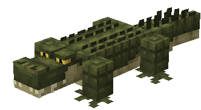
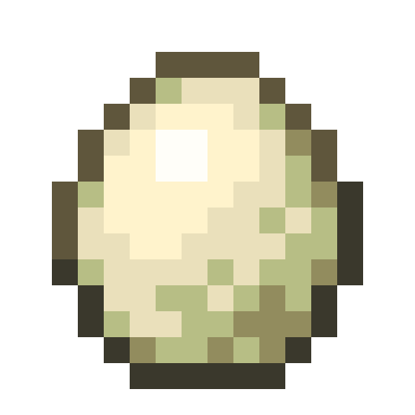
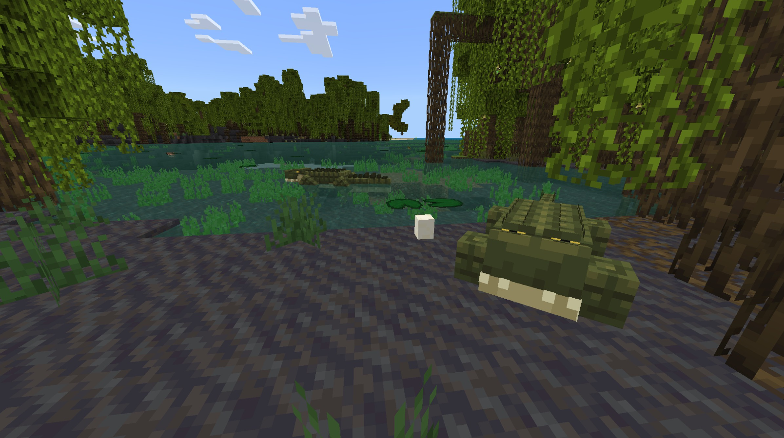

# Alligator

Dernière mise à jour : 22 avril 2025 20:47

---

**Retour**

🐻 [Wiki du Module Naturaliste](https://www.notion.so/1a7a9a61c3f1800c8e32e893d6e7f430?pvs=21)

---

L'alligator est un grand reptile carnivore semi-aquatique que l'on trouve dans les [marais](https://minecraft.fandom.com/wiki/Swamp) et autres biomes similaires. C'est un prédateur des autres animaux des marais.

<aside>

### **Alligator**

---

**Santé :** 40 [♥️♥️♥️]

---

**Classification :** [Animal](https://minecraft.fandom.com/wiki/Animal) / [Aquatique](https://minecraft.fandom.com/wiki/Aquatic)

---

**Comportement :** Neutre

---

**Apparition :** [Marais et Variantes](https://minecraft.fandom.com/wiki/Swamp)

---

</aside>

---

### 🌎 Apparition

Les alligators apparaissent en groupes de 1 à 2 dans les biomes de [marais](https://minecraft.fandom.com/wiki/Swamp) et de [marais de mangroves](https://minecraft.fandom.com/wiki/Swamp). Ils apparaîtront s'il y a des [blocs d'herbe](https://minecraft.fandom.com/wiki/Grass_Block), de la [boue](https://minecraft.fandom.com/wiki/Mud), des [racines de mangroves](https://minecraft.fandom.com/wiki/Mangrove_Roots) et des [racines de mangroves boueuses](https://minecraft.fandom.com/wiki/Muddy_Mangrove_Roots).

---

### ⚔️ Butin

L'alligator adulte [laisse tomber](https://minecraft.fandom.com/wiki/Drops) à sa mort :

- 1 - 3 Dents
    - ⚔️ Le montant maximum est augmenté de 1 par niveau de [Pillage](https://minecraft.fandom.com/wiki/Looting), pour un maximum de 1-6 avec Pillage III
- 🟢 1 - 3 [Orbes d'expérience](https://minecraft.fandom.com/wiki/Experience) s'il est tué par un joueur ou un [Loup](https://minecraft.fandom.com/wiki/Wolf) apprivoisé
- 🟢 1 - 7 Orbes d'expérience lors de la [reproduction](https://minecraft.fandom.com/wiki/Breeding).

*Les bébés ne donnent aucun objet ni expérience.*

---

### 🧠 Comportement

Les alligators peuvent exister dans un état passif ou hostile. Les bébés sont passifs ; les adultes sont hostiles lorsque vous êtes près des **œufs d'alligator** ou provoqués (sauf s'ils sont tués en un coup).

Les alligators attaquent occasionnellement des animaux comme les [cochons](https://minecraft.fandom.com/wiki/Pig), les [vaches](https://minecraft.fandom.com/wiki/Cow), les [moutons](https://minecraft.fandom.com/wiki/Sheep), les cerfs et les poissons-chats.

---

### 🥚 Reproduction

Les alligators adultes en pleine santé peuvent être [reproduits](https://minecraft.fandom.com/wiki/Breeding) avec du [bœuf cru](https://minecraft.wiki/w/Raw_Beef), des [côtelettes de porc crues](https://minecraft.wiki/w/Raw_Porkchop), du [poulet cru](https://minecraft.wiki/w/Raw_Chicken), du [lapin cru](https://minecraft.wiki/w/Raw_Rabbit), du venaison cru et du poisson-chat cru. Il y a un délai de 5 minutes pour la reproduction, pendant lequel les alligators n'acceptent pas la viande crue pour la reproduction.

Lors d'une reproduction réussie, un alligator trouvera du sable, de l'[herbe](https://minecraft.fandom.com/wiki/Grass_Block), de la [terre](https://minecraft.wiki/w/Dirt) ou de la [boue](https://minecraft.fandom.com/wiki/Mud) pour y pondre son œuf. Si en mode survie, l'œuf peut être cassé en 1 coup, et il tombera comme un objet. Une fois l'œuf placé dans le monde, le minuteur d'éclosion de l'œuf redémarrera. Il y a des visuels pour l'éclosion de l'œuf, et un son de craquement sera émis lorsque l'œuf éclot et qu'un bébé apparaît.

---

### 🖼️ Galerie

.png)

---

<aside>
 Vous avez des questions supplémentaires ? Vous voulez faire partie de notre communauté ? → [Rejoignez notre Discord !](https://discord.com/invite/starfishstudios)

</aside>

<aside>

[**Marketplace](https://www.minecraft.net/en-us/marketplace/creator?name=Starfish%20Studios)      [CurseForge](https://www.curseforge.com/members/starfish_studios/projects)      [TikTok](https://www.tiktok.com/@starfishstudios)      [Instagram](https://www.instagram.com/starfishstudiosinc/)      [Twitter](https://twitter.com/starfishstudios)      [YouTube](https://www.youtube.com/@starfishstudios)      [Website](https://starfish-studios.com/)**

</aside>