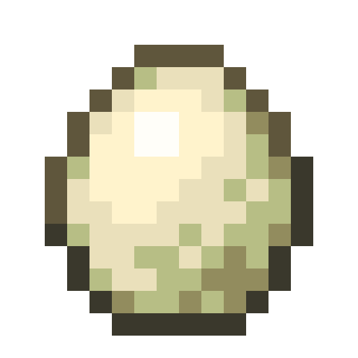

# Alligator

Last Updated: April 22, 2025 8:47 PM

---

**Return**

🐻 [Naturalist Add-On Wiki](/www.notion.so/1a7a9a61c3f1800c8e32e893d6e7f430?pvs=21)

---

The alligator is a large, semi-aquatic carnivorous reptile found in [swamps](/minecraft.fandom.com/wiki/Swamp) and other swamp-like biomes. It is a predator of other swamp animals.

<aside>

### **Alligator**

---

**Health:** 40 [♥️♥️♥️]

---

**Classification:** [Animal](/minecraft.fandom.com/wiki/Animal) / [Aquatic](/minecraft.fandom.com/wiki/Aquatic)

---

**Behavior:** Neutral

---

**Spawn:** [Swamps & Variants](/minecraft.fandom.com/wiki/Swamp)

---

</aside>

---

### 🌎 Spawning

Alligators spawn in groups of 1-2 in the [swamp](/minecraft.fandom.com/wiki/Swamp) and [mangrove swamp](/minecraft.fandom.com/wiki/Swamp) biomes. They will spawn if there are [grass blocks](/minecraft.fandom.com/wiki/Grass_Block), [mud](/minecraft.fandom.com/wiki/Mud), [mangrove roots](/minecraft.fandom.com/wiki/Mangrove_Roots), and [muddy mangrove roots](/minecraft.fandom.com/wiki/Muddy_Mangrove_Roots). 

---

### ⚔️ Drops

Adult alligator [drops](/minecraft.fandom.com/wiki/Drops) upon death:

- 1 - 3 Tooth
    - ⚔️ The maximum amount is increased by 1 per level of [Looting](/minecraft.fandom.com/wiki/Looting), for a maximum of 1-6 with Looting III
- 🟢 1 - 3 [Experience](/minecraft.fandom.com/wiki/Experience) Orbs if killed by Player or Tamed [Wolf](/minecraft.fandom.com/wiki/Wolf)
- 🟢 1 - 7 Experience Orbs upon [breeding](/minecraft.fandom.com/wiki/Breeding).

*Hatchlings yield no items nor experience.*

---

### 🧠 Behavior

Alligators can exist in a passive or hostile state. The hatchlings are passive; adults are hostile when you are near **alligator eggs** or provoked (unless they’re killed in one hit).

Alligators occasionally attack animals like [pigs](/minecraft.fandom.com/wiki/Pig), [cows](/minecraft.fandom.com/wiki/Cow), [sheep](/minecraft.fandom.com/wiki/Sheep), deer, and catfish.

---

### 🥚Breeding

Adult alligators with full health can be [bred](/minecraft.fandom.com/wiki/Breeding) with [raw beef](/minecraft.wiki/w/Raw_Beef), [raw porkchops](/minecraft.wiki/w/Raw_Porkchop), [raw chicken](/minecraft.wiki/w/Raw_Chicken), and [raw rabbit](/minecraft.wiki/w/Raw_Rabbit), raw venison, and raw catfish. There is a 5-minute cooldown for breeding, during which the alligators do not accept raw meat for breeding.

Upon successful breeding, one alligator will find sand, [grass](/minecraft.fandom.com/wiki/Grass_Block), [dirt](/minecraft.wiki/w/Dirt), or [mud](/minecraft.fandom.com/wiki/Mud) to lay their egg on. If in survival mode, the egg can be broken with 1 hit, and it will drop as an item. Once the egg is placed in the world, the egg hatch timer will restart. There are visuals for the egg hatching, and a cracking sound will be emitted when the egg hatches and a hatchling appears.

---

### 🖼️ Gallery

.png)

---

<aside>
 Have additional questions? Want to be a part of our community? → [Join our Discord!](/discord.com/invite/starfishstudios)

</aside>

<aside>

[**Marketplace](/www.minecraft.net/en-us/marketplace/creator?name=Starfish%20Studios)      [CurseForge](/www.curseforge.com/members/starfish_studios/projects)      [TikTok](/www.tiktok.com/@starfishstudios)      [Instagram](/www.instagram.com/starfishstudiosinc/)      [Twitter](/twitter.com/starfishstudios)      [YouTube](/www.youtube.com/@starfishstudios)      [Website](/starfish-studios.com/)**

</aside>
