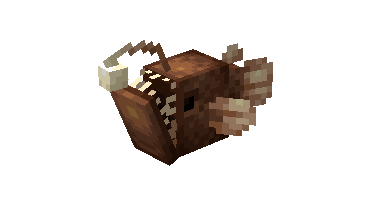
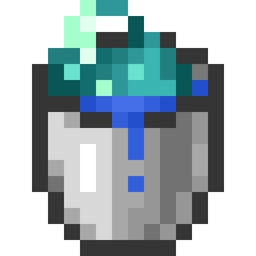
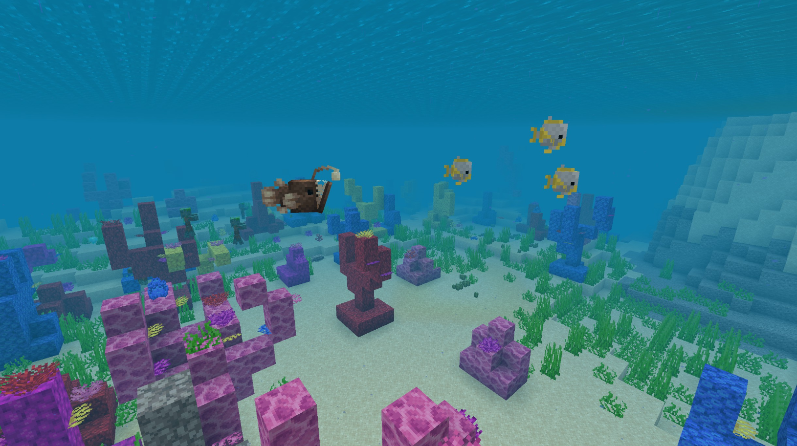
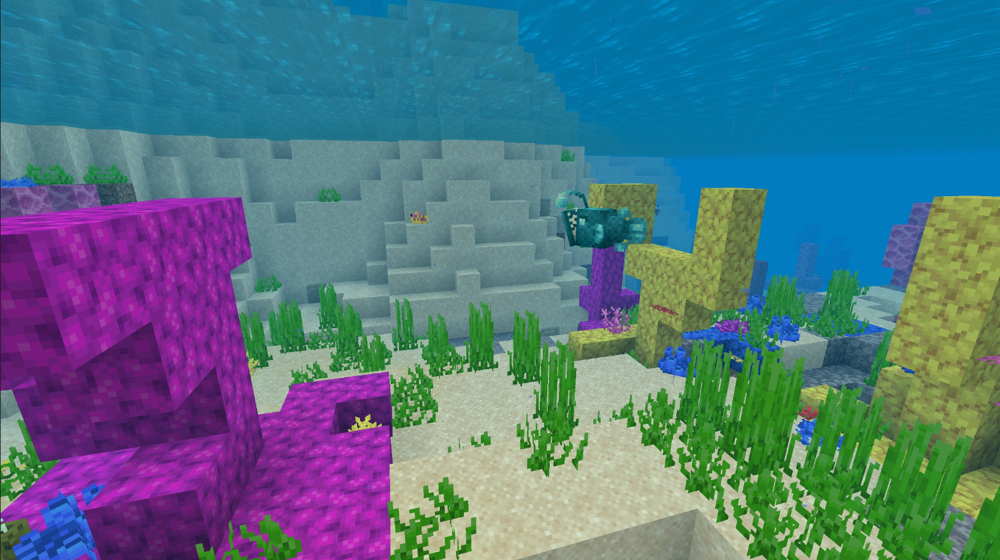
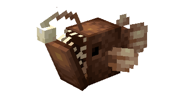
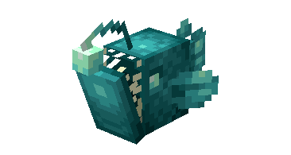

# Anglerfish

Last Updated: April 22, 2025 8:47 PM

---

**Return**

🐻 [Naturalist Add-On Wiki](/www.notion.so/1a7a9a61c3f1800c8e32e893d6e7f430?pvs=21)

---

The anglerfish is a deep-sea predator known for its bizarre appearance, sharp fangs, and bioluminescent lure extending from the top of its head. Anglerfish can be found in oceans and other ocean-like biomes. It is a predator of [tropical fish](/minecraft.fandom.com/wiki/Tropical_Fish).

<aside>

### **Anglerfish**

---

**Health: 8** [♥️♥️♥️]

---

**Classification:** [Animal](/minecraft.fandom.com/wiki/Animal) / [Aquatic](/minecraft.fandom.com/wiki/Aquatic)

---

**Behavior:** Neutral

---

**Spawn: [Ocean & Variants](/minecraft.fandom.com/wiki/Ocean)**

---

</aside>

---

### 🌎 Spawning

Anglerfish spawn underwater in the [ocean](/minecraft.fandom.com/wiki/Ocean) and other ocean-like biomes. These fish will spawn between coordinates Y -20 & Y 64. 

---

### ⚔️ Drops

Anglerfish [drops](/minecraft.fandom.com/wiki/Drops) upon death:

- 0 - 2 [Glowstone Dust](/minecraft.wiki/w/Glowstone_Dust).
    - ⚔️ The maximum amount is increased by 1 per level of [Looting](/minecraft.fandom.com/wiki/Looting), for a maximum of 0-6 with Looting III
- 0 - 1 Raw Anglerfish
    - ⚔️ The maximum amount is increased by 1 per level of [Looting](/minecraft.fandom.com/wiki/Looting), for a maximum of 0-3 with Looting III.
- 0 - 1 Cooked Anglerfish
    - ⚔️ Cooked Anglerfish can be dropped when killed on land with [Smelting](/minecraft.fandom.com/wiki/Fire_Aspect) or [Flame](/minecraft.fandom.com/wiki/Flame) enchantment. This will not work when the Anglerfish is killed underwater.
- 🟢1 - 3 [Experience](/minecraft.fandom.com/wiki/Experience) Orbs if killed by Player.

*Baby Anglerfish will not drop experience orbs when killed.*

---

### 🧠 Behavior

Anglerfish are aggressive predators that will attack both players and [tropical fish](/minecraft.fandom.com/wiki/Tropical_Fish). 

The player may collect anglerfish by using a [water bucket](/minecraft.fandom.com/wiki/Water_bucket) on it, which gives the player a bucket of anglerfish/bucket of glow anglerfish. Anglerfish placed with buckets do not despawn naturally. When that fish bucket is used against a block, it empties the bucket, placing water with the anglerfish swimming in it.

**Weakness:**

Anglerfish are unable to survive out of water. Outside of water, they flop around for a while until, eventually, they start to suffocate and die. Anglerfish cannot be put in a [cauldron](/minecraft.fandom.com/wiki/Cauldron).

---

### 🖼️ Gallery

Anglerfish hunting tropical fish

Glow Anglerfish hunting tropical fish

---

### 🎨 Variants

                                 Anglerfish

                             Glow Anglerfish

---

<aside>
 Have additional questions? Want to be a part of our community? → [Join our Discord!](/discord.com/invite/starfishstudios)

</aside>

<aside>

[**Marketplace](/www.minecraft.net/en-us/marketplace/creator?name=Starfish%20Studios)      [CurseForge](/www.curseforge.com/members/starfish_studios/projects)      [TikTok](/www.tiktok.com/@starfishstudios)      [Instagram](/www.instagram.com/starfishstudiosinc/)      [Twitter](/twitter.com/starfishstudios)      [YouTube](/www.youtube.com/@starfishstudios)      [Website](/starfish-studios.com/)**

</aside>
