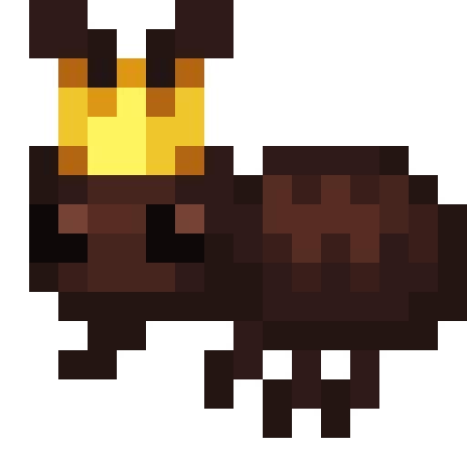
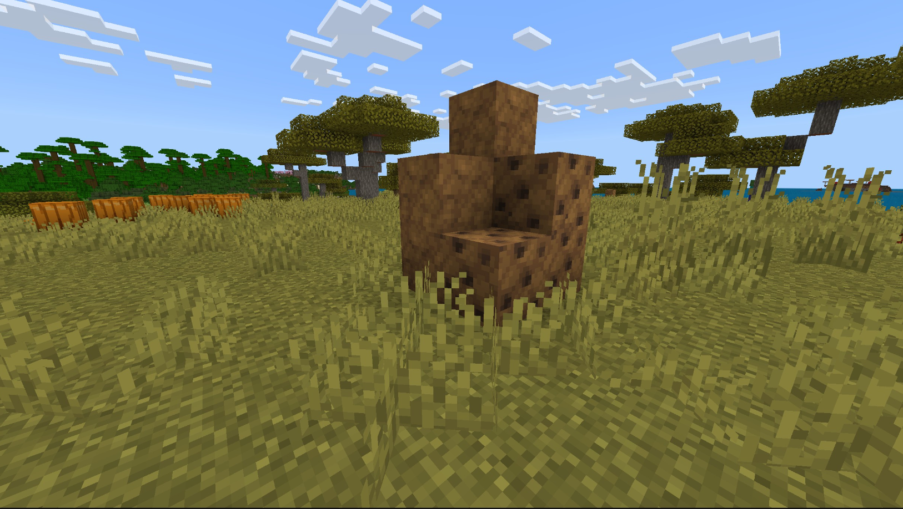
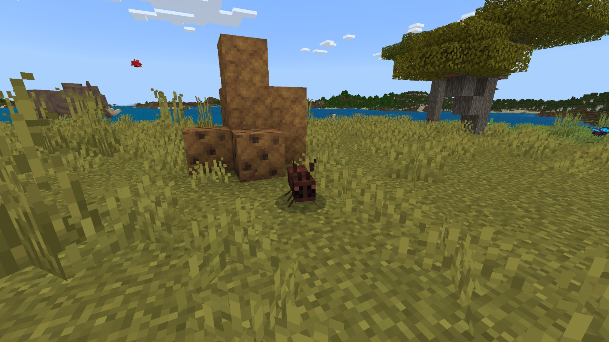

# Fourmi

Dernière mise à jour : 22 avril 2025 20h47

---

**Retour**

🐻 [Wiki de l'extension Naturalist](/www.notion.so/1a7a9a61c3f1800c8e32e893d6e7f430?pvs=21)

---

Les fourmis sont des arthropodes fascinants avec les durées de vie les plus longues. Elles peuvent porter des objets 50 fois leur poids corporel et communiquer en utilisant des produits chimiques appelés phéromones. Les colonies de fourmis sont dirigées par une seule reine, et ces fourmis construisent des nids complexes pour protéger leur reine.

<aside>

### **Fourmi**

---

**Santé : 5** [♥️♥️♥️]

---

**Classification :** [Arthropode](/minecraft.fandom.com/wiki/Arthropods)

---

**Comportement :** Passif

---

**Apparition :** N/A

---

</aside>

---

### 🌎 Apparition

Les fourmis n'apparaissent pas naturellement dans le monde normal ; cependant, leurs fourmilières peuvent être couramment trouvées dans les biomes de [savane](/minecraft.wiki/w/Savanna) et de [jungle](/minecraft.wiki/w/Jungle). Si un bloc de fourmilière est cassé, une fourmi en sortira ! Si le joueur a de la chance, il pourra repérer une reine fourmi, qui peut être utilisée pour créer plus de fourmilières.

---

### 🧠 Comportement

Les fourmis se trouvent dans de nouvelles structures qui apparaissent dans le monde, les Fourmilières. Ce sont de petites collines construites à partir de blocs dans lesquels les fourmis peuvent entrer et sortir, comme les nids d'abeilles.

- S'il n'y a pas de fourmis à l'extérieur des fourmilières, les fourmiliers s'approcheront des blocs et creuseront dedans, forçant les fourmis à en sortir avant de les manger.
- Chaque fourmilière a un seul bloc "Reine Fourmi" qui, lorsqu'il est cassé, laissera tomber un objet Reine Fourmi.

**Filet de capture :**

Les fourmis peuvent être attrapées dans des filets de capture. Si une fourmi est attrapée, elle entrera dans l'inventaire du joueur sous forme d'objet. Si l'inventaire est plein, la fourmi tombera au sol devant le joueur.

- Une fourmi est utilisée en appuyant sur "utiliser" sur n'importe quelle surface (haut, bas ou côté) d'un bloc. Lorsqu'elle est utilisée sur une surface supérieure, la fourmi apparaît avec ses pattes immédiatement adjacentes à la surface. Cette interaction est similaire à un [œuf d'apparition](/minecraft.fandom.com/wiki/Spawn_Egg). Les surfaces des blocs sont prioritaires pour l'apparition ; si aucune n'est à portée, les créatures peuvent également apparaître dans l'[eau](/minecraft.fandom.com/wiki/Water).
- Les fourmis peuvent être données à d'autres animaux pour les apprivoiser ou la [reproduction](/minecraft.fandom.com/wiki/Breeding).

---

### 🖼️ Galerie

---

<aside>
 Des questions supplémentaires ? Vous voulez faire partie de notre communauté ? → [Rejoignez notre Discord !](/discord.com/invite/starfishstudios)

</aside>

<aside>

[**Marketplace](/www.minecraft.net/en-us/marketplace/creator?name=Starfish%20Studios)      [CurseForge](/www.curseforge.com/members/starfish_studios/projects)      [TikTok](/www.tiktok.com/@starfishstudios)      [Instagram](/www.instagram.com/starfishstudiosinc/)      [Twitter](/twitter.com/starfishstudios)      [YouTube](/www.youtube.com/@starfishstudios)      [Website](/starfish-studios.com/)**

</aside> 