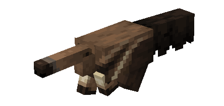
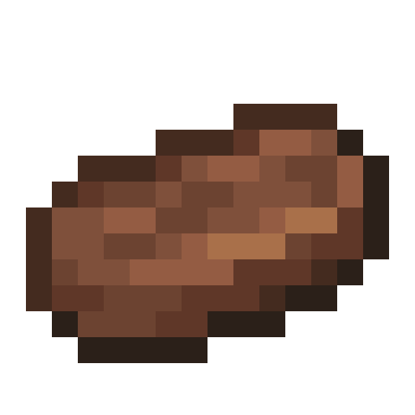
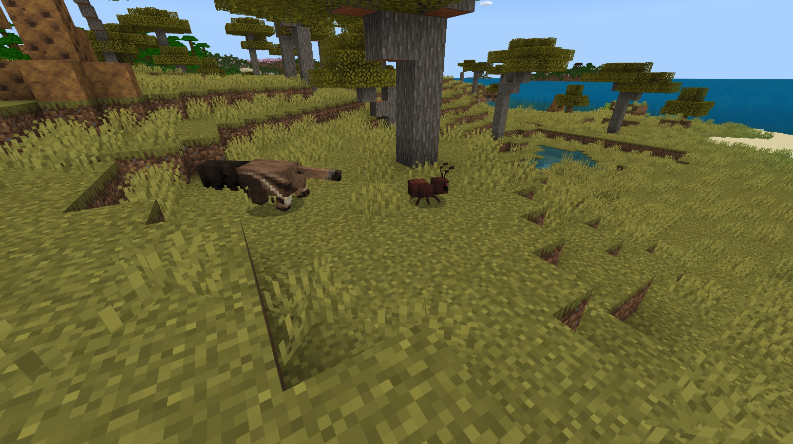
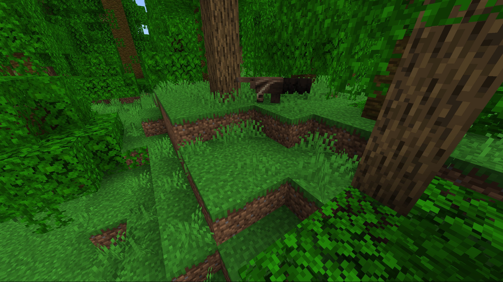
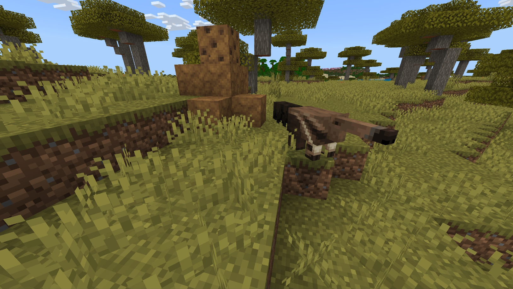

# Fourmilier

Dernière mise à jour : 22 avril 2025 20h47

---

**Retour**

🐻 [Wiki de l'extension Naturalist](/www.notion.so/1a7a9a61c3f1800c8e32e893d6e7f430?pvs=21)

---

Les fourmiliers sont originaires d'Amérique centrale et du Sud. Ils n'ont pas de dents, mais utilisent leur longue langue (plus longue que celle de tout autre mammifère) pour manger. Leur odorat est 40 fois plus développé que celui des humains, ce qui les aide à identifier les sources de nourriture.

<aside>

### **Fourmilier**

---

**Santé : 20** [♥️♥️♥️]

---

**Classification :** [Animal](/minecraft.fandom.com/wiki/Animal)

---

**Comportement :** Neutre

---

**Apparition :** [Jungle](/minecraft.wiki/w/Jungle) & [Savane](/minecraft.wiki/w/Savanna)

---

</aside>

---

### 🌎 Apparition

Un groupe de 1 à 2 fourmiliers apparaît dans les biomes de [jungle](/minecraft.wiki/w/Jungle) et de [savane](/minecraft.wiki/w/Savanna). Ils apparaîtront sur des [blocs d'herbe](/minecraft.fandom.com/wiki/Grass_Block) pendant la journée avec des [niveaux de lumière](/minecraft.fandom.com/wiki/Light) de 7 à 15.

---

### ⚔️ Butin

Le fourmilier [laisse tomber](/minecraft.fandom.com/wiki/Drops) à sa mort :

- 1 - 2 Viande de brousse
    - ⚔️ La quantité maximale est augmentée de 1 par niveau de [Butin](/minecraft.fandom.com/wiki/Looting), pour un maximum de 1-6 avec Butin III
- 🟢 1 - 3 Orbes d'[expérience](/minecraft.fandom.com/wiki/Experience) si tué par un joueur
- 🟢 1 - 7 Orbes d'expérience lors de la [reproduction](/minecraft.fandom.com/wiki/Breeding)

*Les bébés ne donnent ni objets ni expérience.*

---

### 🧠 Comportement

Les fourmiliers sont des créatures neutres qui apparaissent près des fourmilières. Ils errent sans but tout en reniflant le sol ou l'air. Quand ils ont faim, ils creuseront dans les fourmilières pour en extraire une collation croustillante.

Les fourmiliers, une fois apprivoisés, creuseront occasionnellement le sol pour trouver des objets aléatoires et peuvent faire apparaître des objets tels que des scarabées, des fourmis, des pépites d'or, des racines suspendues, des os, ou même des taupes vivantes !

---

### ❤️ Apprivoisement, Soins et Nourriture

Un fourmilier peut être apprivoisé avec des termites et des fourmis. Il y a 75% de chances de réussir l'apprivoisement. Une fois apprivoisé, vous verrez des cœurs apparaître, et un t-shirt apparaîtra sur leur corps, signifiant que vous avez apprivoisé le fourmilier. Vous pouvez teindre le t-shirt à la couleur de votre choix ou utiliser des cisailles pour le retirer. Si vous retirez le t-shirt, il peut être réappliqué en utilisant une couleur de teinture de votre choix.

Les fourmiliers apprivoisés ne peuvent pas être commandés et ne suivront jamais un joueur. Pour garder vos fourmiliers dans une zone spécifique, vous pouvez leur mettre une laisse et les attacher à une clôture ou construire un enclos autour d'eux.

---

### 🥚Reproduction

Les fourmiliers adultes en pleine santé peuvent se [reproduire](/minecraft.fandom.com/wiki/Breeding) avec du [rayon de miel](/minecraft.wiki/w/Honeycomb). Il y a un temps de recharge de 5 minutes pour la reproduction, pendant lequel les fourmiliers n'acceptent pas de rayon de miel pour se reproduire.

Les bébés fourmiliers monteront sur leurs parents jusqu'à ce qu'ils grandissent, moment auquel ils descendront immédiatement. La croissance des bébés peut être lentement accélérée en utilisant des fourmis et des reines fourmis.

---

### 🖼️ Galerie

---

<aside>
 Des questions supplémentaires ? Vous voulez faire partie de notre communauté ? → [Rejoignez notre Discord !](/discord.com/invite/starfishstudios)

</aside>

<aside>

[**Marketplace](/www.minecraft.net/en-us/marketplace/creator?name=Starfish%20Studios)      [CurseForge](/www.curseforge.com/members/starfish_studios/projects)      [TikTok](/www.tiktok.com/@starfishstudios)      [Instagram](/www.instagram.com/starfishstudiosinc/)      [Twitter](/twitter.com/starfishstudios)      [YouTube](/www.youtube.com/@starfishstudios)      [Website](/starfish-studios.com/)**

</aside> 