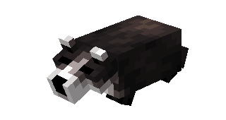
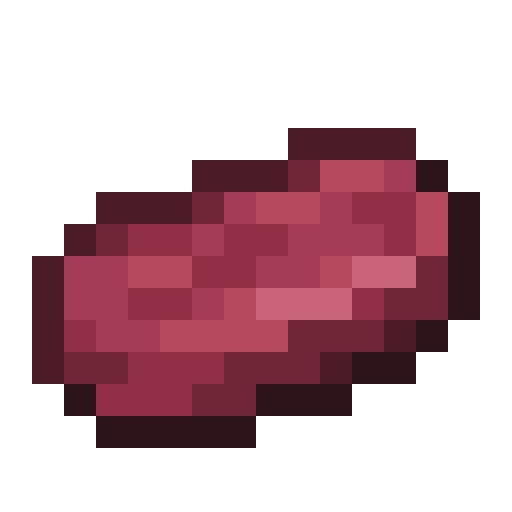
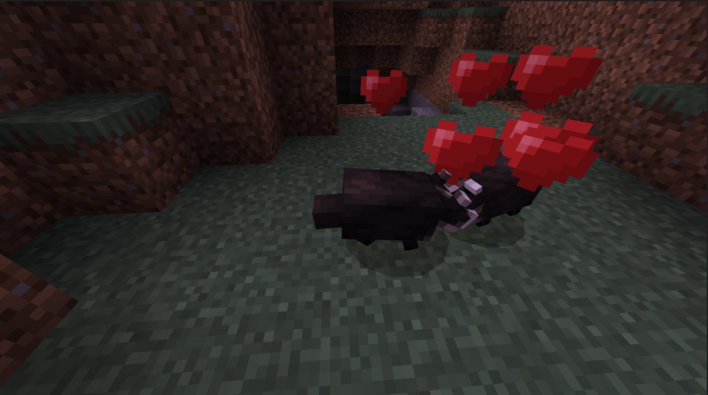
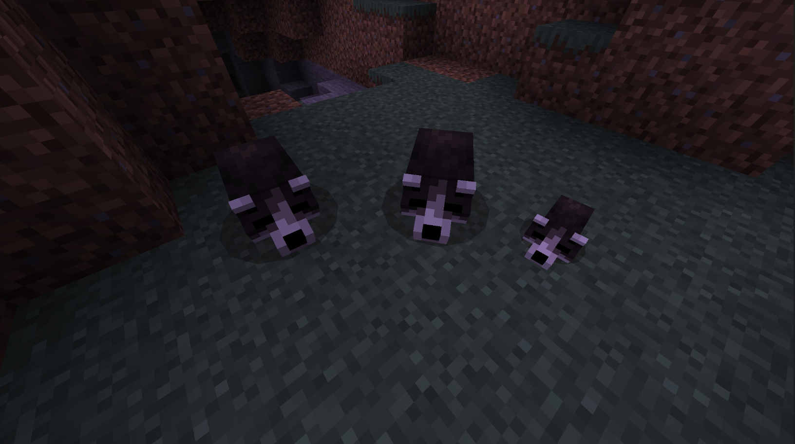
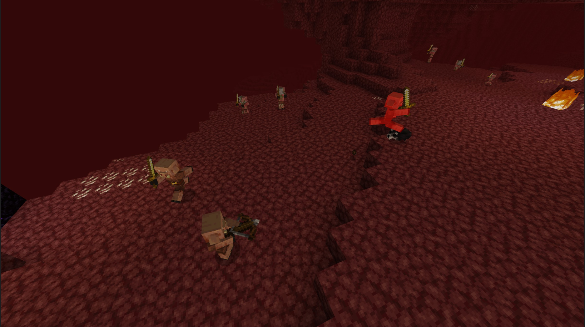

# Badger

Last Updated: April 22, 2025 8:47 PM

---

**Return**

🐻 [Naturalist Add-On Wiki](/www.notion.so/1a7a9a61c3f1800c8e32e893d6e7f430?pvs=21)

---

Badgers are small mammals with flat, wedge-shaped bodies, broad feet with long claws, and coarse hair. They spend most of their time underground, only coming out at night to hunt.

<aside>

### Badger

---

**Health: 6** [♥️♥️♥️]

---

**Classification:** [Animal](/minecraft.fandom.com/wiki/Animal)

---

**Behavior:** Neutral

---

**Spawn: [Forest](/minecraft.fandom.com/wiki/Forest), [Hills](/minecraft.fandom.com/wiki/Biome), [Taiga](/minecraft.fandom.com/wiki/Taiga), and [Lush Caves](/minecraft.fandom.com/wiki/Biome) near cave entrances.**

---

</aside>

---

### 🌎 Spawning

Badgers will spawn in groups of 1-2 near cave entrances in the [forest](/minecraft.fandom.com/wiki/Forest)**,** [hills](/minecraft.fandom.com/wiki/Biome)**,** [taiga](/minecraft.fandom.com/wiki/Taiga)**,** and [lush cave](/minecraft.fandom.com/wiki/Biome) biomes. These animals are more active at night and will spawn with [light levels](/minecraft.fandom.com/wiki/Light) of 7 or less.

---

### ⚔️ Drops

Badger [drops](/minecraft.fandom.com/wiki/Drops) upon death:

- 0 - 1 Fur.
    - ⚔️ The maximum amount is increased by 1 per level of [Looting](/minecraft.fandom.com/wiki/Looting), for a maximum of 0-3 with Looting III
- 0 - 1 Raw Bushmeat
    - ⚔️ The maximum amount is increased by 1 per level of [Looting](/minecraft.fandom.com/wiki/Looting), for a maximum of 0-3 with Looting III.
- 0 - 1 Cooked Bushmeat
    - ⚔️ Cooked Bushmeat can be dropped when killed on land with [Smelting](/minecraft.fandom.com/wiki/Fire_Aspect) or [Flame](/minecraft.fandom.com/wiki/Flame) enchantment. This will not work when a Badger is killed while swimming.
- 🟢1 - 3 [Experience](/minecraft.fandom.com/wiki/Experience) Orbs if killed by Player.
- 🟢 1 - 7 Experience Orbs upon [breeding](/minecraft.fandom.com/wiki/Breeding).

*Cubs will not drop experience orbs when killed.*

---

### 🧠 Behavior

Badgers can exist in a passive or hostile state. The cubs are passive; adult badgers only enter a hostile state near [Piglins](/minecraft.fandom.com/wiki/Piglin) and will attack them. 

Badgers thrive in caves/underground, and if spotted outside in the daytime, you’ll likely find it taking a nap!

---

### 🥚Breeding

Adult Badgers with full health can be [bred](/minecraft.fandom.com/wiki/Breeding) with [sweet berries](/minecraft.wiki/w/Sweet_Berries). There is a 5-minute cooldown for breeding, during which the badger will not accept sweet berries but will if they get injured and need to heal.
Upon successful breeding, a cub will be born. The growth of cubs can be slowly accelerated by using sweet berries.

---

### 🖼️ Gallery

---

<aside>
 Have additional questions? Want to be a part of our community? → [Join our Discord!](/discord.com/invite/starfishstudios)

</aside>

<aside>

[**Marketplace](/www.minecraft.net/en-us/marketplace/creator?name=Starfish%20Studios)      [CurseForge](/www.curseforge.com/members/starfish_studios/projects)      [TikTok](/www.tiktok.com/@starfishstudios)      [Instagram](/www.instagram.com/starfishstudiosinc/)      [Twitter](/twitter.com/starfishstudios)      [YouTube](/www.youtube.com/@starfishstudios)      [Website](/starfish-studios.com/)**

</aside>
