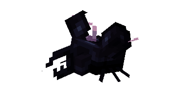
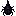
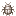
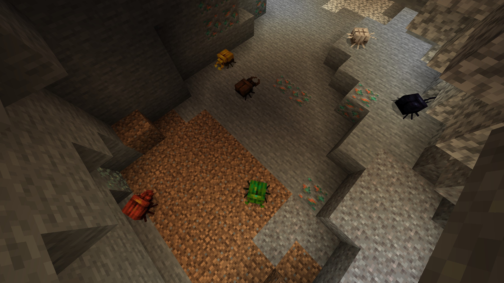
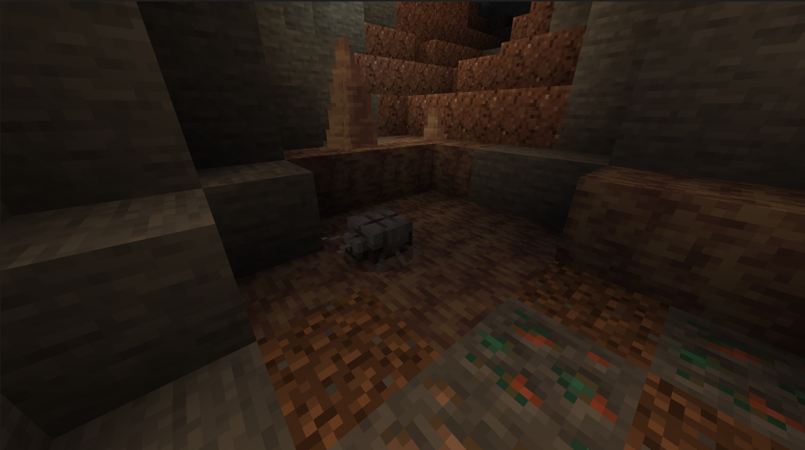
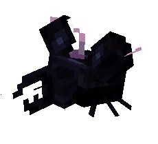

# Scarabée

Dernière mise à jour : 22 avril 2025 20h47

---

**Retour**

🐻 [Wiki de l'extension Naturalist](/www.notion.so/1a7a9a61c3f1800c8e32e893d6e7f430?pvs=21)

---

Les scarabées sont des arthropodes qui ne voient pas très bien. Vous trouverez ces insectes sous terre, où ils se fient aux sons ou aux vibrations. Ils existent en plusieurs couleurs, notamment noir, marron, vert, rouge, blanc et jaune. Les scarabées peuvent être attrapés avec un filet de capture, mais bonne chance pour les attraper car ces insectes peuvent voler !

<aside>

### Scarabée

---

**Santé : 5** [♥️♥️♥️]

---

**Classification :** [Arthropode](/minecraft.fandom.com/wiki/Arthropods)

---

**Comportement :** Passif

---

**Apparition :**

**Variantes aléatoires :** [Plaines, Jungle et Jungle de bambou](/minecraft.fandom.com/wiki/Dripstone_Caves)

**Scarabée blanc :** [Grottes luxuriantes](/minecraft.fandom.com/wiki/Lush_Caves) et [Grottes à stalactites](/minecraft.fandom.com/wiki/Dripstone_Caves)

---

</aside>

---

### 🌎 Apparition

Les scarabées apparaîtront en groupes de 1 à 2 et ont 6 variantes qui apparaîtront sous terre dans les biomes de [Plaines, Jungle et Jungle de bambou](/minecraft.fandom.com/wiki/Dripstone_Caves). Le scarabée blanc est le seul qui apparaîtra dans les [Grottes luxuriantes](/minecraft.fandom.com/wiki/Lush_Caves) et les [Grottes à stalactites](/minecraft.fandom.com/wiki/Dripstone_Caves).

---

### ⚔️ Butin

Le scarabée [laisse tomber](/minecraft.fandom.com/wiki/Drops) à sa mort :

- 0 - 1 Aile d'insecte
    - ⚔️ La quantité maximale est augmentée de 1 par niveau de [Butin](/minecraft.fandom.com/wiki/Looting), pour un maximum de 0-3 avec Butin III
- 🟢 1 - 3 Orbes d'[expérience](/minecraft.fandom.com/wiki/Experience) si tué par un joueur

---

### 🧠 Comportement

Les scarabées sont des insectes passifs qui prendront leur envol dès qu'un joueur s'approche pour tenter de fuir. Ils ne fuient pas les animaux ou les créatures.

**Filet de capture :**

Les scarabées peuvent être attrapés dans des filets de capture. Si un scarabée est attrapé, le scarabée (dans sa variante) entrera dans l'inventaire du joueur comme un objet. Si l'inventaire est plein, le scarabée tombera au sol devant le joueur.

- Un scarabée est utilisé en appuyant sur "utiliser" sur n'importe quelle surface (haut, bas ou côté) d'un bloc. Lorsqu'il est utilisé sur une surface supérieure, le scarabée apparaît avec ses pattes immédiatement adjacentes à la surface. Cette interaction est similaire à un [œuf d'apparition](/minecraft.fandom.com/wiki/Spawn_Egg). Les surfaces des blocs sont prioritaires pour l'apparition ; si aucune n'est à portée, les créatures peuvent également apparaître dans l'[eau](/minecraft.fandom.com/wiki/Water).
- Les scarabées peuvent être donnés à d'autres animaux pour l'apprivoisement/[reproduction](/minecraft.fandom.com/wiki/Breeding).

---

### 🖼️ Galerie

---

### 🎨 Variantes

                Scarabée noir

---

<aside>
 Des questions supplémentaires ? Vous voulez faire partie de notre communauté ? → [Rejoignez notre Discord !](/discord.com/invite/starfishstudios)

</aside>

<aside>

[**Marketplace](/www.minecraft.net/en-us/marketplace/creator?name=Starfish%20Studios)      [CurseForge](/www.curseforge.com/members/starfish_studios/projects)      [TikTok](/www.tiktok.com/@starfishstudios)      [Instagram](/www.instagram.com/starfishstudiosinc/)      [Twitter](/twitter.com/starfishstudios)      [YouTube](/www.youtube.com/@starfishstudios)      [Website](/starfish-studios.com/)**

</aside> 