# Bird

Last Updated: April 22, 2025 8:47 PM

---

**Return**

🐻 [Naturalist Add-On Wiki](/www.notion.so/1a7a9a61c3f1800c8e32e893d6e7f430?pvs=21)

---

Small birds are lightweight, agile animals that have compact bodies, small beaks, and a fast wingbeat. These birds flit between trees and the ground while singing their melodious songs. You can find them in various biomes and even befriend them!

<aside>

### **Birds**

---

**Health: 6** [♥️♥️♥️]

---

**Classification:** [Animal](/minecraft.fandom.com/wiki/Animal) 

---

**Behavior:** Passive

---

**Spawn:** [Overworld Biomes](/minecraft.wiki/w/Overworld)

*(See breakdown below)*

---

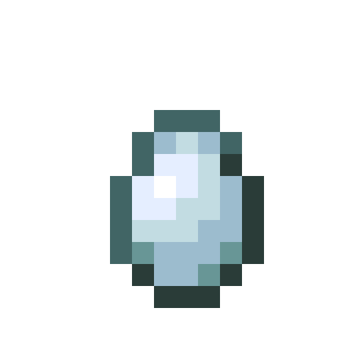

</aside>

---

### 🌎 Spawning

All bird variations will spawn in groups of 1-4 on [grass](/minecraft.wiki/w/Short_Grass), [leaves](/minecraft.wiki/w/Leaves), and [logs](/minecraft.wiki/w/Log). They will spawn during the daytime with [light levels](/minecraft.fandom.com/wiki/Light) between 7-15.

| Bird Variation | Spawn Biomes | Will Not Spawn |
| --- | --- | --- |
| 

       Bluejay | [Extreme Hills](/minecraft.wiki/w/Windswept_Hills)
[Frozen Peaks](/minecraft.wiki/w/Frozen_Peaks)
[Ice Plains](/minecraft.wiki/w/Snowy_Plains)
[Snowy Slopes](/minecraft.wiki/w/Snowy_Slopes)
[Taiga](/minecraft.fandom.com/wiki/Taiga) |  |
|       Canary | [Extreme Hills](/minecraft.wiki/w/Windswept_Hills)
[Mountains](/minecraft.wiki/w/Mountains) | [Groves](/minecraft.wiki/w/Grove) |
| 

       Cardinal | [Birch Forest](/minecraft.wiki/w/Birch_Forest)
[Desert](/minecraft.wiki/w/Desert)
[Flower Forest](/minecraft.wiki/w/Flower_Forest)
[Forest](/minecraft.wiki/w/Forest)
[Grove](/minecraft.wiki/w/Grove)
[Mangrove Swamp](/minecraft.wiki/w/Mangrove_Swamp)
[Savanna](/minecraft.wiki/w/Savanna)
[Swamp](/minecraft.wiki/w/Swamp) | Frozen Variants |
|         Finch | [Forest](/minecraft.wiki/w/Forest)
[Savanna](/minecraft.wiki/w/Savanna) |  |
| 

       Robin | [Birch Forest](/minecraft.wiki/w/Birch_Forest)
[Flower Forest](/minecraft.wiki/w/Flower_Forest)
[Forest](/minecraft.wiki/w/Forest)
[Mega Taiga](/minecraft.wiki/w/Old_Growth_Pine_Taiga)
[Mega Taiga Hills](/minecraft.wiki/w/Giant_Tree_Taiga_Hills)
[Taiga Hills](/minecraft.wiki/w/Taiga_Hills)
[Mountains](/minecraft.wiki/w/Mountains) | Frozen Variants |
|      Sparrow | [Cherry Grove](/minecraft.wiki/w/Cherry_Grove)
[Plains](/minecraft.wiki/w/Plains) |  |

---

### ⚔️ Drops

All bird variation [drops](/minecraft.fandom.com/wiki/Drops) upon death.

- 0 - 1 Feather
    - ⚔️ The maximum amount is increased by 1 per level of [Looting](/minecraft.fandom.com/wiki/Looting), for a maximum of 0-3 with Looting III.
- 🟢1 - 3 [Experience](/minecraft.fandom.com/wiki/Experience) Orbs if killed by Player or [poisoned](/minecraft.wiki/w/Poison).

*Hatchlings yield no items nor experience.*

---

### 🧠 Behavior

Birds are passive animals found in the overworld. Each bird can be found in their specific biome and identified by their color. If you cannot find birds in the wild, listen for their chirps to indicate they are nearby!

Birds fly around idly and land frequently to rest. They will flap their wings to swim and to mitigate fall damage.

---

### ❤️ Taming, Healing, & Feeding

Birds can be tamed with [wheat seeds](/minecraft.wiki/w/Wheat_Seeds), [pumpkin seeds](/minecraft.wiki/w/Pumpkin_Seeds), [melon seeds](/minecraft.wiki/w/Melon_Seeds), and [beetroot seeds](/minecraft.wiki/w/Beetroot_Seeds).  There is a 33% chance of successful taming. Once they are tamed, you will see hearts appear and a ribbon on their left leg signifying you have tamed the bird. You can [dye](/minecraft.fandom.com/wiki/Dye) the ribbon to your color of choice or use [shears](/minecraft.fandom.com/wiki/Shears) to cut off the ribbon. If you shear off the ribbon, it can be reapplied by using a dye color of your choice.

Tamed birds can be commanded to sit or to follow.

- Birds will teleport to the player if the player is further than 5 blocks away.
- Birds will not teleport to the player if they are commanded to sit.

If a bird you have tamed gets injured, you can feed the bird wheat seeds, pumpkin seeds, melon seeds, or beetroot seeds to increase its [health](/minecraft.fandom.com/wiki/Health) until it is maxed. 1 seed increases the bird’s health points by 2. An injured bird will be unable to breed until it is healed. 

Feeding these birds a [cookie](/minecraft.wiki/w/Cookie) will cause [Fatal Poison](/minecraft.wiki/w/Fatal_Poison) particles to be emitted, and they will lose health points. Chocolate is toxic to birds.

**Note:** *Unlike [Parrots](/minecraft.wiki/w/Parrot), these birds do not dance to a jukebox when it is playing music.*

---

### 🥚Breeding

Birds with full health can be [bred](/minecraft.fandom.com/wiki/Breeding) with [wheat seeds](/minecraft.wiki/w/Wheat_Seeds), [pumpkin seeds](/minecraft.wiki/w/Pumpkin_Seeds), [melon seeds](/minecraft.wiki/w/Melon_Seeds), and [beetroot seeds](/minecraft.wiki/w/Beetroot_Seeds). Birds require the following [leaves](/minecraft.wiki/w/Leaves) to be within a 5-block radius for breeding to initiate: Acacia leaves, azalea leaves, flowering azalea leaves, birch leaves, cherry leaves, dark oak leaves, jungle leaves, mangrove leaves, oak leaves, and spruce leaves. There is a 5-minute cooldown for breeding, during which the birds do not accept any seeds for breeding but will if they get injured and need to heal.

Upon successful breeding, the two birds will create a bird nest containing an egg. If in survival mode, the nest & egg can be broken with 1 hit, and it will drop as an item. Once the egg is placed in the world, the egg hatch timer will restart. There are no visuals for the egg hatching, however, a cracking sound will emit when the egg hatches and a hatchling appears.

**Note:** *When breeding, the birds must be of the same variant. Crossbreeding birds of different variations will not work.*

---

### 🖼️ Gallery

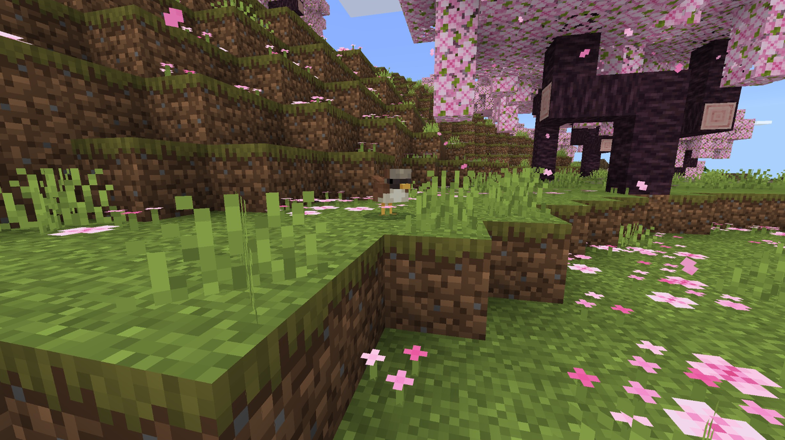

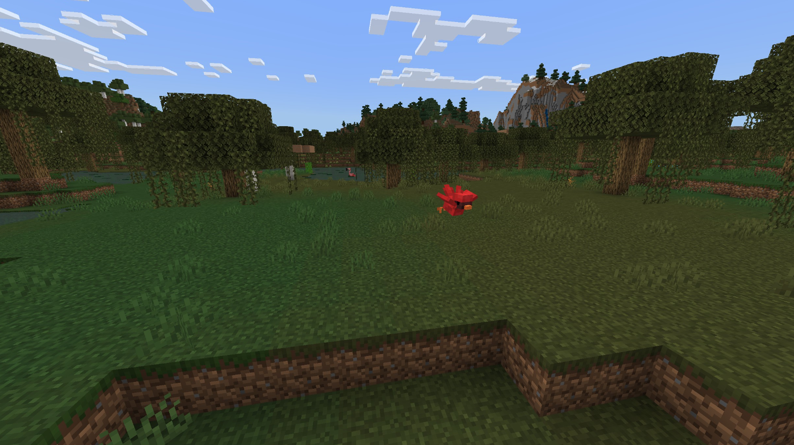

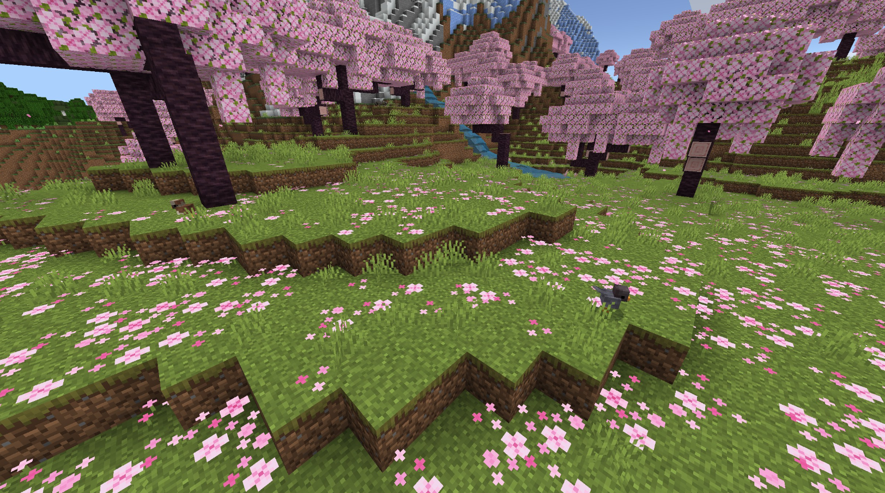

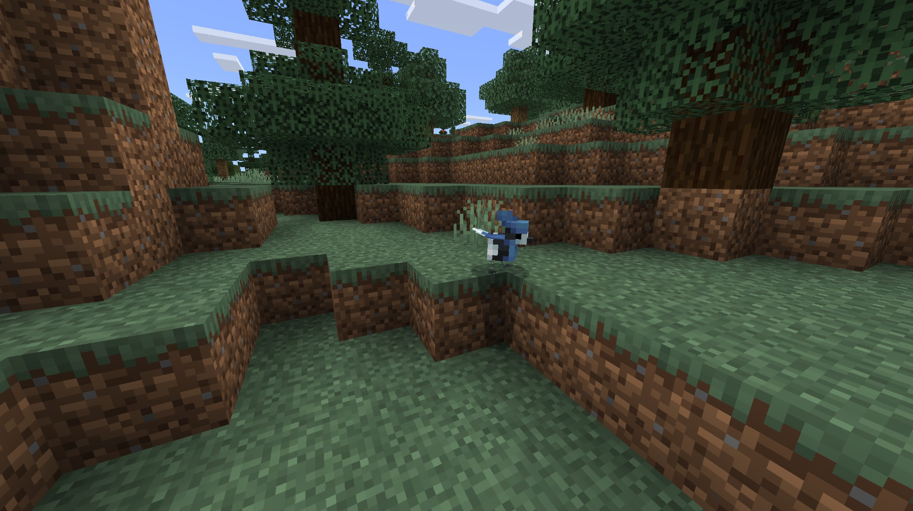

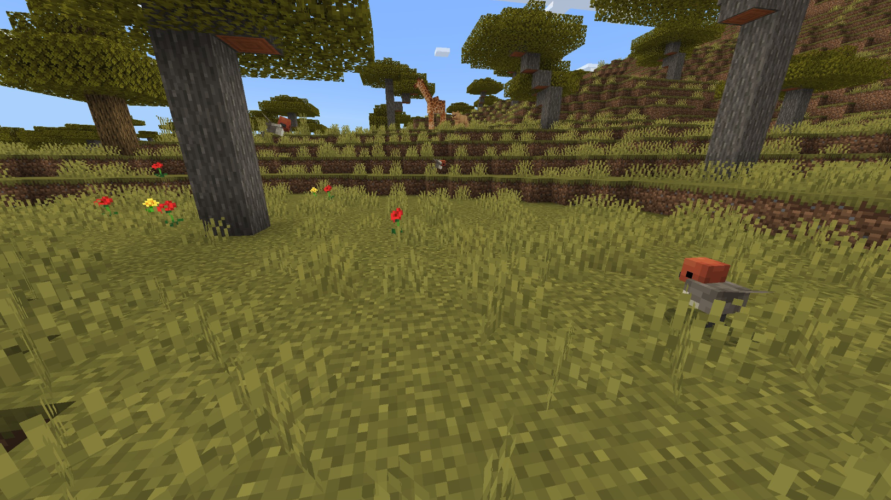

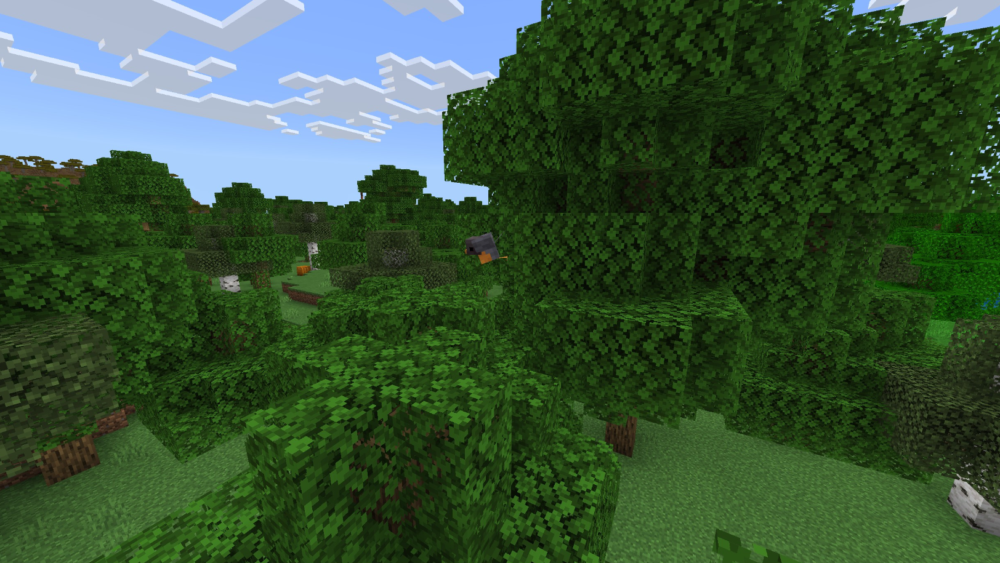

---

### 🎨 Variants

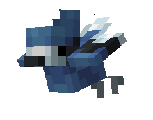

                   Bluejay

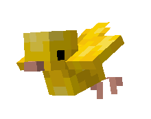

                 Canary

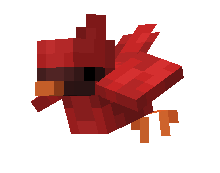

                Cardinal

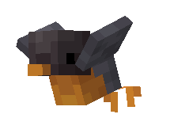

                  Finch

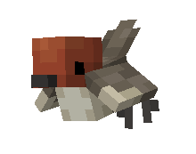

                  Robin

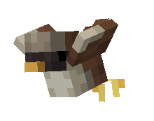

                Sparrow

---

<aside>
 Have additional questions? Want to be a part of our community? → [Join our Discord!](/discord.com/invite/starfishstudios)

</aside>

<aside>

[**Marketplace](/www.minecraft.net/en-us/marketplace/creator?name=Starfish%20Studios)      [CurseForge](/www.curseforge.com/members/starfish_studios/projects)      [TikTok](/www.tiktok.com/@starfishstudios)      [Instagram](/www.instagram.com/starfishstudiosinc/)      [Twitter](/twitter.com/starfishstudios)      [YouTube](/www.youtube.com/@starfishstudios)      [Website](/starfish-studios.com/)**

</aside>
