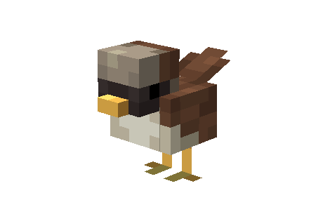
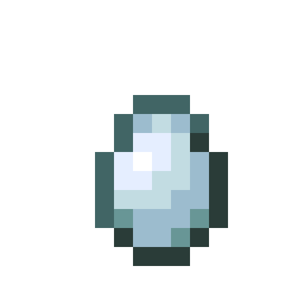

# Oiseau

Dernière mise à jour : 22 avril 2025 20h47

---

**Retour**

🐻 [Wiki de l'extension Naturalist](/www.notion.so/1a7a9a61c3f1800c8e32e893d6e7f430?pvs=21)

---

Les petits oiseaux sont des animaux légers et agiles qui ont des corps compacts, de petits becs et un battement d'ailes rapide. Ces oiseaux voltigent entre les arbres et le sol tout en chantant leurs mélodies. Vous pouvez les trouver dans divers biomes et même les apprivoiser !

<aside>

### **Oiseaux**

---

**Santé : 6** [♥️♥️♥️]

---

**Classification :** [Animal](/minecraft.fandom.com/wiki/Animal)

---

**Comportement :** Passif

---

**Apparition :** [Biomes du monde normal](/minecraft.wiki/w/Overworld)

*(Voir la répartition ci-dessous)*

---

</aside>

---

### 🌎 Apparition

Toutes les variations d'oiseaux apparaîtront en groupes de 1 à 4 sur l'[herbe](/minecraft.wiki/w/Short_Grass), les [feuilles](/minecraft.wiki/w/Leaves) et les [bûches](/minecraft.wiki/w/Log). Ils apparaîtront pendant la journée avec des [niveaux de lumière](/minecraft.fandom.com/wiki/Light) entre 7 et 15.

| Variation d'oiseau | Biomes d'apparition | N'apparaîtra pas |
| --- | --- | --- |
| 
|       Geai bleu | [Collines extrêmes](/minecraft.wiki/w/Windswept_Hills)
[Pics gelés](/minecraft.wiki/w/Frozen_Peaks)
[Plaines de glace](/minecraft.wiki/w/Snowy_Plains)
[Pentes enneigées](/minecraft.wiki/w/Snowy_Slopes)
[Taïga](/minecraft.fandom.com/wiki/Taiga) |  |
|       Canari | [Collines extrêmes](/minecraft.wiki/w/Windswept_Hills)
[Montagnes](/minecraft.wiki/w/Mountains) | [Bosquets](/minecraft.wiki/w/Grove) |
| 
|       Cardinal | [Forêt de bouleaux](/minecraft.wiki/w/Birch_Forest)
[Désert](/minecraft.wiki/w/Desert)
[Forêt fleurie](/minecraft.wiki/w/Flower_Forest)
[Forêt](/minecraft.wiki/w/Forest)
[Bosquet](/minecraft.wiki/w/Grove)
[Marais de mangroves](/minecraft.wiki/w/Mangrove_Swamp)
[Savane](/minecraft.wiki/w/Savanna)
[Marais](/minecraft.wiki/w/Swamp) | Variantes gelées |
|         Pinson | [Forêt](/minecraft.wiki/w/Forest)
[Savane](/minecraft.wiki/w/Savanna) |  |
| 
|       Rouge-gorge | [Forêt de bouleaux](/minecraft.wiki/w/Birch_Forest)
[Forêt fleurie](/minecraft.wiki/w/Flower_Forest)
[Forêt](/minecraft.wiki/w/Forest)
[Méga taïga](/minecraft.wiki/w/Old_Growth_Pine_Taiga)
[Collines de méga taïga](/minecraft.wiki/w/Giant_Tree_Taiga_Hills)
[Collines de taïga](/minecraft.wiki/w/Taiga_Hills)
[Montagnes](/minecraft.wiki/w/Mountains) | Variantes gelées |
|      Moineau | [Bosquet de cerisiers](/minecraft.wiki/w/Cherry_Grove)
[Plaines](/minecraft.wiki/w/Plains) |  |

---

### ⚔️ Butin

Toutes les variations d'oiseaux [laissent tomber](/minecraft.fandom.com/wiki/Drops) à leur mort.

- 0 - 1 Plume
    - ⚔️ La quantité maximale est augmentée de 1 par niveau de [Butin](/minecraft.fandom.com/wiki/Looting), pour un maximum de 0-3 avec Butin III
- 🟢 1 - 3 Orbes d'[expérience](/minecraft.fandom.com/wiki/Experience) si tué par un joueur ou [empoisonné](/minecraft.wiki/w/Poison)

*Les oisillons ne donnent ni objets ni expérience.*

---

### 🧠 Comportement

Les oiseaux sont des créatures passives qui volent entre les arbres et le sol. Ils chantent occasionnellement, produisant des notes musicales qui peuvent être entendues à proximité.

**Filet de capture :**

Les oiseaux peuvent être attrapés dans des filets de capture. Si un oiseau est attrapé, l'oiseau (dans sa variante) entrera dans l'inventaire du joueur comme un objet. Si l'inventaire est plein, l'oiseau tombera au sol devant le joueur.

- Un oiseau est utilisé en appuyant sur "utiliser" sur n'importe quelle surface (haut, bas ou côté) d'un bloc. Lorsqu'il est utilisé sur une surface supérieure, l'oiseau apparaît avec ses pattes immédiatement adjacentes à la surface. Cette interaction est similaire à un [œuf d'apparition](/minecraft.fandom.com/wiki/Spawn_Egg). Les surfaces des blocs sont prioritaires pour l'apparition ; si aucune n'est à portée, les créatures peuvent également apparaître dans l'[eau](/minecraft.fandom.com/wiki/Water).
- Les oiseaux peuvent être donnés à d'autres animaux pour l'apprivoisement/[reproduction](/minecraft.fandom.com/wiki/Breeding).

---

### 🖼️ Galerie

---

### 🎨 Variantes

                Geai bleu

                Canari

                Cardinal

                Pinson

                Rouge-gorge

                Moineau

---

<aside>
 Des questions supplémentaires ? Vous voulez faire partie de notre communauté ? → [Rejoignez notre Discord !](/discord.com/invite/starfishstudios)

</aside>

<aside>

[**Marketplace](/www.minecraft.net/en-us/marketplace/creator?name=Starfish%20Studios)      [CurseForge](/www.curseforge.com/members/starfish_studios/projects)      [TikTok](/www.tiktok.com/@starfishstudios)      [Instagram](/www.instagram.com/starfishstudiosinc/)      [Twitter](/twitter.com/starfishstudios)      [YouTube](/www.youtube.com/@starfishstudios)      [Website](/starfish-studios.com/)**

</aside> 