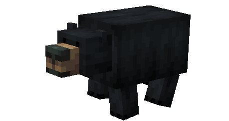
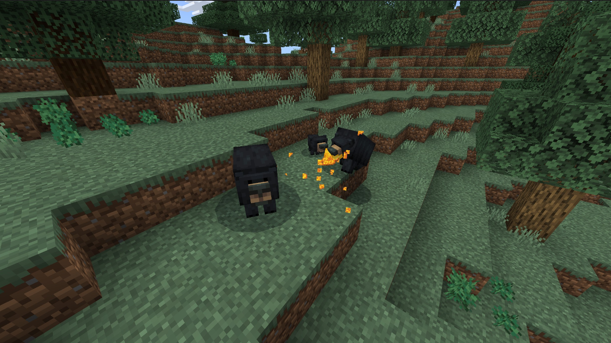
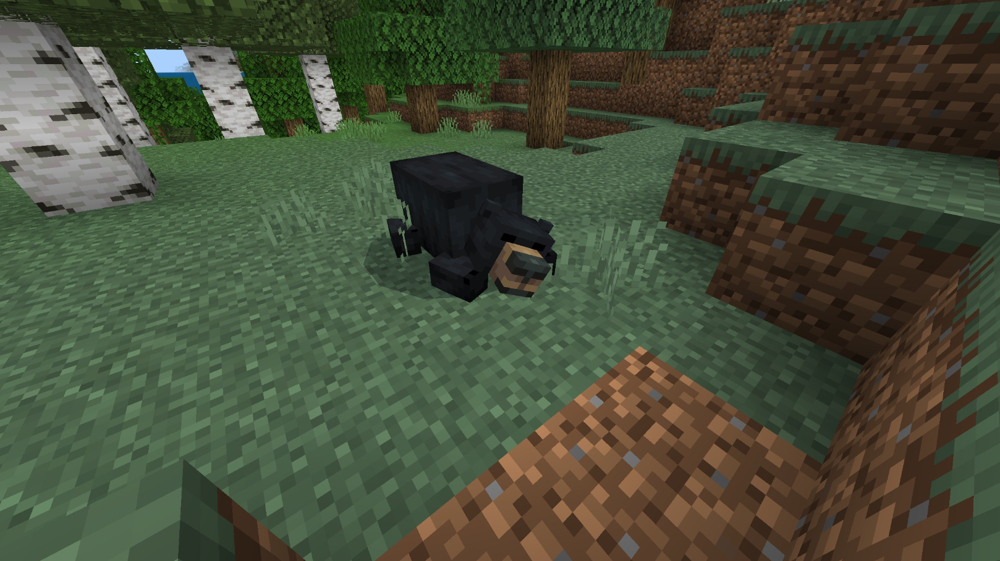
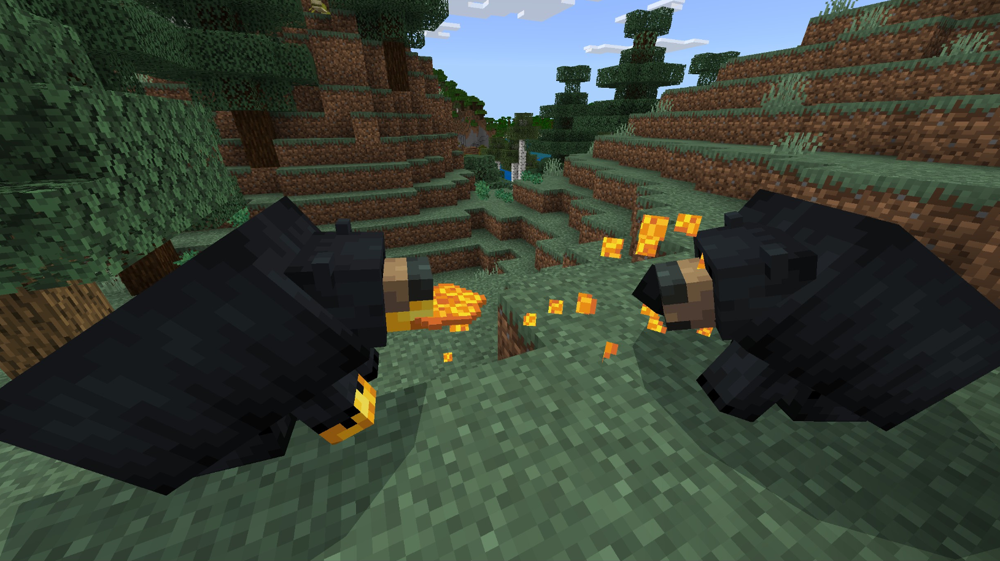

# Black Bear

Last Updated: April 22, 2025 8:47 PM

---

**Return**

🐻 [Naturalist Add-On Wiki](/www.notion.so/1a7a9a61c3f1800c8e32e893d6e7f430?pvs=21)

---

Black bears have a very good sense of smell which helps them find food sources within dense forests. They will eat large amounts of food in preparation for hibernation during the winter season where they live in caves and survive based on stored body fat. Mother bears will wake up during hibernation to take care of their cubs. These bears can run up to 30 miles per hour, so keep your distance if you’re ever near one!

<aside>

### **Black Bear**

---

**Health:** 30 ****[♥️♥️♥️]

---

**Classification:** [Animal](/minecraft.fandom.com/wiki/Animal)

---

**Behavior:** Neutral

---

**Spawn:** [Forest](/minecraft.wiki/w/Forest), [Flower Forest](/minecraft.wiki/w/Flower_Forest), [Taiga](/minecraft.wiki/w/Taiga), [Mega Taiga](/minecraft.wiki/w/Old_Growth_Pine_Taiga), & [Grove](/minecraft.wiki/w/Grove)

---

</aside>

---

### 🌎 Spawning

A group of 1-2 black bears will spawn in the [forest](/minecraft.wiki/w/Forest), [flower forest](/minecraft.wiki/w/Flower_Forest), [taiga](/minecraft.wiki/w/Taiga), [mega taiga](/minecraft.wiki/w/Old_Growth_Pine_Taiga), and [grove](/minecraft.wiki/w/Grove) biomes. They will spawn in the daytime with light levels between 7-15. Make sure to check near berry bushes that grow on [grass](/minecraft.fandom.com/wiki/Grass_Block), as you might find a black bear nearby!

---

### ⚔️ Drops

Adult black bear [drops](/minecraft.fandom.com/wiki/Drops) upon death:

- 1 - 2 Fur.
    - ⚔️ The maximum amount is increased by 1 per level of [Looting](/minecraft.fandom.com/wiki/Looting), for a maximum of 1-4 with Looting III
- 🟢 1 - 3 [Experience](/minecraft.fandom.com/wiki/Experience) Orbs if killed by Player.
- 🟢 1 - 7 Experience Orbs upon [breeding](/minecraft.fandom.com/wiki/Breeding).

*Cubs yield no items nor experience.*

---

### 🧠 Behavior

Black bears can exist in a passive or hostile state. The cubs are passive; adults are hostile when provoked with cubs *(unless killed in one hit‌)*. — If a cub is attacked, unless killed in one hit‌, all adults within the area become hostile toward the player or mob, regardless of [difficulty](/minecraft.fandom.com/wiki/Difficulty). Players are not a black bear’s only target, they will occasionally attack salmon, cod, bass, and deer.

They are animals that roam forests in search of food sources. You will spot them pulling berries off berry bushes and munching on honeycomb from nearby bee hives. When eating, they will sit down and chew on the food while it’s in their hand. Some items will give the bear special textures, like jelly on their paws while eating sweet berries or honey while eating honeycombs.

Bears sleep between the [ticks](/minecraft.fandom.com/wiki/Tick) of 6000-12000 and 18000-23000. While sleeping, they snore similar to [foxes](/minecraft.fandom.com/wiki/Fox). If hit while sleeping, they will wake up in an aggressive state and will go back to sleep once they either kill their target or lose sight of them.

---

### 🥚Breeding

Adult black bears with full health can be [bred](/minecraft.fandom.com/wiki/Breeding) with [honeycomb](/minecraft.wiki/w/Honeycomb), [sweet berries](/minecraft.wiki/w/Sweet_Berries), [raw salmon](/minecraft.wiki/w/Raw_Salmon), [cooked salmon](/minecraft.wiki/w/Cooked_Salmon), and raw venison. There is a 5-minute cooldown for breeding, during which the black bear will not accept any items for breeding.

Upon successful breeding, a cub will be born. The growth of cubs can be slowly accelerated by feeding them honeycomb, sweet berries, raw salmon, cooked salmon, and raw venison. You will need to be careful, though, as soon as a cub is spawned, the adults will immediately become hostile.

---

### 🖼️ Gallery

---

<aside>
 Have additional questions? Want to be a part of our community? → [Join our Discord!](/discord.com/invite/starfishstudios)

</aside>

<aside>

[**Marketplace](/www.minecraft.net/en-us/marketplace/creator?name=Starfish%20Studios)      [CurseForge](/www.curseforge.com/members/starfish_studios/projects)      [TikTok](/www.tiktok.com/@starfishstudios)      [Instagram](/www.instagram.com/starfishstudiosinc/)      [Twitter](/twitter.com/starfishstudios)      [YouTube](/www.youtube.com/@starfishstudios)      [Website](/starfish-studios.com/)**

</aside>
