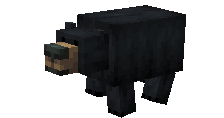
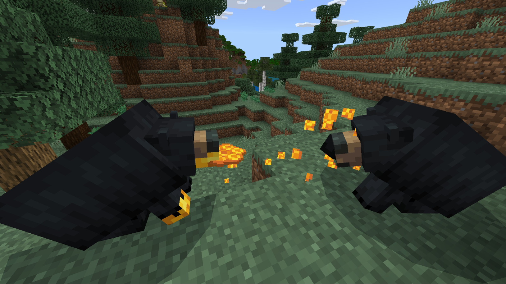

# Ours Noir

Dernière mise à jour : 22 avril 2025 20h47

---

**Retour**

🐻 [Wiki de l'extension Naturalist](/www.notion.so/1a7a9a61c3f1800c8e32e893d6e7f430?pvs=21)

---

Les ours noirs ont un excellent odorat qui les aide à trouver des sources de nourriture dans les forêts denses. Ils mangent de grandes quantités de nourriture en préparation pour l'hibernation pendant la saison hivernale où ils vivent dans des grottes et survivent grâce aux réserves de graisse corporelle. Les ourses se réveillent pendant l'hibernation pour s'occuper de leurs oursons. Ces ours peuvent courir jusqu'à 48 kilomètres par heure, alors gardez vos distances si vous en croisez un !

<aside>

### **Ours Noir**

---

**Santé :** 30 ****[♥️♥️♥️]

---

**Classification :** [Animal](/minecraft.fandom.com/wiki/Animal)

---

**Comportement :** Neutre

---

**Apparition :** [Forêt](/minecraft.wiki/w/Forest), [Forêt fleurie](/minecraft.wiki/w/Flower_Forest), [Taïga](/minecraft.wiki/w/Taiga), [Méga Taïga](/minecraft.wiki/w/Old_Growth_Pine_Taiga), & [Bosquet](/minecraft.wiki/w/Grove)

---

</aside>

---

### 🌎 Apparition

Un groupe de 1 à 2 ours noirs apparaîtra dans les biomes de [forêt](/minecraft.wiki/w/Forest), [forêt fleurie](/minecraft.wiki/w/Flower_Forest), [taïga](/minecraft.wiki/w/Taiga), [méga taïga](/minecraft.wiki/w/Old_Growth_Pine_Taiga) et [bosquet](/minecraft.wiki/w/Grove). Ils apparaissent pendant la journée avec des niveaux de lumière entre 7 et 15. N'oubliez pas de vérifier près des buissons de baies qui poussent sur l'[herbe](/minecraft.fandom.com/wiki/Grass_Block), car vous pourriez y trouver un ours noir !

---

### ⚔️ Butin

L'ours noir adulte [laisse tomber](/minecraft.fandom.com/wiki/Drops) à sa mort :

- 1 - 2 Fourrures
    - ⚔️ La quantité maximale est augmentée de 1 par niveau de [Butin](/minecraft.fandom.com/wiki/Looting), pour un maximum de 1-4 avec Butin III
- 🟢 1 - 3 Orbes d'[expérience](/minecraft.fandom.com/wiki/Experience) si tué par un joueur
- 🟢 1 - 7 Orbes d'expérience lors de la [reproduction](/minecraft.fandom.com/wiki/Breeding)

*Les oursons ne donnent ni objets ni expérience.*

---

### 🧠 Comportement

Les ours noirs peuvent être passifs ou hostiles. Les oursons sont passifs ; les adultes deviennent hostiles quand ils sont provoqués avec leurs oursons *(sauf s'ils sont tués en un coup)*. Si un ourson est attaqué, à moins qu'il ne soit tué en un coup, tous les adultes dans la zone deviennent hostiles envers le joueur ou le mob, quelle que soit la [difficulté](/minecraft.fandom.com/wiki/Difficulty). Les joueurs ne sont pas la seule cible des ours noirs, ils attaquent occasionnellement les saumons, les morues, les bars et les cerfs.

Ce sont des animaux qui parcourent les forêts à la recherche de nourriture. Vous les verrez cueillir des baies sur les buissons et manger du rayon de miel des ruches voisines. En mangeant, ils s'assoient et mâchent la nourriture qu'ils tiennent dans leur patte. Certains aliments donnent à l'ours des textures spéciales, comme de la confiture sur leurs pattes en mangeant des baies sucrées ou du miel en mangeant des rayons de miel.

Les ours dorment entre les [ticks](/minecraft.fandom.com/wiki/Tick) 6000-12000 et 18000-23000. En dormant, ils ronflent comme les [renards](/minecraft.fandom.com/wiki/Fox). Si on les frappe pendant leur sommeil, ils se réveillent dans un état agressif et retournent dormir une fois qu'ils ont soit tué leur cible, soit perdu sa trace.

---

### 🥚Reproduction

Les ours noirs adultes en pleine santé peuvent se [reproduire](/minecraft.fandom.com/wiki/Breeding) avec du [rayon de miel](/minecraft.wiki/w/Honeycomb), des [baies sucrées](/minecraft.wiki/w/Sweet_Berries), du [saumon cru](/minecraft.wiki/w/Raw_Salmon), du [saumon cuit](/minecraft.wiki/w/Cooked_Salmon) et du cerf cru. Il y a un temps de recharge de 5 minutes pour la reproduction, pendant lequel l'ours noir n'acceptera aucun objet pour se reproduire.

Après une reproduction réussie, un ourson naîtra. La croissance des oursons peut être lentement accélérée en leur donnant du rayon de miel, des baies sucrées, du saumon cru, du saumon cuit et du cerf cru. Vous devrez être prudent, car dès qu'un ourson apparaît, les adultes deviennent immédiatement hostiles.

---

### 🖼️ Galerie

---

<aside>
 Des questions supplémentaires ? Vous voulez faire partie de notre communauté ? → [Rejoignez notre Discord !](/discord.com/invite/starfishstudios)

</aside>

<aside>

[**Marketplace](/www.minecraft.net/en-us/marketplace/creator?name=Starfish%20Studios)      [CurseForge](/www.curseforge.com/members/starfish_studios/projects)      [TikTok](/www.tiktok.com/@starfishstudios)      [Instagram](/www.instagram.com/starfishstudiosinc/)      [Twitter](/twitter.com/starfishstudios)      [YouTube](/www.youtube.com/@starfishstudios)      [Website](/starfish-studios.com/)**

</aside> 