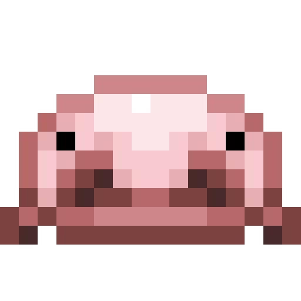
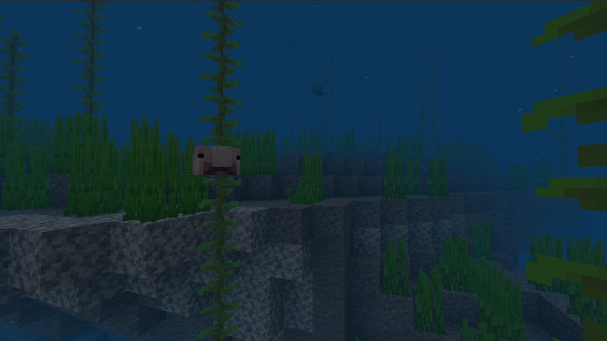
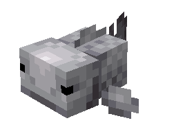

# Blobfish

Last Updated: April 22, 2025 8:47 PM

---

**Return**

🐻 [Naturalist Add-On Wiki](/www.notion.so/1a7a9a61c3f1800c8e32e893d6e7f430?pvs=21)

---

Blobfish are passive aquatic creatures found in deep oceans. With food sources being scarce, conserving energy becomes their number 1 priority. They are predators of axolotls and will attempt to flee them. Their bulbous heads and droopy mouths make them easy to identify. This fish was named the world’s ugliest animal in 2013!

<aside>

### **Blobfish**

---

**Health: 8** [♥️♥️♥️]

---

**Classification:** [Animal](/minecraft.fandom.com/wiki/Animal) / [Aquatic](/minecraft.fandom.com/wiki/Aquatic)

---

**Behavior:** Neutral

---

**Spawn:** [Deep Ocean](/minecraft.wiki/w/Deep_Ocean), [Deep Cold Ocean](/minecraft.wiki/w/Deep_Cold_Ocean), & [Deep Frozen Ocean](/minecraft.wiki/w/Deep_Frozen_Ocean)

---

</aside>

---

### 🌎 Spawning

Blobfish spawn by themselves in deep oceans & their variants. They will not spawn in warm variants of the deep oceans. Blobfish spawn between Y 36 and Y -64. These fish can be put into a bucket, so if you find one on a deep ocean dive, make sure to scoop it up!

---

### ⚔️ Drops

Blobfish [drops](/minecraft.fandom.com/wiki/Drops) upon death:

- 0 - 1 Raw Blobfish
    - ⚔️ The maximum amount is increased by 1 per level of [Looting](/minecraft.fandom.com/wiki/Looting), for a maximum of 0-3 with Looting III.
- 0 - 1 Cooked Blobfish
    - ⚔️ Cooked Anglerfish can be dropped when killed on land with [Smelting](/minecraft.fandom.com/wiki/Fire_Aspect) or [Flame](/minecraft.fandom.com/wiki/Flame) enchantment. This will not work when a Blobfish is killed underwater.
- 🟢1 - 3 [Experience](/minecraft.fandom.com/wiki/Experience) Orbs if killed by Player.

---

### 🧠 Behavior

Blobfish are passive aquatic creatures that tend to float or swim on deep ocean floors. They will attack snails and crabs when they're not in their blobbed state! They are normal fish in water and will turn into a blobfish if above Y 30 or in a bucket.

The player may collect blobfish by using a [water bucket](/minecraft.fandom.com/wiki/Water_bucket) on it, which gives the player a bucket of blobfish. Blobfish placed with buckets do not despawn naturally. When that fish bucket is used against a block, it empties the bucket, placing water with the blobfish swimming in it.

**Weakness:**

Blobfish are unable to survive out of water. Outside of water, they flop around for a while until, eventually, they start to suffocate and die. Blobfish will flop on their sides. Blobfish cannot be put in a [cauldron](/minecraft.fandom.com/wiki/Cauldron).

---

### 🖼️ Gallery

---

### 🎨 Variants

---

<aside>
 Have additional questions? Want to be a part of our community? → [Join our Discord!](/discord.com/invite/starfishstudios)

</aside>

<aside>

[**Marketplace](/www.minecraft.net/en-us/marketplace/creator?name=Starfish%20Studios)      [CurseForge](/www.curseforge.com/members/starfish_studios/projects)      [TikTok](/www.tiktok.com/@starfishstudios)      [Instagram](/www.instagram.com/starfishstudiosinc/)      [Twitter](/twitter.com/starfishstudios)      [YouTube](/www.youtube.com/@starfishstudios)      [Website](/starfish-studios.com/)**

</aside>
