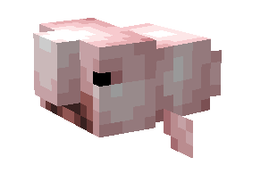
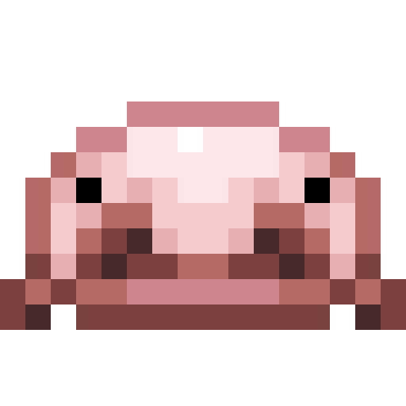
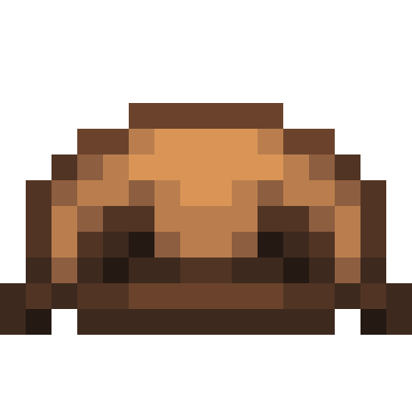
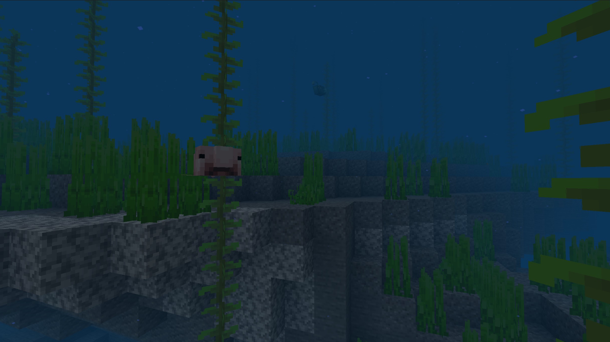
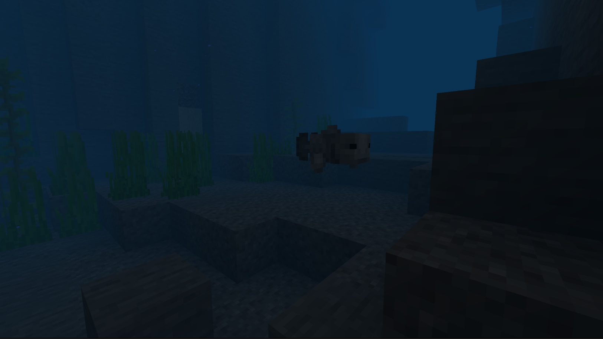

# Poisson-grenouille

Dernière mise à jour : 22 avril 2025 20h47

---

**Retour**

🐻 [Wiki de l'extension Naturalist](/www.notion.so/1a7a9a61c3f1800c8e32e893d6e7f430?pvs=21)

---

Les poissons-grenouilles sont des créatures aquatiques passives trouvées dans les océans profonds. Avec des sources de nourriture rares, la conservation de l'énergie devient leur priorité numéro 1. Ce sont des prédateurs des axolotls et tenteront de les fuir. Leurs têtes bulbeuses et leurs bouches tombantes les rendent faciles à identifier. Ce poisson a été nommé l'animal le plus laid du monde en 2013 !

<aside>

### **Poisson-grenouille**

---

**Santé : 8** [♥️♥️♥️]

---

**Classification :** [Animal](/minecraft.fandom.com/wiki/Animal) / [Aquatique](/minecraft.fandom.com/wiki/Aquatic)

---

**Comportement :** Neutre

---

**Apparition :** [Océan profond](/minecraft.wiki/w/Deep_Ocean), [Océan profond froid](/minecraft.wiki/w/Deep_Cold_Ocean) et [Océan profond gelé](/minecraft.wiki/w/Deep_Frozen_Ocean)

---

</aside>

---

### 🌎 Apparition

Les poissons-grenouilles apparaissent seuls dans les océans profonds et leurs variantes. Ils n'apparaîtront pas dans les variantes chaudes des océans profonds. Les poissons-grenouilles apparaissent entre Y 36 et Y -64. Ces poissons peuvent être mis dans un seau, donc si vous en trouvez un lors d'une plongée en eau profonde, assurez-vous de le récupérer !

---

### ⚔️ Butin

Le poisson-grenouille [laisse tomber](/minecraft.fandom.com/wiki/Drops) à sa mort :

- 0 - 1 Poisson-grenouille cru
    - ⚔️ La quantité maximale est augmentée de 1 par niveau de [Butin](/minecraft.fandom.com/wiki/Looting), pour un maximum de 0-3 avec Butin III
- 0 - 1 Poisson-grenouille cuit
    - ⚔️ Le poisson-grenouille cuit peut être obtenu lorsqu'il est tué sur terre avec l'enchantement [Fonte](/minecraft.fandom.com/wiki/Fire_Aspect) ou [Flamme](/minecraft.fandom.com/wiki/Flame). Cela ne fonctionnera pas si le poisson-grenouille est tué sous l'eau
- 🟢 1 - 3 Orbes d'[expérience](/minecraft.fandom.com/wiki/Experience) si tué par un joueur

---

### 🧠 Comportement

Les poissons-grenouilles sont des créatures aquatiques passives qui ont tendance à flotter ou à nager sur les fonds des océans profonds. Ils attaqueront les escargots et les crabes lorsqu'ils ne sont pas dans leur état de blob ! Ce sont des poissons normaux dans l'eau et se transformeront en poisson-grenouille s'ils sont au-dessus de Y 30 ou dans un seau.

Le joueur peut collecter des poissons-grenouilles en utilisant un [seau d'eau](/minecraft.fandom.com/wiki/Water_bucket) sur eux, ce qui donne au joueur un seau de poisson-grenouille. Les poissons-grenouilles placés avec des seaux ne disparaissent pas naturellement. Lorsque ce seau de poisson est utilisé contre un bloc, il vide le seau, plaçant de l'eau avec le poisson-grenouille nageant dedans.

**Faiblesse :**

Les poissons-grenouilles ne peuvent pas survivre hors de l'eau. En dehors de l'eau, ils se débattent pendant un moment jusqu'à ce qu'ils commencent à suffoquer et meurent. Les poissons-grenouilles se débattent sur leurs côtés. Les poissons-grenouilles ne peuvent pas être placés dans un [chaudron](/minecraft.fandom.com/wiki/Cauldron).

---

### 🖼️ Galerie

---

### 🎨 Variantes

---

<aside>
 Des questions supplémentaires ? Vous voulez faire partie de notre communauté ? → [Rejoignez notre Discord !](/discord.com/invite/starfishstudios)

</aside>

<aside>

[**Marketplace](/www.minecraft.net/en-us/marketplace/creator?name=Starfish%20Studios)      [CurseForge](/www.curseforge.com/members/starfish_studios/projects)      [TikTok](/www.tiktok.com/@starfishstudios)      [Instagram](/www.instagram.com/starfishstudiosinc/)      [Twitter](/twitter.com/starfishstudios)      [YouTube](/www.youtube.com/@starfishstudios)      [Website](/starfish-studios.com/)**

</aside> 