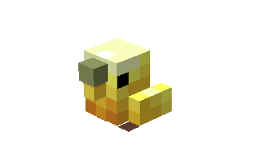
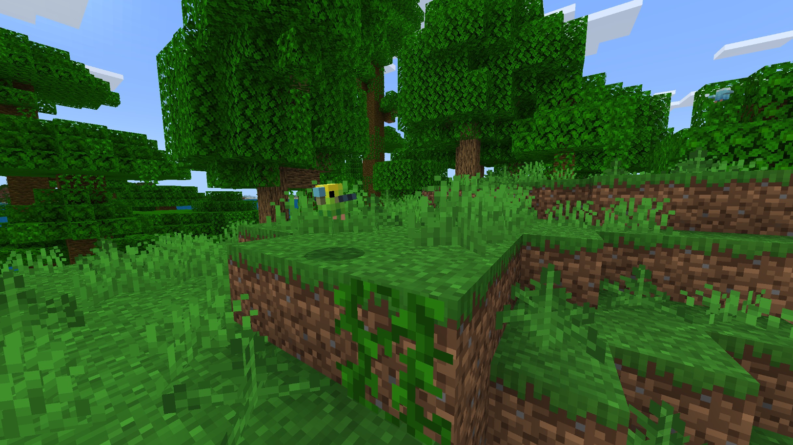
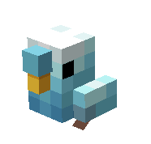

# Budgie

Last Updated: April 22, 2025 8:47 PM

---

**Return**

🐻 [Naturalist Add-On Wiki](/www.notion.so/1a7a9a61c3f1800c8e32e893d6e7f430?pvs=21)

---

Budgies are social, clever birds that are native to Australia. They are similar to parrots in their capabilities to mimic speech and learn tricks. A budgie has the highest vocabulary record, recorded at 1,728 words before it passed (according to the Guinness World Records)!

<aside>

### **Budgie**

---

**Health: 6** [♥️♥️♥️]

---

**Classification:** [Animal](/minecraft.fandom.com/wiki/Animal)

---

**Behavior:** Passive

---

**Spawn:** [Flower Forest](/minecraft.wiki/w/Flower_Forest) & [Jungle](/minecraft.wiki/w/Jungle)

</aside>

---

### 🌎 Spawning

A flock of 2-4 budgies will spawn in the [flower forest](/minecraft.wiki/w/Flower_Forest) and the [jungle](/minecraft.wiki/w/Jungle) biomes. They spawn exclusively during the day with [light levels](/minecraft.fandom.com/wiki/Light) of 7-15.

---

### ⚔️ Drops

Budgie [drops](/minecraft.fandom.com/wiki/Drops) upon death:

- 0 - 1 Feather
- 1 Bonemeal
- 🟢 1 - 3 [Experience](/minecraft.fandom.com/wiki/Experience) Orbs if killed by Player

---

### 🧠 Behavior

Budgies are adorable passive birds that act similar to [parrots](Budgie%201dd816019a9f810d8303fdc928247be2.md). They love making small chirps within the forest or jungle. If there are 2 or more budgies near each other, they will occasionally spawn an experience orb!

When budgies are tamed, a player can crouch and interact with the budgie to get heart particles to display, and they make a cute noise!

---

### ❤️ Taming, Healing, & Feeding

Budgies can be tamed with [wheat seeds](/minecraft.wiki/w/Wheat_Seeds), [pumpkin seeds](/minecraft.wiki/w/Pumpkin_Seeds), [melon seeds](/minecraft.wiki/w/Melon_Seeds), [beetroot seeds](/minecraft.wiki/w/Beetroot_Seeds), and [torchflower seeds](/minecraft.wiki/w/Torchflower_Seeds). There is a 33% chance of successful taming. Once they are tamed, you will see hearts appear. There is no visual indication that they are tamed other than the hearts, however, budgies will follow you once tamed.

Tamed budgies can be commanded to sit or to follow.

- Budgies will teleport to the player if the player is further than 5 blocks away.
- Budgies will not teleport to the player if they are commanded to sit.

If a budgie you have tamed gets injured, you can feed the bird wheat seeds, pumpkin seeds, melon seeds, or beetroot seeds to increase its [health](/minecraft.fandom.com/wiki/Health) until it is maxed. 1 seed increases the bird’s health points by 2. An injured bird will be unable to breed until it is healed. 

Feeding these birds a [cookie](/minecraft.wiki/w/Cookie) will cause [Fatal Poison](/minecraft.wiki/w/Fatal_Poison) particles to be emitted, and they will lose health points. Chocolate is toxic to birds.

---

### 🖼️ Gallery

---

### 🎨 Variants

           Yellow Budgie

            Green Budgie

            Blue Budgie

<aside>
 Have additional questions? Want to be a part of our community? → [Join our Discord!](/discord.com/invite/starfishstudios)

</aside>

<aside>

[**Marketplace](/www.minecraft.net/en-us/marketplace/creator?name=Starfish%20Studios)      [CurseForge](/www.curseforge.com/members/starfish_studios/projects)      [TikTok](/www.tiktok.com/@starfishstudios)      [Instagram](/www.instagram.com/starfishstudiosinc/)      [Twitter](/twitter.com/starfishstudios)      [YouTube](/www.youtube.com/@starfishstudios)      [Website](/starfish-studios.com/)**

</aside>
