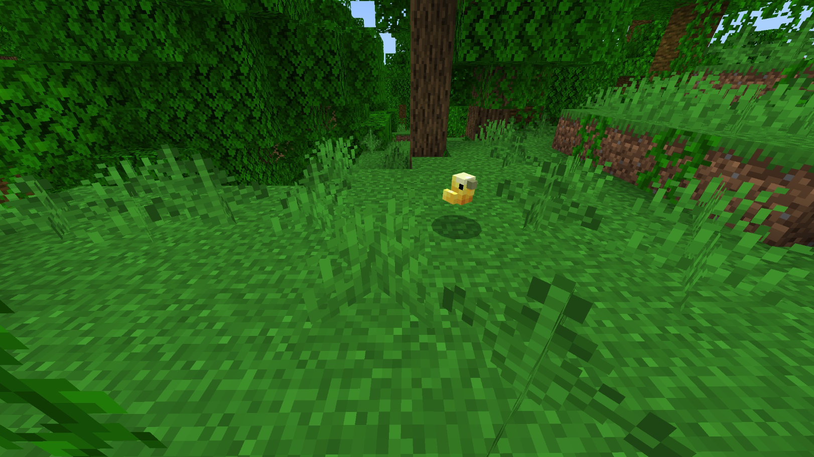
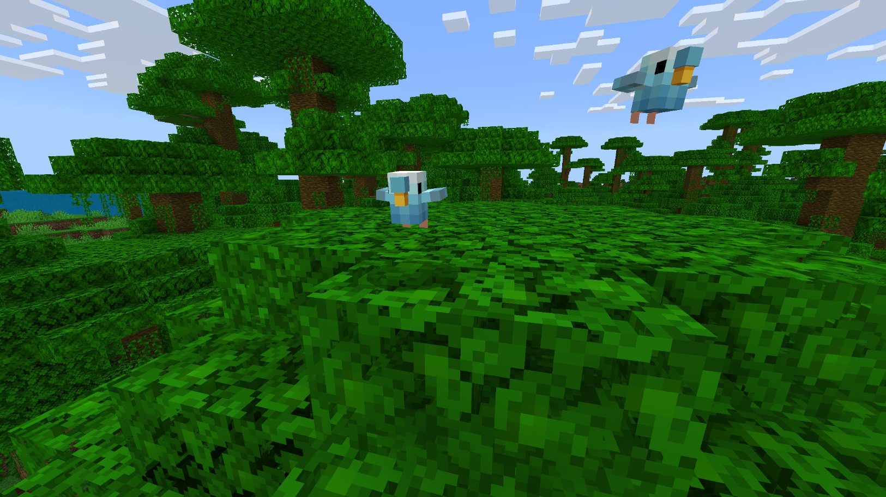
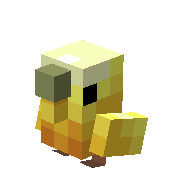
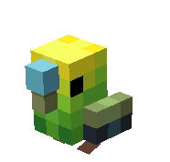

# Perruche

Dernière mise à jour : 22 avril 2025 20h47

---

**Retour**

🐻 [Wiki de l'extension Naturalist](/www.notion.so/1a7a9a61c3f1800c8e32e893d6e7f430?pvs=21)

---

Les perruches sont des oiseaux sociaux et intelligents originaires d'Australie. Elles sont similaires aux perroquets dans leur capacité à imiter la parole et à apprendre des tours. Une perruche détient le record du plus grand vocabulaire, enregistré à 1 728 mots avant sa mort (selon le Guinness World Records) !

<aside>

### **Perruche**

---

**Santé : 6** [♥️♥️♥️]

---

**Classification :** [Animal](/minecraft.fandom.com/wiki/Animal)

---

**Comportement :** Passif

---

**Apparition :** [Forêt fleurie](/minecraft.wiki/w/Flower_Forest) et [Jungle](/minecraft.wiki/w/Jungle)

</aside>

---

### 🌎 Apparition

Un groupe de 2 à 4 perruches apparaîtra dans les biomes de [forêt fleurie](/minecraft.wiki/w/Flower_Forest) et de [jungle](/minecraft.wiki/w/Jungle). Elles apparaissent exclusivement pendant la journée avec des [niveaux de lumière](/minecraft.fandom.com/wiki/Light) de 7 à 15.

---

### ⚔️ Butin

La perruche [laisse tomber](/minecraft.fandom.com/wiki/Drops) à sa mort :

- 0 - 1 Plume
- 1 Poudre d'os
- 🟢 1 - 3 Orbes d'[expérience](/minecraft.fandom.com/wiki/Experience) si tuée par un joueur

---

### 🧠 Comportement

Les perruches sont des oiseaux passifs adorables qui agissent de manière similaire aux [perroquets](Budgie%201dd816019a9f810d8303fdc928247be2.md). Elles aiment faire de petits gazouillis dans la forêt ou la jungle. S'il y a 2 perruches ou plus à proximité les unes des autres, elles feront occasionnellement apparaître une orbe d'expérience !

Lorsque les perruches sont apprivoisées, un joueur peut s'accroupir et interagir avec la perruche pour faire apparaître des particules de cœur, et elles font un bruit mignon !

---

### ❤️ Apprivoisement, Soins et Nourriture

Les perruches peuvent être apprivoisées avec des [graines de blé](/minecraft.wiki/w/Wheat_Seeds), des [graines de citrouille](/minecraft.wiki/w/Pumpkin_Seeds), des [graines de melon](/minecraft.wiki/w/Melon_Seeds), des [graines de betterave](/minecraft.wiki/w/Beetroot_Seeds) et des [graines de torche](/minecraft.wiki/w/Torchflower_Seeds). Il y a 33% de chances de réussir l'apprivoisement. Une fois apprivoisées, vous verrez des cœurs apparaître. Il n'y a pas d'indication visuelle qu'elles sont apprivoisées autre que les cœurs, cependant, les perruches vous suivront une fois apprivoisées.

Les perruches apprivoisées peuvent être commandées pour s'asseoir ou suivre.

- Les perruches se téléporteront vers le joueur si celui-ci est à plus de 5 blocs de distance.
- Les perruches ne se téléporteront pas vers le joueur si elles sont commandées pour s'asseoir.

Si une perruche que vous avez apprivoisée est blessée, vous pouvez nourrir l'oiseau de graines de blé, de graines de citrouille, de graines de melon ou de graines de betterave pour augmenter sa [santé](/minecraft.fandom.com/wiki/Health) jusqu'à son maximum. 1 graine augmente les points de santé de l'oiseau de 2. Un oiseau blessé ne pourra pas se reproduire jusqu'à ce qu'il soit guéri.

Nourrir ces oiseaux d'un [cookie](/minecraft.wiki/w/Cookie) fera apparaître des particules de [Poison mortel](/minecraft.wiki/w/Fatal_Poison), et ils perdront des points de santé. Le chocolat est toxique pour les oiseaux.

---

### 🖼️ Galerie

---

### 🎨 Variantes

           Perruche jaune

            Perruche verte

            Perruche bleue

---

<aside>
 Des questions supplémentaires ? Vous voulez faire partie de notre communauté ? → [Rejoignez notre Discord !](/discord.com/invite/starfishstudios)

</aside>

<aside>

[**Marketplace](/www.minecraft.net/en-us/marketplace/creator?name=Starfish%20Studios)      [CurseForge](/www.curseforge.com/members/starfish_studios/projects)      [TikTok](/www.tiktok.com/@starfishstudios)      [Instagram](/www.instagram.com/starfishstudiosinc/)      [Twitter](/twitter.com/starfishstudios)      [YouTube](/www.youtube.com/@starfishstudios)      [Website](/starfish-studios.com/)**

</aside> 