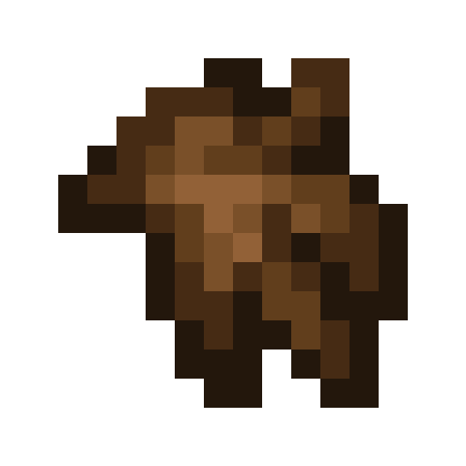

# Capybara

Last Updated: April 22, 2025 8:47 PM

---

**Return**

🐻 [Naturalist Add-On Wiki](/www.notion.so/1a7a9a61c3f1800c8e32e893d6e7f430?pvs=21)

---

Capybaras are the world’s largest rodents. They are semi-aquatic creatures that are excellent swimmers. Capybaras are relaxed creatures around other species, so you may find a Capybara riding on an alligator!

<aside>

### **Capybara**

---

**Health: 14** [♥️♥️♥️]

---

**Classification:** [Animal](/minecraft.fandom.com/wiki/Animal)

---

**Behavior:** Passive

---

**Spawn:** [Jungle](/minecraft.wiki/w/Jungle), [Jungle Edge](/minecraft.wiki/w/Sparse_Jungle), & [Swamps, & Variants](/minecraft.fandom.com/wiki/Swamp)

---

</aside>

---

### 🌎 Spawning

Capybaras spawn in a herd of 2-4 in the [jungle](/minecraft.wiki/w/Jungle), [jungle edge](/minecraft.wiki/w/Sparse_Jungle), and [swamps](/minecraft.fandom.com/wiki/Swamp). These climates are typically warm, so you won’t find capybara anywhere near frozen variants of those biomes!

---

### ⚔️ Drops

Capybara [drops](/minecraft.fandom.com/wiki/Drops) upon death:

- 0 - 1 Bushmeat.
    - ⚔️ The maximum amount is increased by 1 per level of [Looting](/minecraft.fandom.com/wiki/Looting), for a maximum of 0-3 with Looting III
- 0 - 1 Cooked Bushmeat
    - ⚔️ Cooked bushmeat can be dropped when killed on land by [smelting](/minecraft.fandom.com/wiki/Fire_Aspect) or [flame](/minecraft.fandom.com/wiki/Flame) enchantment.
- 1 Fur
    - ⚔️ The maximum amount is increased by 1 per level of [Looting](/minecraft.fandom.com/wiki/Looting), for a maximum of 3 with Looting III
- 🟢 1 - 3 [Experience](/minecraft.fandom.com/wiki/Experience) Orbs if killed by Player.
- 🟢 1 - 7 Experience Orbs upon [breeding](/minecraft.fandom.com/wiki/Breeding).

*Pups yield no items nor experience.*

---

### 🧠 Behavior

Capybaras are entirely passive animals. They aimlessly wander around, but you can sometimes find them riding an alligator! Occasionally, small animals will ride on a capybara, such as birds, squirrels, and other small animals. If a player hits them, they will panic and lose their rider in the process.

---

### ❤️ Taming, Healing, & Feeding

Capybaras can be tamed with [melon slices](/minecraft.wiki/w/Melon_Slice). There is a 33% chance of successful taming. Once they are tamed, you will see hearts appear and a collar with a gold medallion hanging around their neck signifying you have tamed the capybara. You can [dye](/minecraft.fandom.com/wiki/Dye) the collar to your color of choice or use [shears](/minecraft.fandom.com/wiki/Shears) to cut off the collar. If you shear off the collar, it can be reapplied by using a dye color of your choice.

Tamed capybaras can be commanded to sit or roam.

- Capybaras will not teleport to the player if the capybara is in roam mode and the player is far away.
- Capybaras will not teleport to the player if they are commanded to sit.

If a capybara you have tamed gets injured, you can feed the capybara melon slices to increase its [health](/minecraft.fandom.com/wiki/Health) until it is maxed. 1 melon slice increases the bird’s health points by 2. An injured capybara will be unable to breed until it is healed. 

---

### 🥚Breeding

Adult Capybaras with full health can be [bred](/minecraft.fandom.com/wiki/Breeding) with melon slices. There is a 5-minute cooldown for breeding, during which the capybara will not accept melon slices but will if they get injured and need to heal.

Upon successful breeding, a pup will be born. The growth of pups can be slowly accelerated by using melon slices.

---

### 🖼️ Gallery

---

<aside>
 Have additional questions? Want to be a part of our community? → [Join our Discord!](/discord.com/invite/starfishstudios)

</aside>

<aside>

[**Marketplace](/www.minecraft.net/en-us/marketplace/creator?name=Starfish%20Studios)      [CurseForge](/www.curseforge.com/members/starfish_studios/projects)      [TikTok](/www.tiktok.com/@starfishstudios)      [Instagram](/www.instagram.com/starfishstudiosinc/)      [Twitter](/twitter.com/starfishstudios)      [YouTube](/www.youtube.com/@starfishstudios)      [Website](/starfish-studios.com/)**

</aside>
