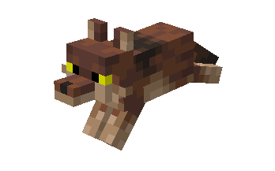
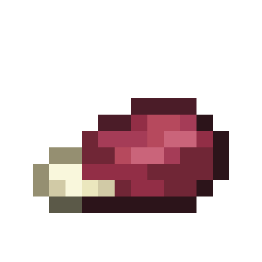
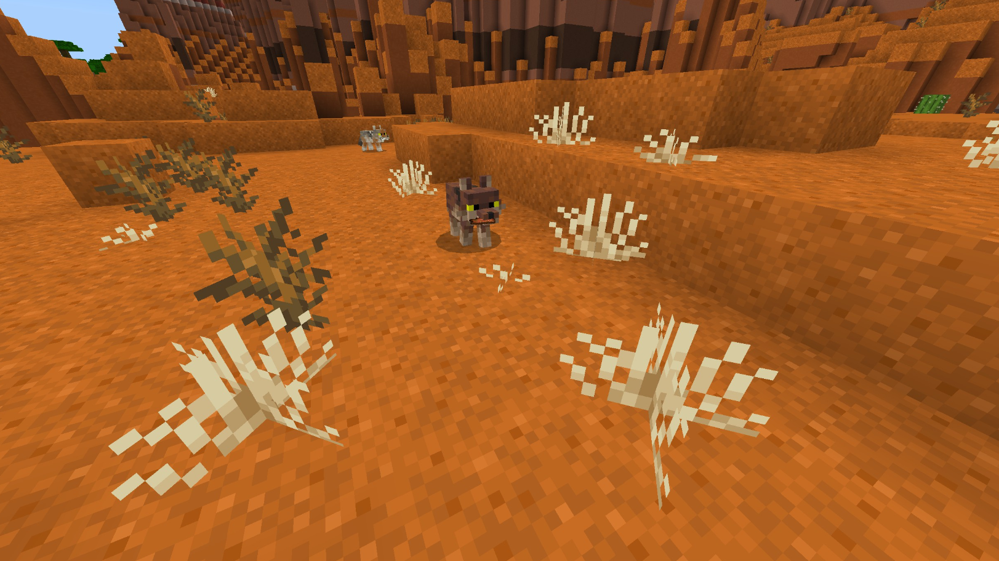
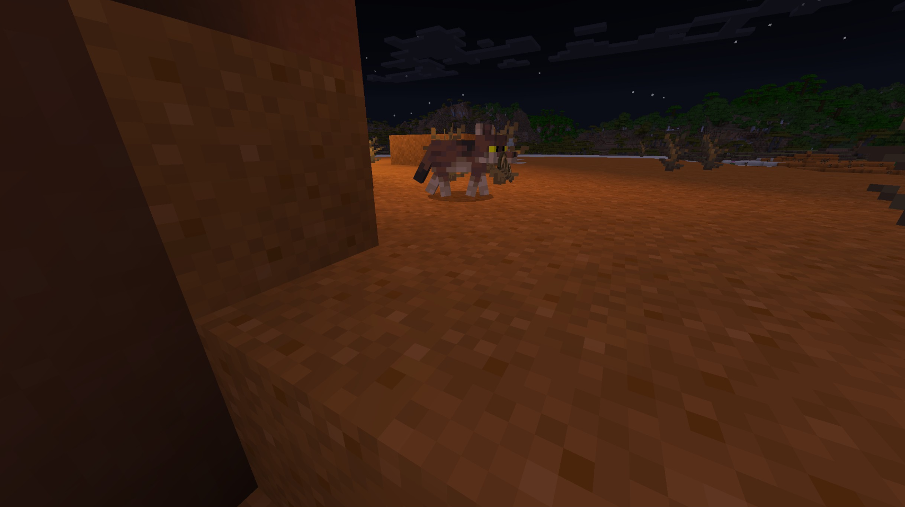
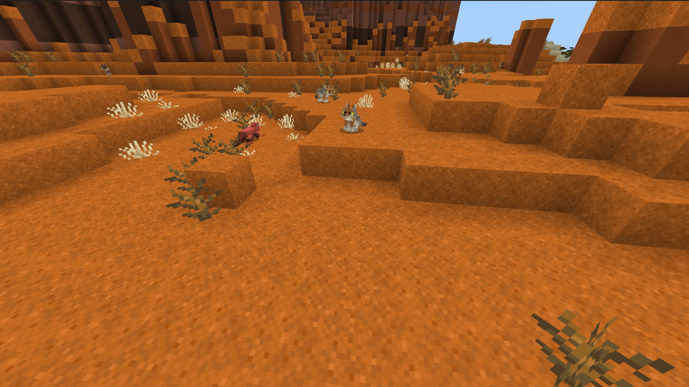
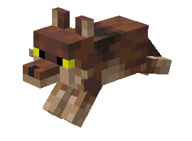

# Coyote

Last Updated: April 22, 2025 8:47 PM

---

**Return**

🐻 [Naturalist Add-On Wiki](/www.notion.so/1a7a9a61c3f1800c8e32e893d6e7f430?pvs=21)

---

Coyotes are unpredictable predators that can run up to 40 mph while hunting but are omnivores and enjoy feasting on ripe berries. Coyotes may not be tamable, but they have adapted to rural and urban lifestyles due to many forests getting cut down due to expansion. 

<aside>

### **Coyote**

---

**Health: 20** [♥️♥️♥️]

---

**Classification:** [Animal](/minecraft.fandom.com/wiki/Animal) 

---

**Behavior:** 

---

**Spawn:** [Desert](/minecraft.wiki/w/Desert), [Hills](/minecraft.wiki/w/Terrain_features#Hill), & [Mesa](/minecraft.wiki/w/Badlands)

---

</aside>

---

### 🌎 Spawning

Coyotes spawn by themselves in warmer climates such as [deserts](/minecraft.wiki/w/Desert), [hills](/minecraft.wiki/w/Terrain_features#Hill), & [mesas](/minecraft.wiki/w/Badlands). They will avoid frozen variations of these biomes. You will find them in the daytime with light levels of 7-15.

---

### ⚔️ Drops

Coyote [drops](/minecraft.fandom.com/wiki/Drops) upon death:

- 0 - 2 Morsel
- 0 - 1 Fur
- 🟢 1 - 3 [Experience](/minecraft.fandom.com/wiki/Experience) Orbs if killed by Player
- 🟢 1 - 7 Experience Orbs upon [breeding](/minecraft.fandom.com/wiki/Breeding)

*Pups yield no items nor experience.*

Coyotes may drop items beyond those in their designated loot pool. Make sure to watch for the following items:

- [Bone](/minecraft.wiki/w/Bone)
- [Rotten Flesh](/minecraft.wiki/w/Rotten_Flesh)
- Antler

---

### 🧠 Behavior

Coyotes are rabid animals that primarily hunt other animals and roam nearby villages. 

Coyotes hunt chicken, rabbits, and baby turtles when they are on land. They can be spotted sneaking stealthily before pouncing on their next meal. Along with hunting for fresh meat, they will attack sweet berry bushes and cave fines for berries to eat. They will not be damaged by sweet berry bushes when they rub up against them.

Coyotes attack either by running against or pouncing. Like rabbits and foxes, they can jump more than one block high without status effects or player input. They prepare to jump by tilting and lowering their head and body before jumping/pouncing at least two blocks in the air.  It can jump over fences and walls if needed. If coyotes are attached to a lead, they will attempt to run towards their prey but be unable to break the lead.

Coyotes will avoid wolves, polar bears, and players unless the player approaches them by sneaking.

Coyotes will sit down during the day if they are unable to find a shaded area to nap in. They will not sleep during thunderstorms and they will find cover if it is thunderstorming.

---

### 🥚Breeding

Adult coyotes with full health can be [bred](/minecraft.fandom.com/wiki/Breeding) with [sweet berries](/minecraft.wiki/w/Sweet_Berries) and [glow berries](/minecraft.wiki/w/Glow_Berries). There is a 5-minute cooldown for breeding, during which the coyote does not accept berries for breeding. The color variant of the pup is random when breeding. 

Upon successful breeding, a pup will be born. The growth of pups can be slowly accelerated by using berries.

---

### 🖼️ Gallery

---

### 🎨 Variants

           White, Orange, & Gray Coyote

                         Brown Coyote

<aside>
 Have additional questions? Want to be a part of our community? → [Join our Discord!](/discord.com/invite/starfishstudios)

</aside>

<aside>

[**Marketplace](/www.minecraft.net/en-us/marketplace/creator?name=Starfish%20Studios)      [CurseForge](/www.curseforge.com/members/starfish_studios/projects)      [TikTok](/www.tiktok.com/@starfishstudios)      [Instagram](/www.instagram.com/starfishstudiosinc/)      [Twitter](/twitter.com/starfishstudios)      [YouTube](/www.youtube.com/@starfishstudios)      [Website](/starfish-studios.com/)**

</aside>
