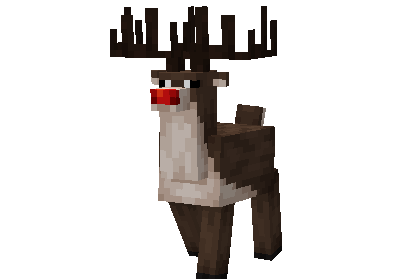
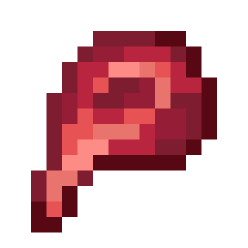
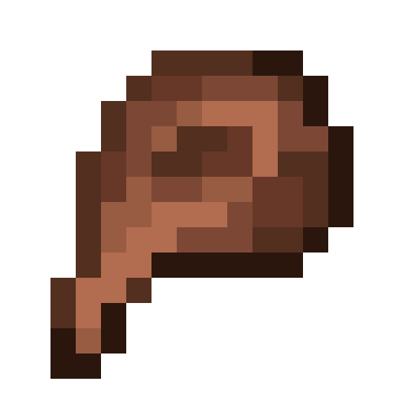
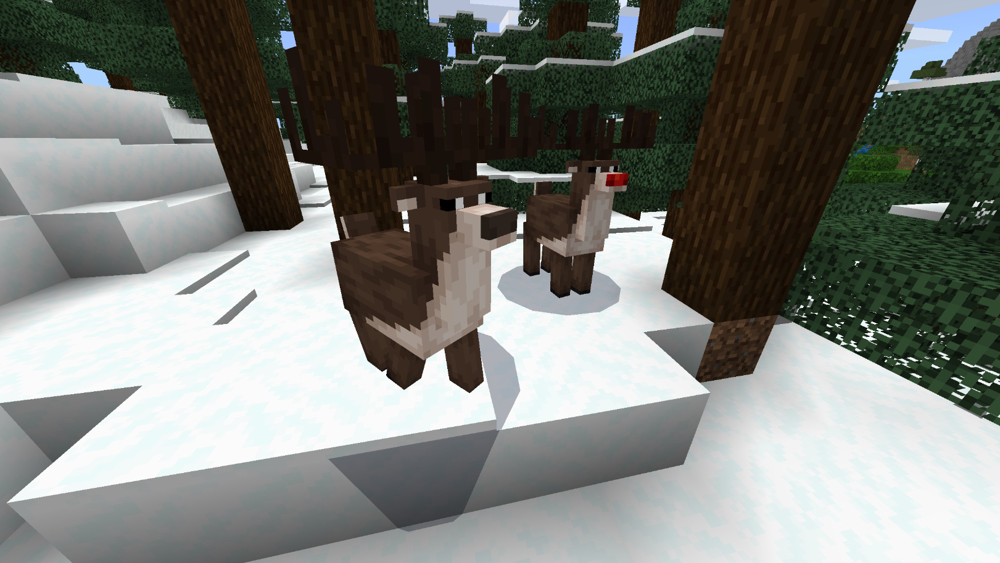
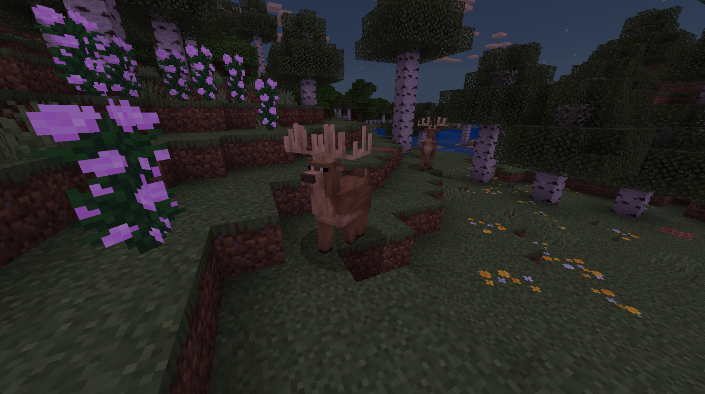
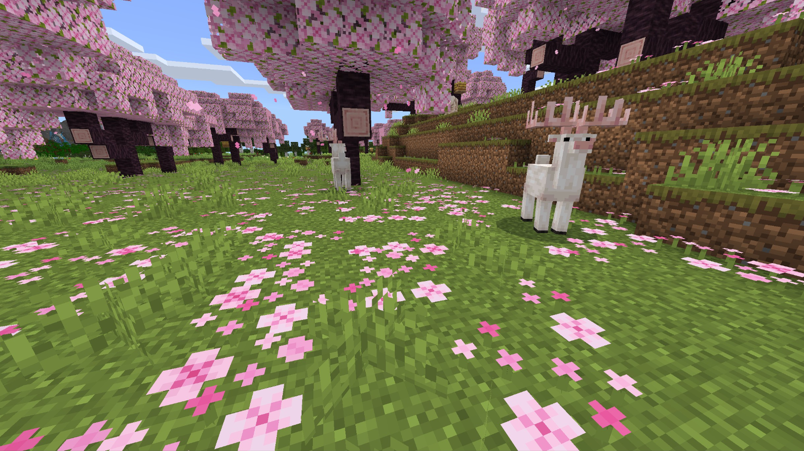
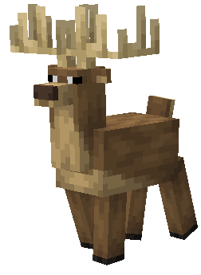
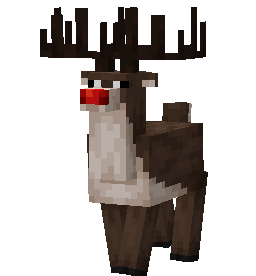
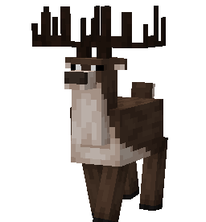
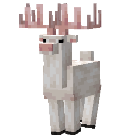

# Deer

Last Updated: April 22, 2025 8:47 PM

---

**Return**

🐻 [Naturalist Add-On Wiki](/www.notion.so/1a7a9a61c3f1800c8e32e893d6e7f430?pvs=21)

---

Deer are popular wild animals that are often hunted by players for a source of meat. Deer have unique antlers that fall off yearly and regrow. Each variation of antlers is much like a human’s fingerprint, where no two sets of antlers are the same. Deer are herbivores and love to munch on apples!

<aside>

### **Deer**

---

**Health: 16** [♥️♥️♥️]

---

**Classification:** [Animal](/minecraft.fandom.com/wiki/Animal) 

---

**Behavior:** Passive

---

**Spawn:** [Forest](/minecraft.wiki/w/Forest), [Flower Forest](/minecraft.wiki/w/Flower_Forest), [Birch Forest](/minecraft.wiki/w/Birch_Forest), [Taiga](/minecraft.wiki/w/Taiga), [Cold Taiga](/minecraft.wiki/w/Snowy_Taiga), & [Cherry Grove](/minecraft.wiki/w/Cherry_Grove)

---

</aside>

---

### 🌎 Spawning

Deer will spawn in a herd of 1-3 within the [forest](/minecraft.wiki/w/Forest), [flowered forest](/minecraft.wiki/w/Flower_Forest), [birch forest](/minecraft.wiki/w/Birch_Forest), [taiga](/minecraft.wiki/w/Taiga), [cold taiga](/minecraft.wiki/w/Snowy_Taiga), and [cherry grove](/minecraft.wiki/w/Cherry_Grove) biomes. They will spawn during the day with [light levels](/minecraft.fandom.com/wiki/Light) between 9-15.

---

### ⚔️ Drops

Deer [drops](/minecraft.fandom.com/wiki/Drops) upon death:

- 0 - 1 Antler
    - ⚔️ The maximum amount is increased by 1 per level of [Looting](/minecraft.fandom.com/wiki/Looting), for a maximum of 0-3 with Looting III.
- 1 - 2 Raw Venison
    - ⚔️ The maximum amount is increased by 1 per level of [Looting](/minecraft.fandom.com/wiki/Looting), for a maximum of 1-4 with Looting III.
- 1 - 2 Cooked Venison
    - ⚔️ Cooked Venison can be dropped when killed on land with [Smelting](/minecraft.fandom.com/wiki/Fire_Aspect) or [Flame](/minecraft.fandom.com/wiki/Flame) enchantment.
- 1 Saddle
    - A saddle will only drop if the animal was saddled before death.
- 🟢 1 - 3 [Experience](/minecraft.fandom.com/wiki/Experience) Orbs if killed by Player.
- 🟢 1 - 7 Experience Orbs upon [breeding](/minecraft.fandom.com/wiki/Breeding).

Fawn yield no items nor experience.

---

### 🧠 Behavior

Deer are skittish, passive mobs that are fairly common in their spawn biomes. Deer will run from players who come near but can be tempted with apples. If the player is trying to stay near a deer, they will need to crouch while holding apples to catch their attention and slowly approach. This behavior is similar to cats with fish. If a player moves and approaches without crouching, the deer will be spooked and run away. This action will trigger all other deer to scatter as well.

Deer will occasionally lean down and eat [grass blocks](/minecraft.fandom.com/wiki/Grass_Block), similar to [sheep](/minecraft.fandom.com/wiki/Sheep).

When a deer is tamed, a player can put a [saddle](/minecraft.wiki/w/Saddle) on the deer and ride it.

---

### ❤️ Taming, Healing, & Feeding

Deer can be tamed by riding them. You can calm their temper with [apples](/minecraft.wiki/w/Apple), [golden apples](/minecraft.wiki/w/Golden_Apple), and [enchanted golden apples](/minecraft.wiki/w/Enchanted_Golden_Apple). Once they are tamed, you will see hearts appear. There is no visual indication that they are tamed other than the hearts, however, the deer will let you ride it once it is tamed without throwing you off.

Tamed deer cannot be commanded, nor will they follow a player at any time. To keep your deer within a certain area, you can put a [lead](/minecraft.wiki/w/Lead) on them and tie them to a [fence](/minecraft.wiki/w/Wooden_Fence) or build a corral around them. 

---

### 🥚Breeding

Adult deer with full health can be [bred](/minecraft.fandom.com/wiki/Breeding) with [apples](/minecraft.wiki/w/Apple), [golden apples](/minecraft.wiki/w/Golden_Apple), and [enchanted golden apples](/minecraft.wiki/w/Enchanted_Golden_Apple). There is a 5-minute cooldown for breeding, during which the deer does not accept any items for breeding.

Upon successful breeding, a fawn will be born. The growth of fawns can be slowly accelerated by using all variations of apples.

---

### 🖼️ Gallery

---

### 🎨 Variants

                        Brown Deer

                   Red Nosed Reindeer

                           Reindeer

                          White Deer

---

<aside>
 Have additional questions? Want to be a part of our community? → [Join our Discord!](/discord.com/invite/starfishstudios)

</aside>

<aside>

[**Marketplace](/www.minecraft.net/en-us/marketplace/creator?name=Starfish%20Studios)      [CurseForge](/www.curseforge.com/members/starfish_studios/projects)      [TikTok](/www.tiktok.com/@starfishstudios)      [Instagram](/www.instagram.com/starfishstudiosinc/)      [Twitter](/twitter.com/starfishstudios)      [YouTube](/www.youtube.com/@starfishstudios)      [Website](/starfish-studios.com/)**

</aside>
