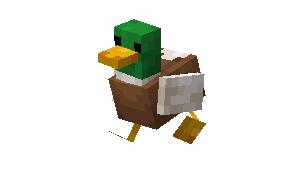
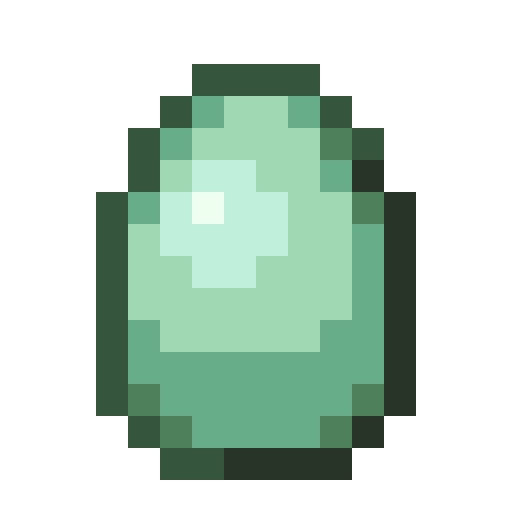
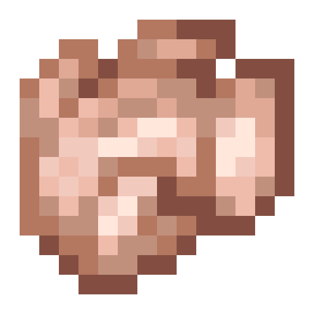
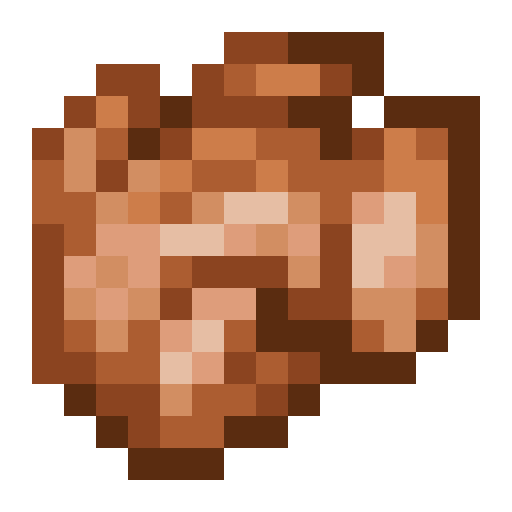
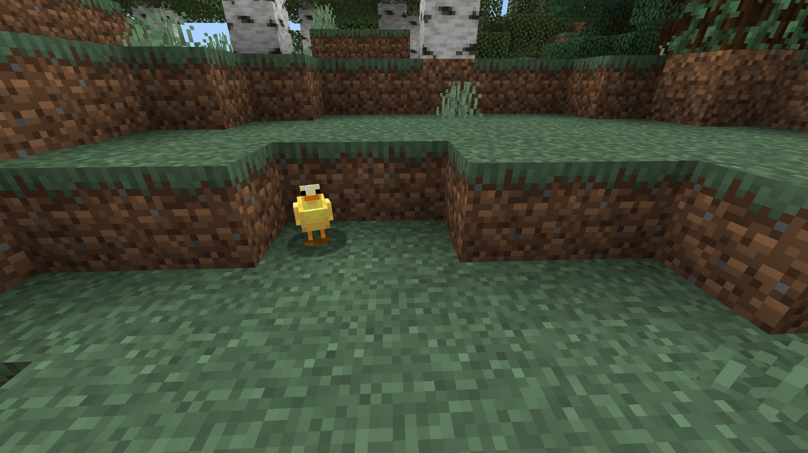
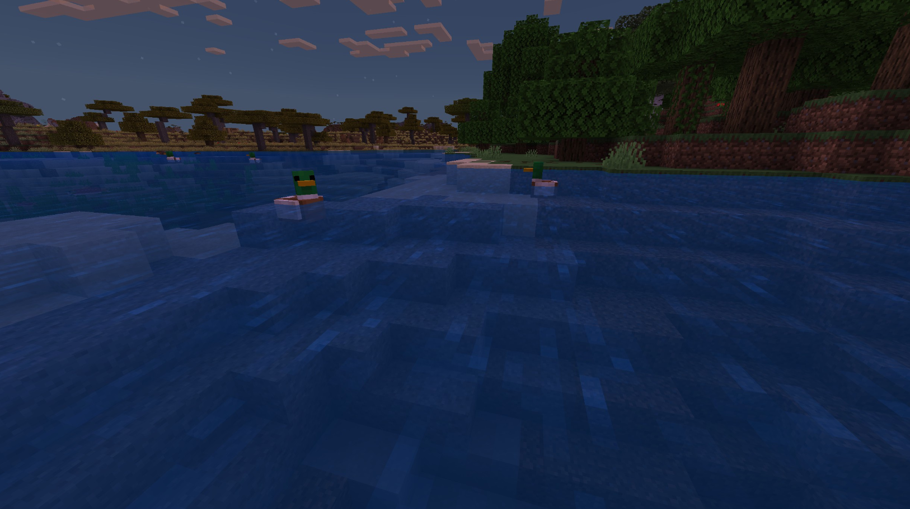
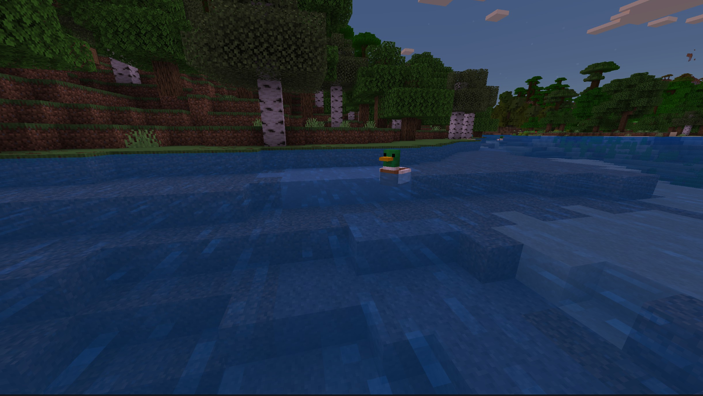
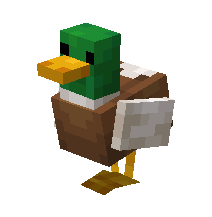
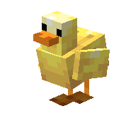

# Duck

Last Updated: April 22, 2025 8:47 PM

---

**Return**

🐻 [Naturalist Add-On Wiki](/www.notion.so/1a7a9a61c3f1800c8e32e893d6e7f430?pvs=21)

---

Ducks are the most common type of bird in North America. They have serrated edges on each side of their beak, which helps them catch and consume fish, but they also love seeds! Ducks have waterproof feathers to keep them warm and dry in the warm or while swimming in bodies of water. 

<aside>

### **Duck**

---

**Health: 4** [♥️♥️♥️]

---

**Classification:** [Animal](/minecraft.fandom.com/wiki/Animal) / [Aquatic](/minecraft.fandom.com/wiki/Aquatic)

---

**Behavior:** Passive

---

**Spawn:** [Plains](/minecraft.wiki/w/Plains)**,** [Birch Forest](/minecraft.wiki/w/Birch_Forest), [Birch Forest Hills](/minecraft.wiki/w/Birch_Forest_Hills), [Birch Forest Mutated](/minecraft.wiki/w/Old_Growth_Birch_Forest), & [Rivers](/minecraft.wiki/w/River)

---

</aside>

---

### 🌎 Spawning

Ducks will spawn in a flock of 1-5 in the [plains](/minecraft.wiki/w/Plains), [birch forest](/minecraft.wiki/w/Birch_Forest_Hills), [birch forest hills](/minecraft.wiki/w/Birch_Forest_Hills), [birch forest mutated](/minecraft.wiki/w/Old_Growth_Birch_Forest), and [river](/minecraft.wiki/w/River) biomes. You will find them during the day with light levels of 9-15. They will spawn on [dirt](/minecraft.wiki/w/Dirt), [grass](/minecraft.fandom.com/wiki/Grass_Block), [mud](/minecraft.wiki/w/Mud), [sand](/minecraft.wiki/w/Sand), and in [water](/minecraft.wiki/w/Water).

---

### ⚔️ Drops

Adult duck [drops](/minecraft.fandom.com/wiki/Drops) upon death:

- 0 - 2 [Feather](/minecraft.wiki/w/Feather)
    - ⚔️ The maximum amount is increased by 1 per level of [Looting](/minecraft.fandom.com/wiki/Looting), for a maximum of 0-4 with Looting III.
- 1 Raw Duck
    - ⚔️ The maximum amount is increased by 1 per level of [Looting](/minecraft.fandom.com/wiki/Looting), for a maximum of 1-3 with Looting III.
- 1 Cooked Duck
    - ⚔️ Cooked Duck can be dropped when killed on land with [Smelting](/minecraft.fandom.com/wiki/Fire_Aspect) or [Flame](/minecraft.fandom.com/wiki/Flame) enchantment. This will not work when the Duck is killed in the water.
- 🟢 1 - 3 [Experience](/minecraft.fandom.com/wiki/Experience) Orbs if killed by Player.
- 🟢 1 - 7 Experience Orbs upon [breeding](/minecraft.fandom.com/wiki/Breeding).

*Ducklings yield no items nor experience.* 

---

### 🧠 Behavior

Ducks are passive birds that can be found in flocks of up to 5 birds. You can find them swimming in nearby waters or slapping their webbed feet on the ground. They wander around aimlessly, but they will follow a player with seeds much like a chicken does!

Ducks love to swim; they will bring in their legs and float on water as they move about. They will lay eggs, both in water and on land, every 5-10 minutes.

---

### ❤️ Taming, Healing, & Feeding

Ducks can be tamed with raw and cooked fish. There is a 50% chance of successful taming. Once they are tamed, you will see hearts appear and a bow on their chest signifying you have tamed the duck. You can [dye](/minecraft.fandom.com/wiki/Dye) the bow to your color of choice or use [shears](/minecraft.fandom.com/wiki/Shears) to cut off the bow. If you shear off the bow, it can be reapplied by using a dye color of your choice.

Tamed ducks can be commanded to sit or follow:

- Ducks will teleport to the player if the player is further than 10 blocks away.
- Ducks will not teleport to the player if they are commanded to sit.

If a duck you have tamed gets injured, you can feed it raw and cooked fish to increase its health until it is maxed. 1 fish increased the duck’s health points by 2. An injured duck will be unable to breed until it is healed.

**List of fish for taming:** [Raw Salmon](/minecraft.wiki/w/Raw_Salmon), [Cooked Salmon](/minecraft.wiki/w/Cooked_Salmon), Raw Cavefish, Cooked Cavefish, Raw Catfish, Cooked Catfish, [Raw Cod](/minecraft.wiki/w/Raw_Cod), [Cooked Cod](/minecraft.wiki/w/Cooked_Cod), Raw Bass, Cooked Bass, and [Tropical Fish](/minecraft.fandom.com/wiki/Tropical_Fish).

---

### 🥚Breeding

Ducks with full health can be bred with a variety of seeds and fish. There is a 5-minute cooldown for breeding, during which the duck does not accept any seeds or fish for breeding but will accept fish for healing if they are injured.

Upon successful breeding, a duckling will be born. The growth of ducklings can be slowly accelerated by using seeds or fish.

**List of items for breeding:**

**Seeds:** [Wheat Seeds](/minecraft.wiki/w/Wheat_Seeds), [Beetroot Seeds](/minecraft.wiki/w/Beetroot_Seeds), [Melon Seeds](/minecraft.wiki/w/Melon_Slice), [Pumpkin Seeds](/minecraft.wiki/w/Pumpkin_Seeds), [Pitcher Pods](/minecraft.wiki/w/Pitcher_Pod), and [Torchflower Seeds](/minecraft.wiki/w/Torchflower_Seeds).

**Fish:** [Raw Salmon](/minecraft.wiki/w/Raw_Salmon), [Cooked Salmon](/minecraft.wiki/w/Cooked_Salmon), Raw Cavefish, Cooked Cavefish, Raw Catfish, Cooked Catfish, [Raw Cod](/minecraft.wiki/w/Raw_Cod), [Cooked Cod](/minecraft.wiki/w/Cooked_Cod), Raw Bass, Cooked Bass, and [Tropical Fish](/minecraft.fandom.com/wiki/Tropical_Fish).

---

### 🖼️ Gallery

---

### 🎨 Variants

              Duck

            Baby Duck

<aside>
 Have additional questions? Want to be a part of our community? → [Join our Discord!](/discord.com/invite/starfishstudios)

</aside>

<aside>

[**Marketplace](/www.minecraft.net/en-us/marketplace/creator?name=Starfish%20Studios)      [CurseForge](/www.curseforge.com/members/starfish_studios/projects)      [TikTok](/www.tiktok.com/@starfishstudios)      [Instagram](/www.instagram.com/starfishstudiosinc/)      [Twitter](/twitter.com/starfishstudios)      [YouTube](/www.youtube.com/@starfishstudios)      [Website](/starfish-studios.com/)**

</aside>
