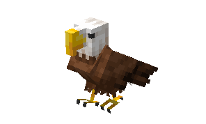
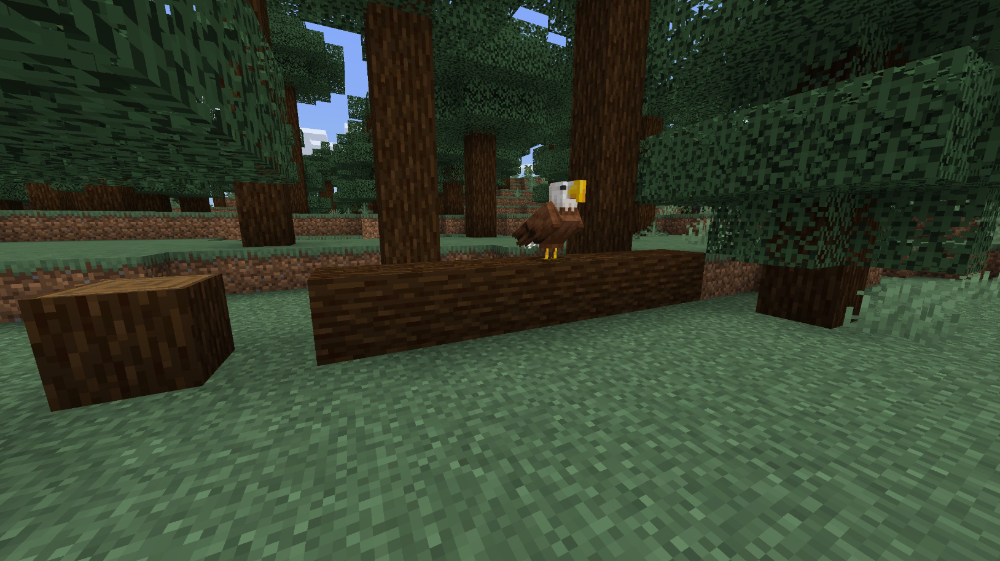
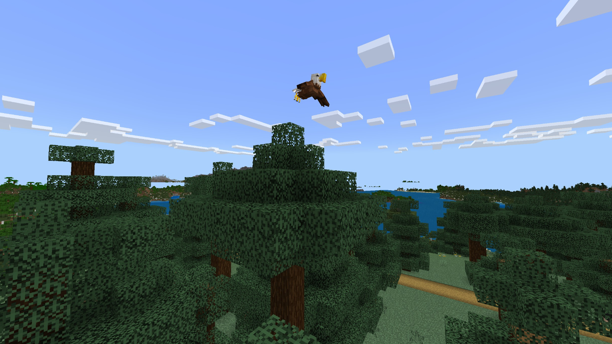

# Eagle

Last Updated: April 22, 2025 8:47 PM

---

**Return**

🐻 [Naturalist Add-On Wiki](/www.notion.so/1a7a9a61c3f1800c8e32e893d6e7f430?pvs=21)

---

Eagles are one of the biggest birds on the planet that reside at the top of the food chain. They can see up to 3 kilometers away and use their powerful talons to help them catch prey. They build their nests on high cliffs or in tall trees, which is why you can typically find them in higher-altitude locations.

<aside>

### **Eagle**

---

**Health: 15** [♥️♥️♥️]

---

**Classification:** [Animal](/minecraft.fandom.com/wiki/Animal) 

---

**Behavior:** Passive unless protecting

---

**Spawn:** [Taiga](/minecraft.wiki/w/Taiga), [Extreme Hills](/minecraft.wiki/w/Windswept_Hills), [Ice Plains](/minecraft.wiki/w/Snowy_Plains), [Stony Peaks](/minecraft.wiki/w/Stony_Peaks), & [Frozen Peaks](/minecraft.wiki/w/Frozen_Peaks)

---

</aside>

---

### 🌎 Spawning

A soar of 1-4 eagles will spawn in taiga, extreme hills, ice plains, stony peaks, and frozen peaks biomes. They will spawn during the daytime with [light levels](/minecraft.fandom.com/wiki/Light) between 7-15. If you are searching for them in the frozen peak biome, they will exclusively spawn on [grass](/minecraft.fandom.com/wiki/Grass_Block), [leaves](/minecraft.wiki/w/Leaves), and [logs](/minecraft.wiki/w/Log).

---

### ⚔️ Drops

Eagle [drops](/minecraft.fandom.com/wiki/Drops) upon death:

- 1 - 2 [Feather](/minecraft.wiki/w/Feather)
    - ⚔️ The maximum amount is increased by 1 per level of [Looting](/minecraft.fandom.com/wiki/Looting), for a maximum of 1-4 with Looting III.
- 1 - 2 Talon
    - ⚔️ The maximum amount is increased by 1 per level of [Looting](/minecraft.fandom.com/wiki/Looting), for a maximum of 1-4 with Looting III.
- 🟢 1 - 3 [Experience](/minecraft.fandom.com/wiki/Experience) Orbs if killed by Player.

---

### 🧠 Behavior

Eagles are passive birds, but they are fierce protectors. They will be spotted soaring the skies, perching on trees, or hopping around on the ground.

Eagles will circle and prey on squirrels and rabbits. You will spot them swooping down from the skies to attack these animals until they are successful in capturing their prey.

When eagles are tamed, they are a player’s new protector. If a player attacks a mob, they will divebomb any enemies that they attack. They will be persistent in their attacks until either 1) the player runs away and the mob they attacked is out of range or 2) the mob they attacked dies.

---

### ❤️ Taming, Healing, & Feeding

Eagles can be tamed with [raw cod](/minecraft.wiki/w/Raw_Cod), [raw salmon](/minecraft.wiki/w/Raw_Salmon), and [tropical fish](/minecraft.fandom.com/wiki/Tropical_Fish). There is a 50% chance of successful taming. Once they are tamed, they will follow and protect you by attacking hostiles if they attack you first. There is no visual indicator that an eagle has been tamed, but they will soar the skies around you as proof of their loyalty.

Tamed eagles can be commanded to sit or follow.

- Eagles will teleport to the player if the player is further than 17 blocks away.
- Eagles will not teleport to the player if they are commanded to sit.

If an eagle you have tamed gets injured, you can feed the eagle raw cod, raw salmon, and tropical fish to increase its [health](/minecraft.fandom.com/wiki/Health) until it is maxed. 1 fish increases the eagle’s health points by 2. An injured eagle will be unable to breed until it is healed.

Feeding an eagle a [cookie](/minecraft.wiki/w/Cookie) will cause [Fatal Poison](/minecraft.wiki/w/Fatal_Poison) particles to be emitted, and they will lose health points. Chocolate is toxic to birds.

---

### 🖼️ Gallery

---

<aside>
 Have additional questions? Want to be a part of our community? → [Join our Discord!](/discord.com/invite/starfishstudios)

</aside>

<aside>

[**Marketplace](/www.minecraft.net/en-us/marketplace/creator?name=Starfish%20Studios)      [CurseForge](/www.curseforge.com/members/starfish_studios/projects)      [TikTok](/www.tiktok.com/@starfishstudios)      [Instagram](/www.instagram.com/starfishstudiosinc/)      [Twitter](/twitter.com/starfishstudios)      [YouTube](/www.youtube.com/@starfishstudios)      [Website](/starfish-studios.com/)**

</aside>
