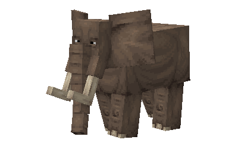
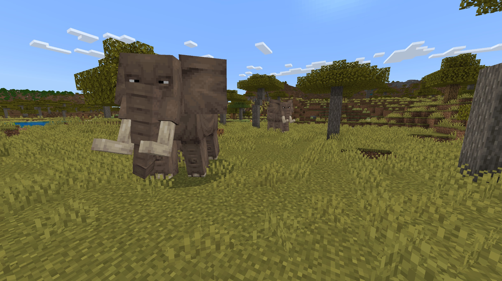
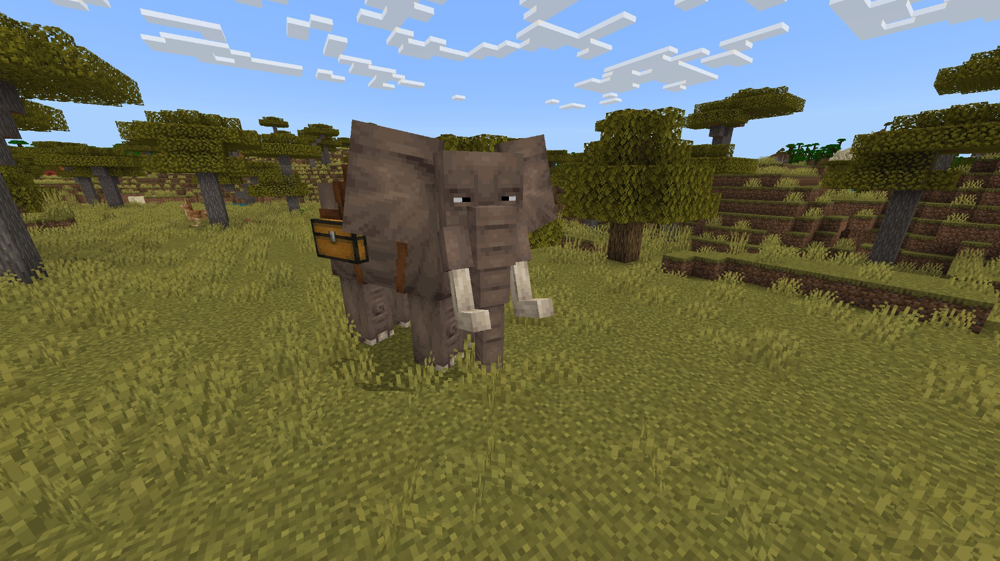

# Elephant

Last Updated: April 22, 2025 8:47 PM

---

**Return**

🐻 [Naturalist Add-On Wiki](/www.notion.so/1a7a9a61c3f1800c8e32e893d6e7f430?pvs=21)

---

Elephants are the largest land animals with only 3 distinct species. Elephants can easily distinguish people from friends to foes based on their smell and will sometimes comfort their distressed friends by stroking them with their trunks. Elephants sleep 2-3 hours per day and will sleep standing up.

Ironically enough, elephants don’t like peanuts!

<aside>

### **Elephant**

---

**Health: 50** [♥️♥️♥️]

---

**Classification:** [Animal](/minecraft.fandom.com/wiki/Animal) 

---

**Behavior:** Passive unless provoked

---

**Spawn:** [Savanna](/minecraft.wiki/w/Savanna)

---

</aside>

---

### 🌎 Spawning

Elephants will spawn in a herd of 2-3 in [savanna](/minecraft.wiki/w/Savanna) biomes. They will spawn during the daytime with [light levels](/minecraft.fandom.com/wiki/Light) between 9-15. They will spawn on [grass](/minecraft.fandom.com/wiki/Grass_Block), [mud](/minecraft.fandom.com/wiki/Mud), [mangrove roots](/minecraft.fandom.com/wiki/Mangrove_Roots), and [muddy mangrove roots](/minecraft.fandom.com/wiki/Muddy_Mangrove_Roots). 

---

### ⚔️ Drops

Adult elephant [drops](/minecraft.fandom.com/wiki/Drops) upon death:

- 1 - 3 Hide
    - ⚔️ The maximum amount is increased by 1 per level of [Looting](/minecraft.fandom.com/wiki/Looting), for a maximum of 1-6 with Looting III.
- 1 - 3 Bushmeat
    - ⚔️ The maximum amount is increased by 1 per level of [Looting](/minecraft.fandom.com/wiki/Looting), for a maximum of 1-6 with Looting III.
- 1 [Saddle](/minecraft.wiki/w/Saddle)
    - A saddle will only drop if the animal was saddled before death.
- 🟢 1 - 3 [Experience](/minecraft.fandom.com/wiki/Experience) Orbs if killed by Player.
- 🟢 1 - 7 Experience Orbs upon [breeding](/minecraft.fandom.com/wiki/Breeding).

*Calves yield no items nor experience.*

---

### 🧠 Behavior

Elephants roam the savannas aimlessly unless there are bees nearby. Elephants cannot stand bees and will flee until they are out of range.

Elephant calves will follow their parents until they are mature adults. If their parent wanders away, the calf will quickly run to catch up. Elephants do not attack players that come near their calves, like bears, but they will attack if a player attacks the calf first!

Once an elephant is tamed, they can be [saddled](/minecraft.wiki/w/Saddle) and carry a chest of items that can be accessed by opening the inventory while riding the elephant.

---

### ❤️ Taming, Healing, & Feeding

Elephants can be tamed with [pumpkins](/minecraft.wiki/w/Pumpkin) or by riding the elephant until it no longer kicks you off its back. Elephants are temperamental creatures that may not like someone riding on their back until they get comfortable with you. If you feed an elephant [wheat](/minecraft.wiki/w/Wheat), [sugar](/minecraft.wiki/w/Sugar), [apple](/minecraft.wiki/w/Apple), [golden apple](/minecraft.wiki/w/Golden_Apple), [enchanted golden apple](/minecraft.wiki/w/Enchanted_Golden_Apple), or a [golden carrot](/minecraft.wiki/w/Golden_Carrot), their temper will decrease, and the elephant will start to be friendlier with you until you can tame it. Once they are tamed, you will see hearts appear. There is no visual indication that they are tamed other than the hearts; however, an elephant will let you ride it once it is tamed, and you can put a [saddle](/minecraft.wiki/w/Saddle) on it. 

Tamed elephants cannot be commanded, nor will they follow a player at any time. To keep your elephants within a certain area, you can put a [lead](/minecraft.wiki/w/Lead) on them and tie them to a [fence](/minecraft.wiki/w/Wooden_Fence) or build a corral around them. 

Tamed elephants cannot be commanded, nor will they follow a player at any time. To keep your elephants within a certain area, you can put a [lead](/minecraft.wiki/w/Lead) on them and tie them to a [fence](/minecraft.wiki/w/Wooden_Fence) or build a corral around them. 

---

### 🥚Breeding

Adult elephants can be bred with [pumpkins](/minecraft.wiki/w/Pumpkin). There is a 5-minute cooldown for breeding, during which the elephant does not accept pumpkins for breeding.

Upon successful breeding, a calf will be born. It takes a calf a full Minecraft day to grow up into an adult. You cannot feed a calf any items to accelerate its growth rate.

---

### 🖼️ Gallery

---

<aside>
 Have additional questions? Want to be a part of our community? → [Join our Discord!](/discord.com/invite/starfishstudios)

</aside>

<aside>

[**Marketplace](/www.minecraft.net/en-us/marketplace/creator?name=Starfish%20Studios)      [CurseForge](/www.curseforge.com/members/starfish_studios/projects)      [TikTok](/www.tiktok.com/@starfishstudios)      [Instagram](/www.instagram.com/starfishstudiosinc/)      [Twitter](/twitter.com/starfishstudios)      [YouTube](/www.youtube.com/@starfishstudios)      [Website](/starfish-studios.com/)**

</aside>
