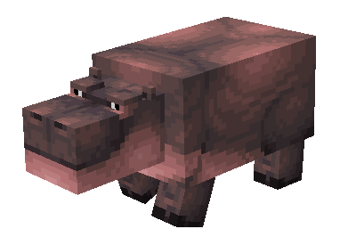
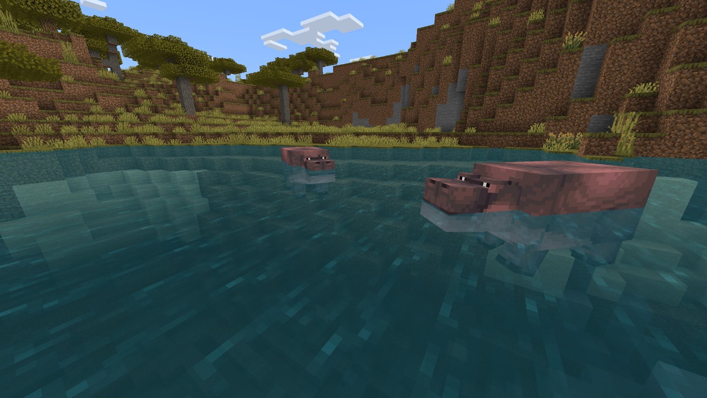

# Hippo

Last Updated: April 22, 2025 8:47 PM

---

**Return**

🐻 [Naturalist Add-On Wiki](/www.notion.so/1a7a9a61c3f1800c8e32e893d6e7f430?pvs=21)

---

Hippos are the third largest land mammals native to sub-Saharan Africa and Columbia. They spend most of their time in the water to stay cool in the heat. They can hold their breath underwater, and if they are completely submerged, their ears and nostrils fold shut to keep water out! Hippos are quite aggressive if they are threatened and can deliver a powerful bite with their strong teeth!

<aside>

### **Hippo**

---

**Health: 40** [♥️♥️♥️]

---

**Classification:** [Animal](/minecraft.fandom.com/wiki/Animal) / [Aquatic](/minecraft.fandom.com/wiki/Aquatic)

---

**Behavior:** Passive unless provoked

---

**Spawn:** [Savanna](/minecraft.wiki/w/Savanna)

</aside>

---

### 🌎 Spawning

Hippos spawn in a bloat of 1-2 during the daytime with [light levels](/minecraft.fandom.com/wiki/Light) of 9-15. You will find these animals in the [savanna](/minecraft.wiki/w/Savanna) biome, and if they wander around, you may find them taking a bath in a nearby river!

---

### ⚔️ Drops

Adult hippo [drops](/minecraft.fandom.com/wiki/Drops) upon death:

- 1 - 5 [Melon Slice](/minecraft.wiki/w/Melon_Slice)
- 🟢 1 - 3 [Experience](/minecraft.fandom.com/wiki/Experience) Orbs if killed by Player.
- 🟢 1 - 7 Experience Orbs upon [breeding](/minecraft.fandom.com/wiki/Breeding).

*Calves yield no items nor experience.*

---

### 🧠 Behavior

Hippos aimlessly wander around the savannas, occasionally taking a dip in the cool water where they will randomly swim around.

Hippos attack [boats](/minecraft.fandom.com/wiki/Boats) as well as players who come into the water, but if you’re around them while on land, you will be relatively safe unless they are chasing you out of the water or you have attacked one of them or their babies. They have powerful bites, so be sure to keep your distance unless you have melon blocks in hand.

---

### 🥚Breeding

Adult hippos can be bred with [melon blocks](/minecraft.wiki/w/Melon). There is a 5-minute cooldown for breeding, during which the hippo does not accept melon blocks for breeding.

Upon successful breeding, a calf will be born. The growth of calves can be slowly accelerated by using melon blocks.

---

### 🖼️ Gallery

---

<aside>
 Have additional questions? Want to be a part of our community? → [Join our Discord!](/discord.com/invite/starfishstudios)

</aside>

<aside>

[**Marketplace](/www.minecraft.net/en-us/marketplace/creator?name=Starfish%20Studios)      [CurseForge](/www.curseforge.com/members/starfish_studios/projects)      [TikTok](/www.tiktok.com/@starfishstudios)      [Instagram](/www.instagram.com/starfishstudiosinc/)      [Twitter](/twitter.com/starfishstudios)      [YouTube](/www.youtube.com/@starfishstudios)      [Website](/starfish-studios.com/)**

</aside>
