# Iguana

Last Updated: April 22, 2025 8:47 PM

---

**Return**

🐻 [Naturalist Add-On Wiki](/www.notion.so/1a7a9a61c3f1800c8e32e893d6e7f430?pvs=21)

---

Iguanas live in tropical rainforests in Central and South America and the Caribbean Islands. Iguanas utilize their tails as powerful weapons, but they can also shed their tails to escape predators. Don’t worry, as the tail can grow back! They store large amounts of fat in their lower jaw and neck area to survive if they cannot find food. 

<aside>

### **Iguana**

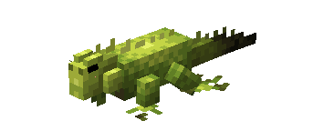

---

**Health: 8** [♥️♥️♥️]

---

**Classification:** [Animal](/minecraft.fandom.com/wiki/Animal)

---

**Behavior:** Passive

---

**Spawn:** [Beach](/minecraft.wiki/w/Beach), [Jungle](/minecraft.wiki/w/Jungle), [Lush Caves](/minecraft.wiki/w/Lush_Caves), [Mesa](/minecraft.wiki/w/Badlands), [Savanna](/minecraft.wiki/w/Savanna), & [Swamp](/minecraft.wiki/w/Swamp)

---

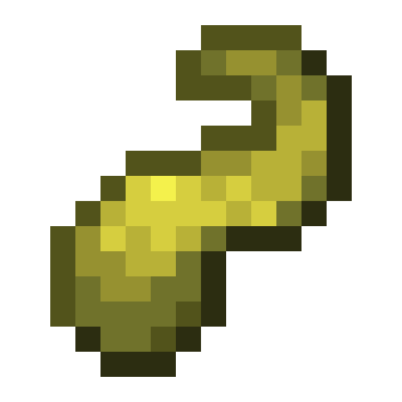

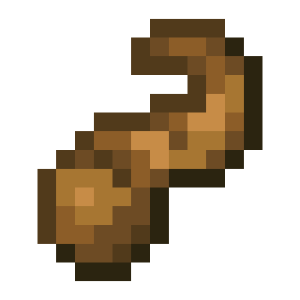

</aside>

---

### 🌎 Spawning

Iguanas will spawn in a mess of 1-2 in biomes consisting of the [beach](/minecraft.wiki/w/Beach), [jungle](/minecraft.wiki/w/Jungle), [lush caves](/minecraft.wiki/w/Lush_Caves), [mesa](/minecraft.wiki/w/Badlands), [savanna](/minecraft.wiki/w/Savanna), and [swamp](/minecraft.wiki/w/Swamp). They will stick to warmer climates as they enter a cold-stunned state in cold weather! Freezing weather can be fatal to iguanas, so you won’t find them in frozen biomes. They will spawn on [grass](/minecraft.fandom.com/wiki/Grass_Block), [sand](/minecraft.wiki/w/Sand), [terracotta](/minecraft.wiki/w/Terracotta), and [orange terracotta](/minecraft.wiki/w/Stained_Terracotta#Orange). 

---

### ⚔️ Drops

Iguana [drops](/minecraft.fandom.com/wiki/Drops) upon death:

- 1 Raw Reptile Tail
    - ⚔️ The maximum amount is increased by 1 per level of [Looting](/minecraft.fandom.com/wiki/Looting), for a maximum of 0-3 with Looting III.
- 0 - 1 Cooked Reptile Tail
    - ⚔️ Cooked Reptile Tail can be dropped when killed on land with [Smelting](/minecraft.fandom.com/wiki/Fire_Aspect) or [Flame](/minecraft.fandom.com/wiki/Flame) enchantment. This will not work when the Iguana is killed underwater.
- 🟢 1 - 3 [Experience](/minecraft.fandom.com/wiki/Experience) Orbs if killed by Player.
- 🟢 1 - 7 Experience Orbs upon [breeding](/minecraft.fandom.com/wiki/Breeding).

*Hatchlings yield no items nor experience.*

---

### 🧠 Behavior

Iguanas are passive reptiles that meander around the jungle. They can swim in water, so if you can’t find them on land, check nearby water sources!

Iguanas will run away from players unless they are tempted by seeds. They will change colors to camouflage themselves to the block that they are standing on as a form of protection.

They love sleeping at night but cannot sleep if they are in the water or during thunderstorms! They can be startled awake if a player gets too close or by other iguanas.

---

### ❤️ Taming, Healing, & Feeding

Adult iguanas can be tamed with [wheat seeds](/minecraft.wiki/w/Wheat_Seeds), [beetroot seeds](/minecraft.wiki/w/Beetroot_Seeds), [melon seeds](/minecraft.wiki/w/Melon_Seeds), and [pumpkin seeds](/minecraft.wiki/w/Pumpkin_Seeds). There is a 33% chance of successful taming. Once they are tamed, you will see hearts appear. There is no visual indication they are tamed other than the hearts, however, the iguana will listen to commands once it is tamed.

Tamed iguanas can be commanded to sit or follow.

- Iguanas will teleport to the player if the player is further than 10 blocks away.
- Iguanas will not teleport to the player if they are commanded to sit.

If an iguana you have tamed gets injured, you can feed the iguana wheat seeds, beetroot seeds, melon seeds, and pumpkin seeds to increase its [health](/minecraft.fandom.com/wiki/Health) until it is maxed. 1 seed increases the iguana’s health points by 2. An injured iguana will be unable to breed until it is healed.

---

### 🥚Breeding

Iguanas require to be tamed before they can be [bred](/minecraft.fandom.com/wiki/Breeding). Adult iguanas can be bred with [sweet berries](/minecraft.wiki/w/Sweet_Berries). There is a 5-minute cooldown for breeding, during which the iguana will not accept any sweet berries but they will accept their other liked foods if they get injured and need to heal.

Upon successful breeding, a hatchling will be born. The growth of hatchlings can be slowly accelerated by using sweet berries.

---

### 🖼️ Gallery

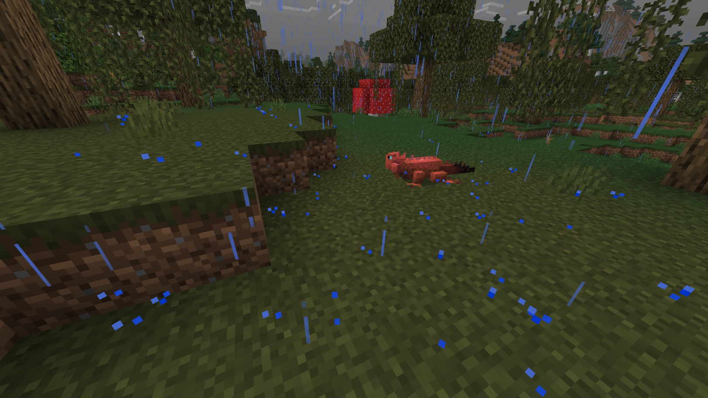

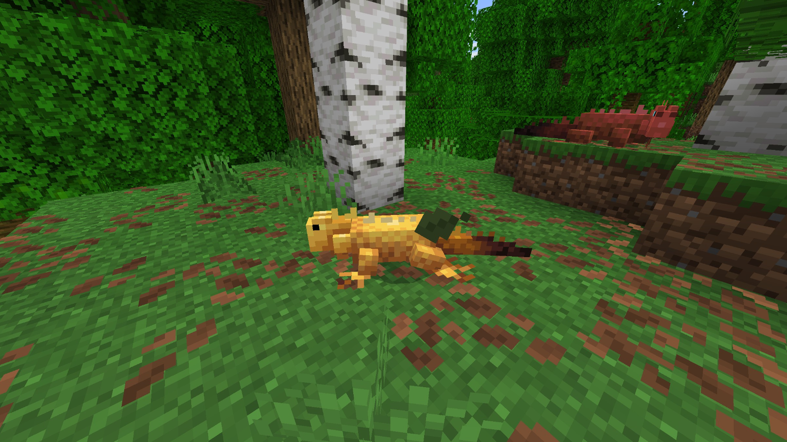

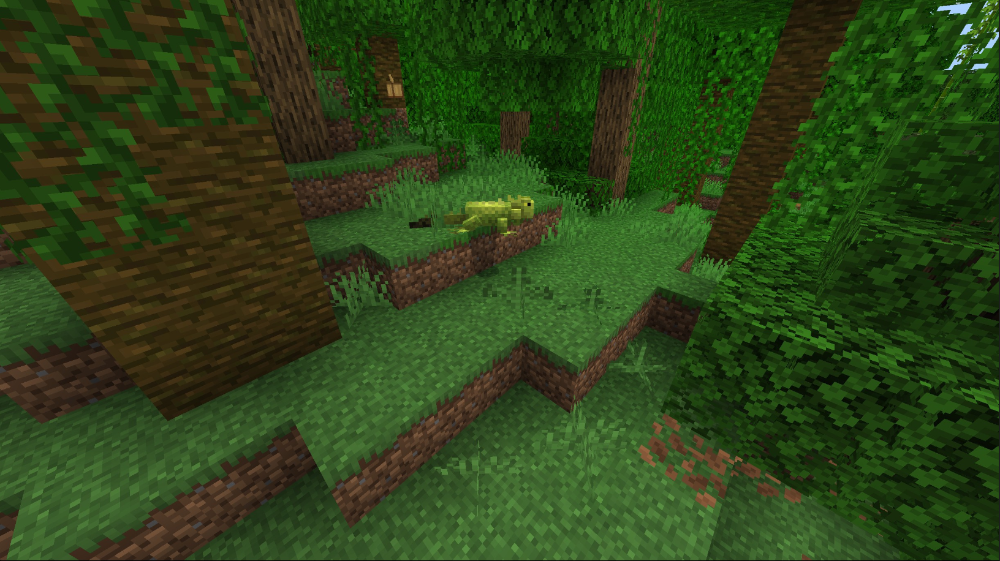

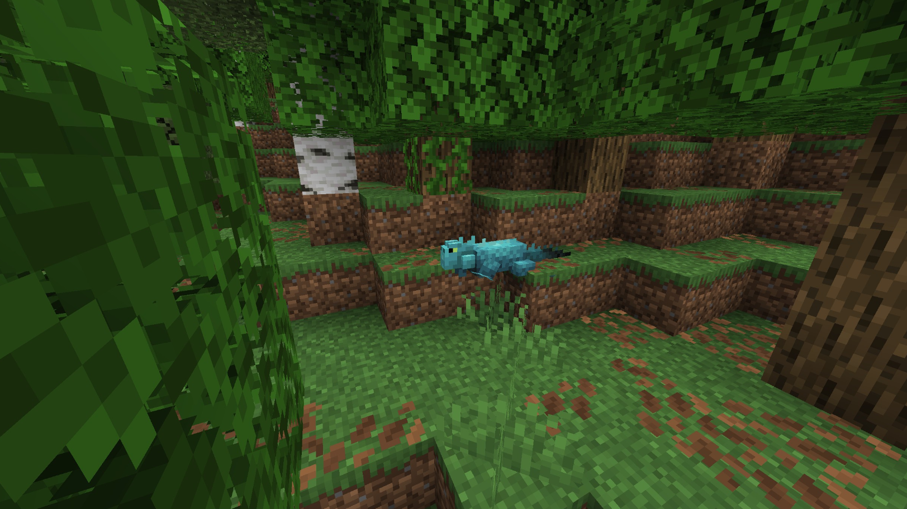

---

### 🎨 Variants

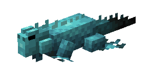

                        Blue Iguana

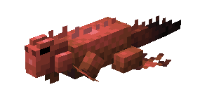

                          Red Iguana

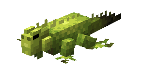

                        Green Iguana

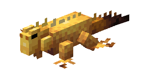

                         Yellow Iguana

---

<aside>
 Have additional questions? Want to be a part of our community? → [Join our Discord!](/discord.com/invite/starfishstudios)

</aside>

<aside>

[**Marketplace](/www.minecraft.net/en-us/marketplace/creator?name=Starfish%20Studios)      [CurseForge](/www.curseforge.com/members/starfish_studios/projects)      [TikTok](/www.tiktok.com/@starfishstudios)      [Instagram](/www.instagram.com/starfishstudiosinc/)      [Twitter](/twitter.com/starfishstudios)      [YouTube](/www.youtube.com/@starfishstudios)      [Website](/starfish-studios.com/)**

</aside>
