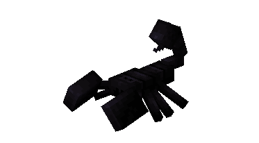
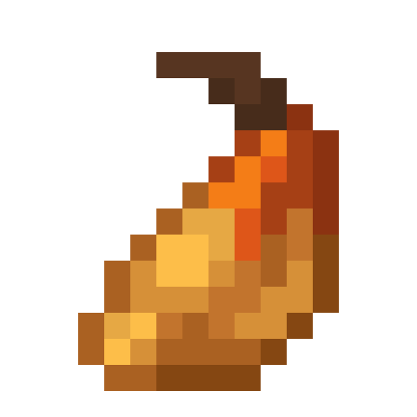
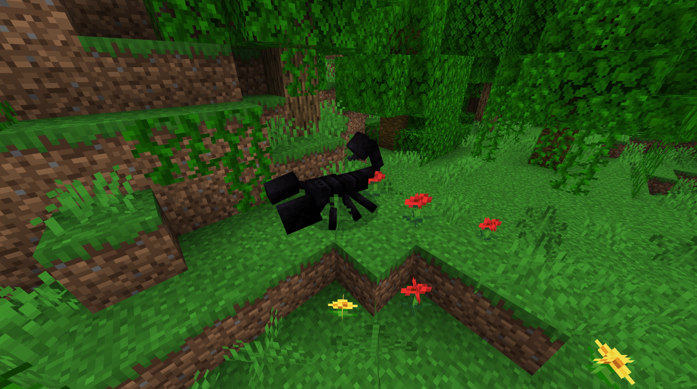
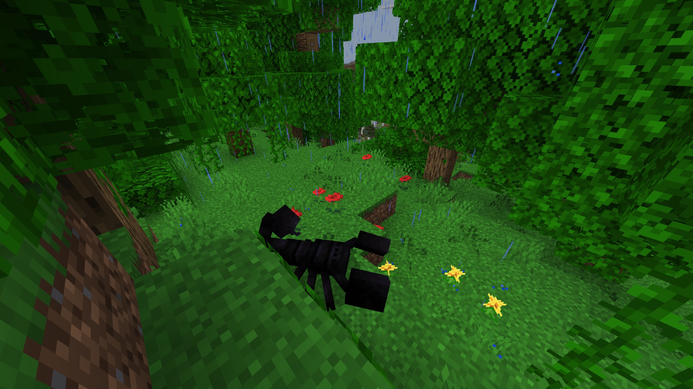
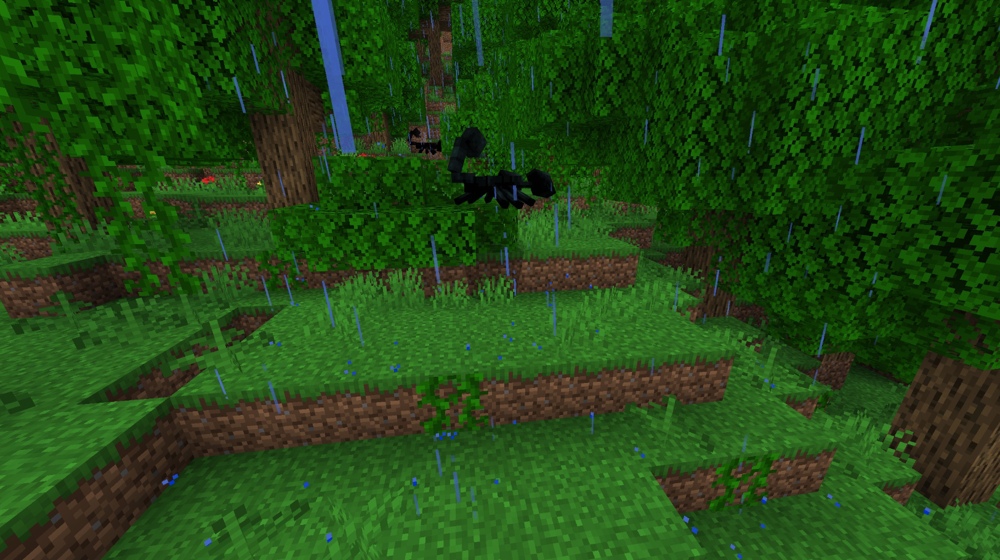
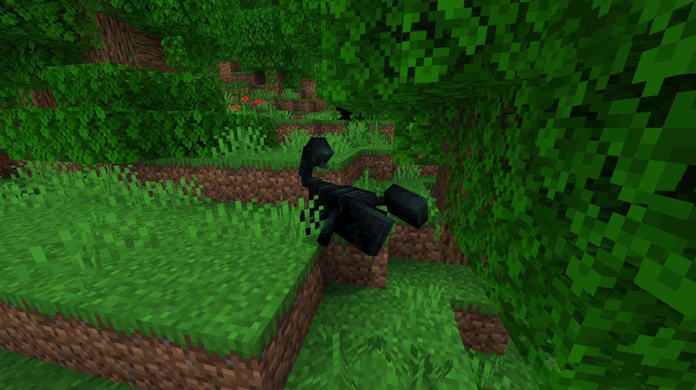
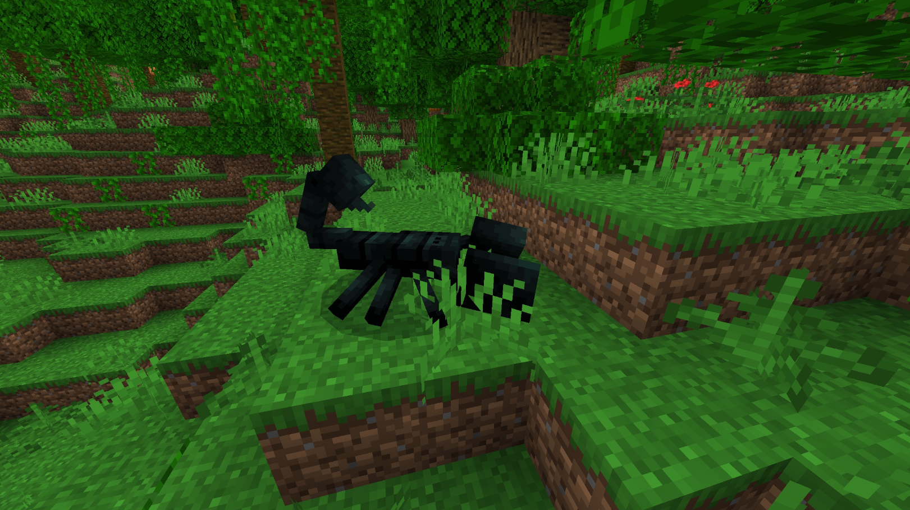
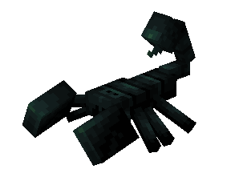
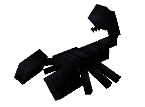

# Jungle Scorpion

Last Updated: April 22, 2025 8:47 PM

---

**Return**

🐻 [Naturalist Add-On Wiki](/www.notion.so/1a7a9a61c3f1800c8e32e893d6e7f430?pvs=21)

---

These scorpions are primarily found in warm climates and tropical areas such as the jungle. They have fierce stingers that can poison predators in means to protect itself. While ancient culture believes these scorpions are fierce and dangerous, they are more often the prey than they are the predator. 

<aside>

### **Jungle Scorpion**

---

**Health: 8** [♥️♥️♥️]

---

**Classification:** [Arthropod](/minecraft.wiki/w/Arthropod)

---

**Behavior:** Passive unless provoked

---

**Spawn:** [Jungle](/minecraft.wiki/w/Jungle)

---

</aside>

---

### 🌎 Spawning

A bed of 1-4 jungle scorpions will spawn in the [jungle](/minecraft.wiki/w/Jungle) biome. They will spawn during the daytime with [light levels](/minecraft.fandom.com/wiki/Light) between 7-15.

---

### ⚔️ Drops

Jungle Scorpion [drops](/minecraft.fandom.com/wiki/Drops) upon death:

- 1 Scorpion Poison Gland
    - ⚔️ The maximum amount is increased by 1 per level of [Looting](/minecraft.fandom.com/wiki/Looting), for a maximum of 1-3 with Looting III
- 🟢 3 [Experience](/minecraft.fandom.com/wiki/Experience) Orbs if killed by Player

---

### 🧠 Behavior

Scorpions are passive arthropods that roam the jungle biomes. They will hunt lizards, beetles, and termites.

If the player attacks a jungle scorpion, they will chase the player at high speeds to attack back. If their attack is successful, the player will be dealt poison damage. The only way to negate the poison is to have an antivenom potion readily available.

Antivenom potions can be crafted with the poison gland that a scorpion drops upon death.

---

### 🖼️ Gallery

---

### 🎨 Variants

                    Green Jungle Scorpion

                       Jungle Scorpion

---

<aside>
 Have additional questions? Want to be a part of our community? → [Join our Discord!](/discord.com/invite/starfishstudios)

</aside>

<aside>

[**Marketplace](/www.minecraft.net/en-us/marketplace/creator?name=Starfish%20Studios)      [CurseForge](/www.curseforge.com/members/starfish_studios/projects)      [TikTok](/www.tiktok.com/@starfishstudios)      [Instagram](/www.instagram.com/starfishstudiosinc/)      [Twitter](/twitter.com/starfishstudios)      [YouTube](/www.youtube.com/@starfishstudios)      [Website](/starfish-studios.com/)**

</aside>
