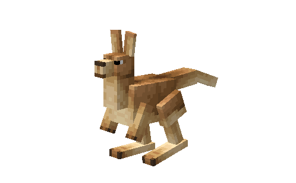
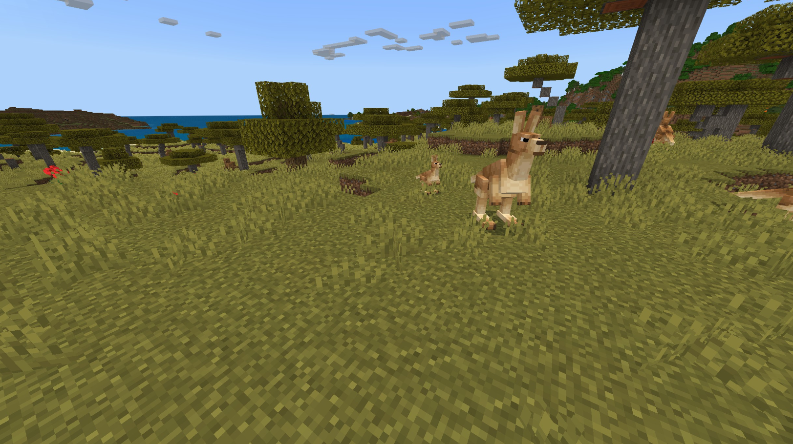
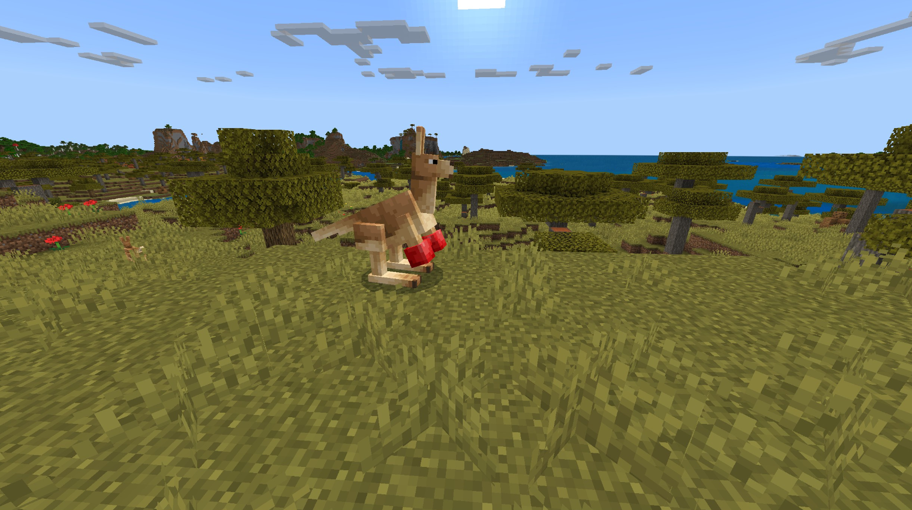

# Kangaroo

Last Updated: April 22, 2025 8:47 PM

---

**Return**

🐻 [Naturalist Add-On Wiki](/www.notion.so/1a7a9a61c3f1800c8e32e893d6e7f430?pvs=21)

---

Kangaroos are the largest marsupials in the world and are the symbol of Australia. They can hop over 8 meters in a single leap as their hind legs are spring loaded. Baby kangaroos, called joeys, live in the mother’s pouch for several months as it grows and develops. Male kangaroos can flex much like humans, but they flex to fend off rival mates.

<aside>

### **Kangaroo**

---

**Health: 12** [♥️♥️♥️]

---

**Classification:** [Animal](/minecraft.fandom.com/wiki/Animal)

---

**Behavior:** Passive unless provoked

Boxing Gloves: Hostile

Has Joey: Hostile

---

**Spawn:** [Savanna](/minecraft.wiki/w/Savanna)

---

</aside>

---

### 🌎 Spawning

A kangaroo will spawn by itself in the [savanna](/minecraft.wiki/w/Savanna) biome. They will spawn during the daytime with [light levels](/minecraft.fandom.com/wiki/Light) between 9-15. Additionally, they will spawn on [sand](/minecraft.wiki/w/Sand), [grass](/minecraft.fandom.com/wiki/Grass_Block), [mud](/minecraft.fandom.com/wiki/Mud), [mangrove roots](/minecraft.fandom.com/wiki/Mangrove_Roots), and [muddy mangrove roots](/minecraft.fandom.com/wiki/Muddy_Mangrove_Roots). 

---

### ⚔️ Drops

Adult kangaroo [drops](/minecraft.fandom.com/wiki/Drops) upon death:

- 0 - 2 Hide
    - ⚔️ The maximum amount is increased by 1 per level of [Looting](/minecraft.fandom.com/wiki/Looting), for a maximum of 0-4 with Looting III
- 0 - 1 Raw Bushmeat
    - ⚔️ The maximum amount is increased by 1 per level of [Looting](/minecraft.fandom.com/wiki/Looting), for a maximum of 0-3 with Looting III.
- 0 - 1 Cooked Bushmeat
    - ⚔️ Cooked Bushmeat can be dropped when killed on land with [Smelting](/minecraft.fandom.com/wiki/Fire_Aspect) or [Flame](/minecraft.fandom.com/wiki/Flame) enchantment.
- 🟢 3 [Experience](/minecraft.fandom.com/wiki/Experience) Orbs if killed by Player
- 🟢 1 - 7 Experience Orbs upon [breeding](/minecraft.fandom.com/wiki/Breeding)

*A joey yields no items nor experience.*

---

### 🧠 Behavior

Kangaroos are passive animals that hop around the savanna biome. It is best to keep your eye out if the kangaroo has either a joey in their pouch or is wearing boxing gloves as they are not kind to unwelcome guests. 

Kangaroos are incredibly protective of their young and will attack players if a player gets too close.

Kangaroos with boxing gloves are incredibly hostile and will put up a fight unless they are tempted with carrots and wheat.

Kangaroos will also attack nearby mobs that threaten players and their families alike!

---

### 🥚Breeding

Adult kangaroos can be [bred](/minecraft.fandom.com/wiki/Breeding) with [carrots](/minecraft.wiki/w/Carrot) and [wheat](/minecraft.wiki/w/Wheat). There is a 5-minute cooldown for breeding, during which the kangaroo will not accept carrots or wheat for breeding. 

Upon successful breeding, a joey will be born. The joey can be found inside the parent’s pouch. This joey will be carried in the pouch until it grows up and can survive on its own.

---

### 🖼️ Gallery

---

<aside>
 Have additional questions? Want to be a part of our community? → [Join our Discord!](/discord.com/invite/starfishstudios)

</aside>

<aside>

[**Marketplace](/www.minecraft.net/en-us/marketplace/creator?name=Starfish%20Studios)      [CurseForge](/www.curseforge.com/members/starfish_studios/projects)      [TikTok](/www.tiktok.com/@starfishstudios)      [Instagram](/www.instagram.com/starfishstudiosinc/)      [Twitter](/twitter.com/starfishstudios)      [YouTube](/www.youtube.com/@starfishstudios)      [Website](/starfish-studios.com/)**

</aside>
