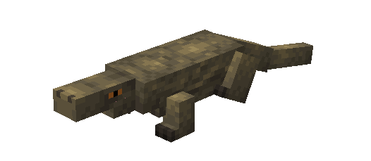
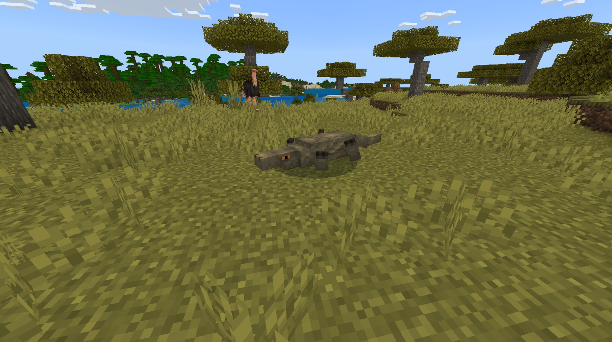
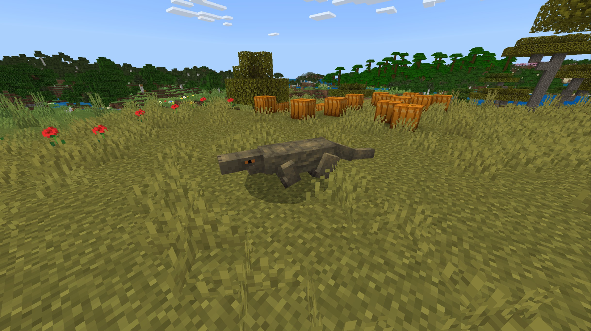

# Komodo Dragon

Last Updated: April 22, 2025 8:47 PM

---

**Return**

🐻 [Naturalist Add-On Wiki](/www.notion.so/1a7a9a61c3f1800c8e32e893d6e7f430?pvs=21)

---

Komodo dragons primarily reside in Indonesia and are the largest living lizards worldwide. They are known for their massive size, upwards of the length of a small car. Their tail is strong enough to take down a deer in one hit! They will hunt their prey with their sense of smell from miles away.

<aside>

### **Komodo Dragon**

---

**Health: 32** [♥️♥️♥️]

---

**Classification:** [Animal](/minecraft.fandom.com/wiki/Animal)

---

**Behavior:** Neutral

---

**Spawn:** [Desert](/minecraft.wiki/w/Desert), [Mesa](/minecraft.wiki/w/Badlands), & [Savanna](/minecraft.wiki/w/Savanna)

---

</aside>

---

### 🌎 Spawning

A mob of 1-2 Komodo dragons will spawn in the [desert](/minecraft.wiki/w/Desert), [mesa](/minecraft.wiki/w/Badlands), or [savanna](/minecraft.wiki/w/Savanna) biomes. They will spawn on [grass](/minecraft.fandom.com/wiki/Grass_Block), [sand](/minecraft.wiki/w/Sand), [terracotta](/minecraft.wiki/w/Terracotta), and [orange terracotta](/minecraft.wiki/w/Stained_Terracotta#Orange) during the daytime with [light levels](/minecraft.fandom.com/wiki/Light) of 7-15.

---

### ⚔️ Drops

Adult Komodo Dragon [drops](/minecraft.fandom.com/wiki/Drops) upon death:

- 0 - 1 Hide
    - ⚔️ The maximum amount is increased by 1 per level of [Looting](/minecraft.fandom.com/wiki/Looting), for a maximum of 0-2 with Looting III
- 1 Bushmeat
    - ⚔️ The maximum amount is increased by 1 per level of [Looting](/minecraft.fandom.com/wiki/Looting), for a maximum of 0-2 with Looting III
- 🟢 1 - 3 [Experience](/minecraft.fandom.com/wiki/Experience) Orbs if killed by Player
- 🟢 1 - 7 Experience Orbs upon [breeding](/minecraft.fandom.com/wiki/Breeding).

*Hatchlings yield no items nor experience.*

---

### 🧠 Behavior

Komodo dragons are neutral mobs that enjoy basking in the sun during the day. They are passive animals that do not mind a player walking by; however, if a player stays in their territory too long, they will target players until either the player escapes them or dies. When the Komodo dragon attacks entities, they are affected with [poison II](/minecraft.fandom.com/wiki/Poison) for 5 seconds. Players are not the Komodo dragon’s only target, they will occasionally hunt [chickens](/minecraft.fandom.com/wiki/Rabbit), lizards, snakes, and boars.

---

### 🥚Breeding

Adult Komodo dragons can be [bred](/minecraft.fandom.com/wiki/Breeding) with various meats. There is a 5-minute cooldown for breeding, during which the Komodo dragon does not accept any items for breeding, but they will if they get injured and need to heal. Each item increases their health by 2 points.

Upon successful breeding, a hatchling will be born. The growth of hatchlings can be slowly accelerated by using any of the items listed below.

**List of items for breeding and healing:**
Meat: [Raw Chicken](/minecraft.wiki/w/Raw_Chicken), [Raw Beef](/minecraft.wiki/w/Raw_Beef), [Raw Mutton](/minecraft.wiki/w/Raw_Mutton), [Raw Porkchop](/minecraft.wiki/w/Raw_Porkchop), [Raw Rabbit](/minecraft.wiki/w/Raw_Rabbit), [Raw Cod](/minecraft.wiki/w/Raw_Cod), [Raw Salmon](/minecraft.wiki/w/Raw_Salmon), [Rotton Flesh](/minecraft.wiki/w/Rotten_Flesh), Raw Piranha, Raw Moose Meat, Raw Mammoth Meat, Raw Eel, Raw Drumstick, Raw Venison, Raw Morsel, Raw Reptile Tail, Raw Frog Leg, Raw Duck, Raw Crab Meat, Raw Clam Meat, Raw Catfish, Raw Bushmeat, Raw Bass, Raw Cavefish, Raw Blobfish, and Raw Anglerfish

---

### 🖼️ Gallery

---

<aside>
 Have additional questions? Want to be a part of our community? → [Join our Discord!](/discord.com/invite/starfishstudios)

</aside>

<aside>

[**Marketplace](/www.minecraft.net/en-us/marketplace/creator?name=Starfish%20Studios)      [CurseForge](/www.curseforge.com/members/starfish_studios/projects)      [TikTok](/www.tiktok.com/@starfishstudios)      [Instagram](/www.instagram.com/starfishstudiosinc/)      [Twitter](/twitter.com/starfishstudios)      [YouTube](/www.youtube.com/@starfishstudios)      [Website](/starfish-studios.com/)**

</aside>
