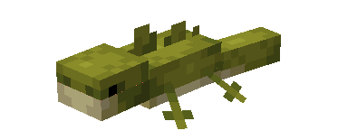
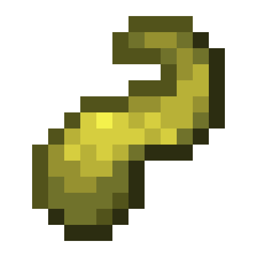
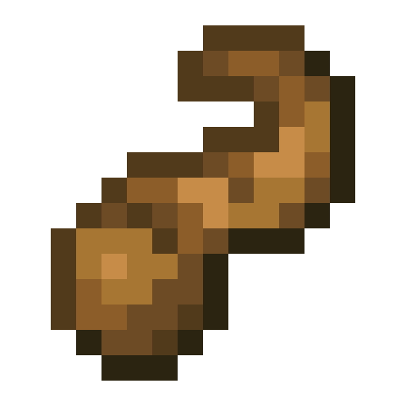
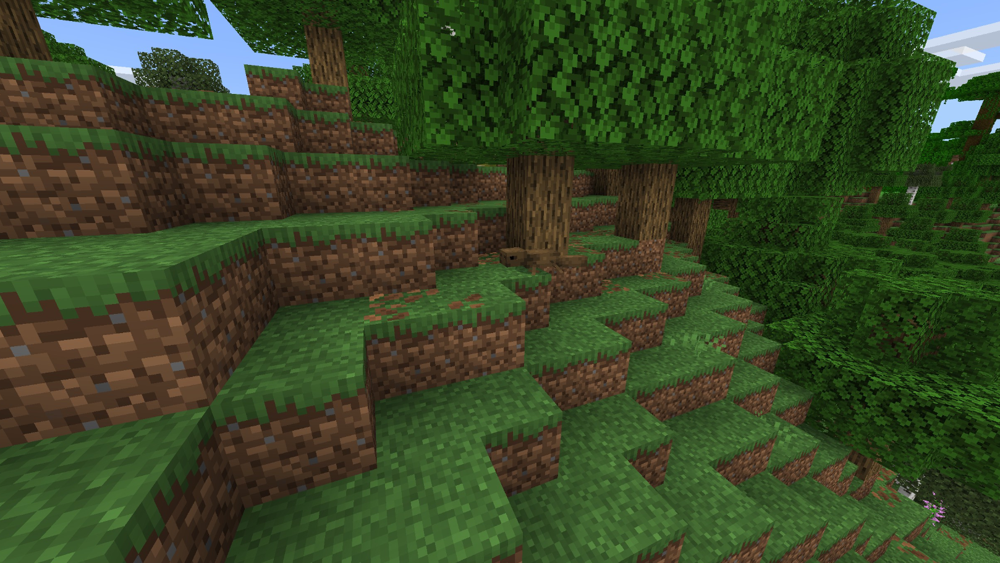
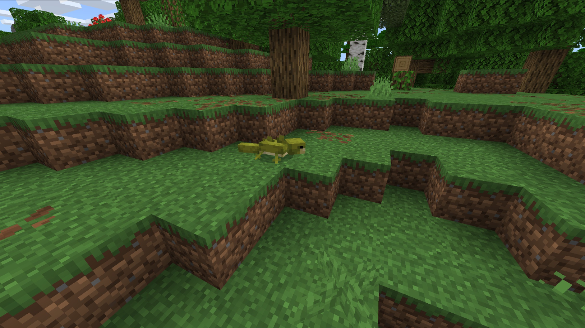
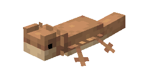
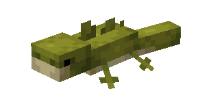
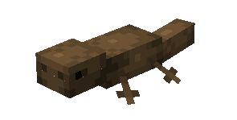
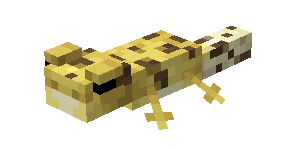

# Lizard

Last Updated: April 22, 2025 8:47 PM

---

**Return**

🐻 [Naturalist Add-On Wiki](/www.notion.so/1a7a9a61c3f1800c8e32e893d6e7f430?pvs=21)

---

Lizards are reptiles, and there are about 6,000 species worldwide. Unlike other reptiles, these lizards can blink (except geckos, who cannot move their eyelids).  Lizards have various adaptations to include frills, horns, and wings. They range in a variety of coloration, and some have spots! Lizards have tails that are designed to look weak, but it’s helpful for when a predator grabs it, and the lizard is able to get away when the tail breaks off.

<aside>

### **Lizard**

---

**Health: 8** [♥️♥️♥️]

---

**Classification:** [Animal](/minecraft.fandom.com/wiki/Animal)

---

**Behavior:** Passive

---

**Spawn:** [Forest](/minecraft.wiki/w/Forest), [Jungle](/minecraft.wiki/w/Jungle), [Mesa](/minecraft.wiki/w/Badlands), & [Swampland](/minecraft.wiki/w/Swamp)

---

</aside>

---

### 🌎 Spawning

A lizard will spawn by itself in the [forest](/minecraft.wiki/w/Forest), [jungle](/minecraft.wiki/w/Jungle), [mesa](/minecraft.wiki/w/Badlands), and [swampland](/minecraft.wiki/w/Swamp) biomes. Lizards enter a paralytic state and lose the ability to move their limbs when they are cold, so you will not find them in frozen variations of those biomes! They will spawn on [grass](/minecraft.fandom.com/wiki/Grass_Block), [sand](/minecraft.wiki/w/Sand), [terracotta](/minecraft.wiki/w/Terracotta), and [orange terracotta](/minecraft.wiki/w/Stained_Terracotta#Orange). 

---

### ⚔️ Drops

Lizard [drops](/minecraft.fandom.com/wiki/Drops) upon death:

- 0 - 1 Bone Meal
- 1 Morsel
    - ⚔️ Cooked Morsel can be dropped when killed on land with [Smelting](/minecraft.fandom.com/wiki/Fire_Aspect) or [Flame](/minecraft.fandom.com/wiki/Flame) enchantment. This will not work when the Lizard is killed in water.
- 🟢 1 - 3 [Experience](/minecraft.fandom.com/wiki/Experience) Orbs if killed by Player
- 🟢 1 - 7 Experience Orbs upon [breeding](/minecraft.fandom.com/wiki/Breeding).

*Hatchlings yield no items nor experience.*

---

### 🧠 Behavior

Lizards are passive reptiles that skitter about the biomes they are found in. They are prey to players and predators alike. If they are attacked, they will panic and try to flee. If their health reaches half, they will drop their tail, which will flop about, and some mobs will prioritize this as their new target. The tail flops for about 1 minute until it drops as an item.

---

### ❤️ Taming, Healing, & Feeding

Lizards can be tamed with [spider eyes](/minecraft.wiki/w/Spider_Eye). There is a 33% chance of successful taming. Once they are tamed, you will see hearts appear and a shirt on their body signifying you have tamed the lizard. You can [dye](/minecraft.fandom.com/wiki/Dye) the shirt to your color of choice or use [shears](/minecraft.fandom.com/wiki/Shears) to cut off the shirt. If you shear off the shirt, it can be reapplied by using a dye color of your choice.

Tamed lizards can be commanded to sit or to follow.

- Lizards will teleport to the player if the player is further than 10 blocks away.
- Lizards will not teleport to the player if they are commanded to sit.

If a lizard you have tamed gets injured, you can feed the lizard spider eyes to increase its [health](/minecraft.fandom.com/wiki/Health) until it is maxed. 1 spider eye increases the lizard’s health points by 2. An injured lizard will be unable to breed until it is healed.

---

### 🥚Breeding

Adult lizards with full health can be [bred](/minecraft.fandom.com/wiki/Breeding) with [spider eyes](/minecraft.wiki/w/Spider_Eye). There is a 5-minute cooldown for breeding, during which the lizard does not accept spider eyes for breeding but they will if they get injured and need to heal.

Upon successful breeding, a hatchling will be born. The growth rate of hatchlings can be slowly accelerated by using spider eyes.

---

### 🖼️ Gallery

---

### 🎨 Variants

                        Beardie Lizard

                          Green Lizard

                          Brown Lizard

                         Spotted Lizard

---

<aside>
 Have additional questions? Want to be a part of our community? → [Join our Discord!](/discord.com/invite/starfishstudios)

</aside>

<aside>

[**Marketplace](/www.minecraft.net/en-us/marketplace/creator?name=Starfish%20Studios)      [CurseForge](/www.curseforge.com/members/starfish_studios/projects)      [TikTok](/www.tiktok.com/@starfishstudios)      [Instagram](/www.instagram.com/starfishstudiosinc/)      [Twitter](/twitter.com/starfishstudios)      [YouTube](/www.youtube.com/@starfishstudios)      [Website](/starfish-studios.com/)**

</aside>
