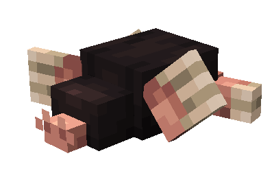
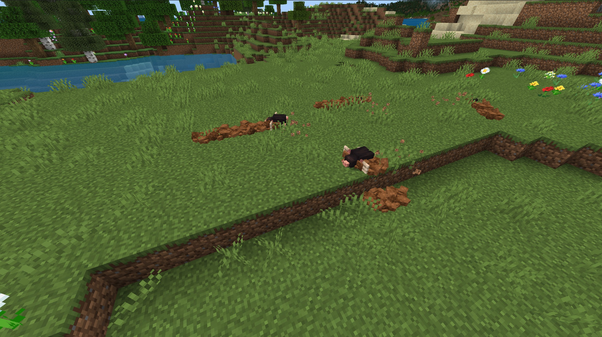
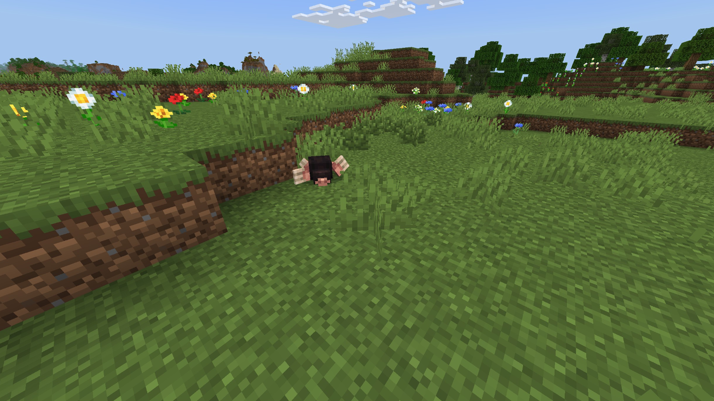
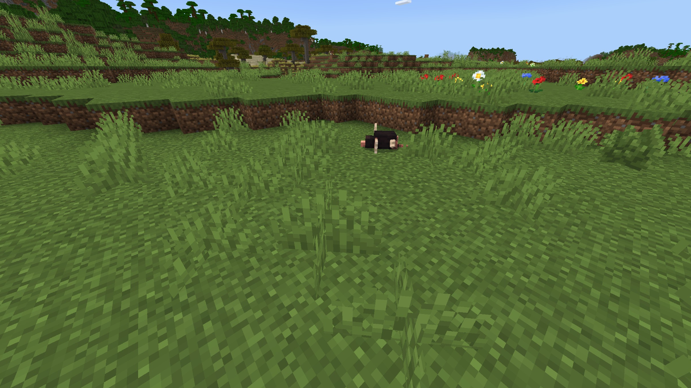

# Mole

Last Updated: April 22, 2025 8:47 PM

---

**Return**

🐻 [Naturalist Add-On Wiki](/www.notion.so/1a7a9a61c3f1800c8e32e893d6e7f430?pvs=21)

---

Moles have poor eyesight and rely on their sense of touch and smell to navigate their surroundings. They have powerful limbs with spade-like paws that are for digging through soil, which they spend most of their time doing. Their diets primarily consist of bugs they find, mainly beetles. Moles aerate the soil with their digging, this helps promote healthy crops.

<aside>

### **Mole**

---

**Health: 12** [♥️♥️♥️]

---

**Classification:** [Animal](/minecraft.fandom.com/wiki/Animal)

---

**Behavior:** Passive

---

**Spawn:** [Forest](/minecraft.wiki/w/Forest) & [Plains](/minecraft.wiki/w/Plains)

---

</aside>

---

### 🌎 Spawning

A labour of 1-2 moles will spawn in the [forest](/minecraft.wiki/w/Forest) and [plains](/minecraft.wiki/w/Plains) biome. If these biomes are frozen over, they will not spawn. Moles will spawn in the daytime with [light levels](/minecraft.fandom.com/wiki/Light) of 6-15. They will spawn on [grass](/minecraft.fandom.com/wiki/Grass_Block) and [dirt](/minecraft.wiki/w/Dirt).

---

### ⚔️ Drops

Mole [drops](/minecraft.fandom.com/wiki/Drops) upon death:

- 1 - 2 [Dirt](/minecraft.wiki/w/Dirt)
- 1 - 2 Fur
- 🟢 1 - 3 [Experience](/minecraft.fandom.com/wiki/Experience) Orbs if killed by Player.
- 🟢 1 - 7 Experience Orbs upon [breeding](/minecraft.fandom.com/wiki/Breeding).

*Pups yield no items nor experience.*

---

### 🧠 Behavior

Moles are passive animals and are incredibly skittish around players. They can burrow underground and move around while digging. Players can follow their trail with the dug-up dirt they leave behind. Moles move slowly on the surface or can sit on the mounds they’ve created. If a player approaches too fast, the mole will quickly burrow.

---

### 🥚Breeding

Adult moles can be bred with beetles (red, brown, green, yellow, and black). There is a 5-minute cooldown for breeding, during which the mole does not accept beetles for breeding. 

Upon successful breeding, a pup will be born. The growth of pups can be slowly accelerated by feeding them beetles.

---

### 🖼️ Gallery

---

<aside>
 Have additional questions? Want to be a part of our community? → [Join our Discord!](/discord.com/invite/starfishstudios)

</aside>

<aside>

[**Marketplace](/www.minecraft.net/en-us/marketplace/creator?name=Starfish%20Studios)      [CurseForge](/www.curseforge.com/members/starfish_studios/projects)      [TikTok](/www.tiktok.com/@starfishstudios)      [Instagram](/www.instagram.com/starfishstudiosinc/)      [Twitter](/twitter.com/starfishstudios)      [YouTube](/www.youtube.com/@starfishstudios)      [Website](/starfish-studios.com/)**

</aside>
