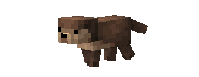
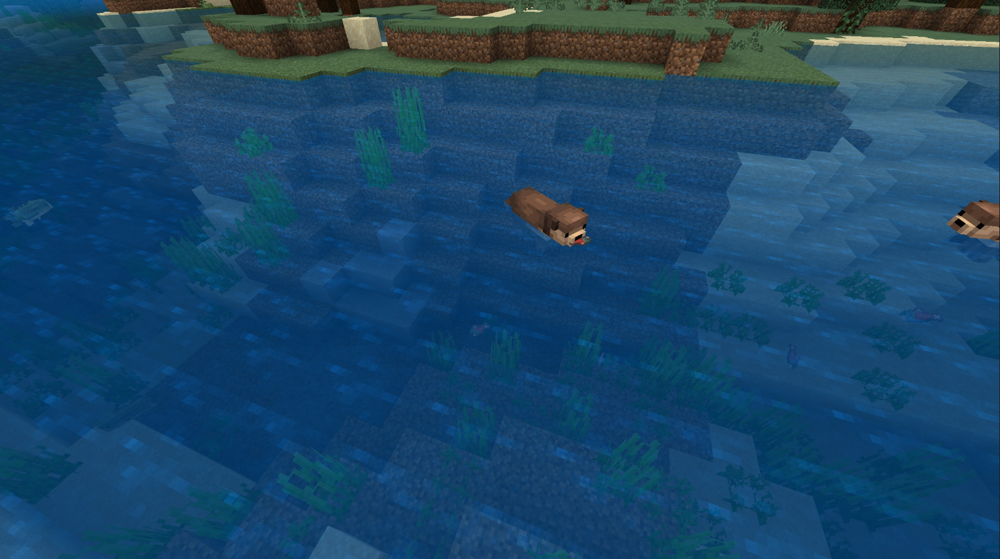
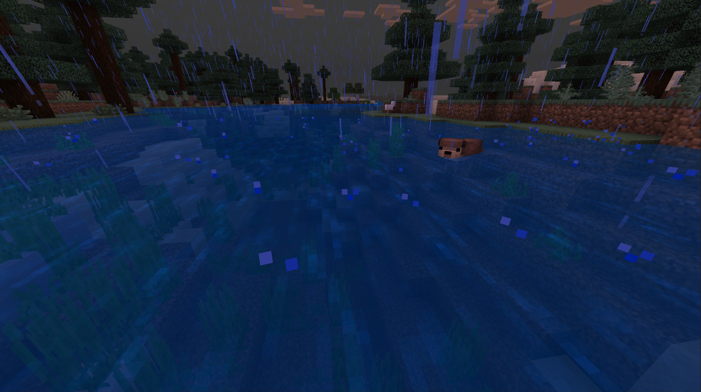
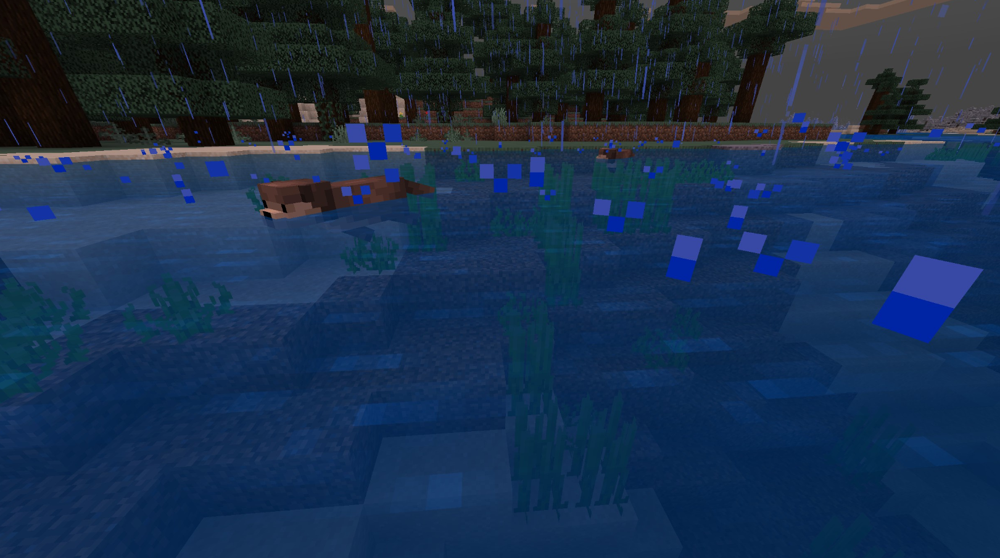

# Otter

Last Updated: April 22, 2025 8:47 PM

---

**Return**

🐻 [Naturalist Add-On Wiki](/www.notion.so/1a7a9a61c3f1800c8e32e893d6e7f430?pvs=21)

---

Otters are semi-aquatic social creatures that love to interact with other animals and humans alike. Otters eat up to 20-33% of their body weight each day in fish they hunt in the wild. They often lay on their backs and utilize their stomachs as tables while eating! These fast creatures love to deliver fish to their owners as if you are one of their own.

<aside>

### **Otter**

---

**Health: 15** [♥️♥️♥️]

---

**Classification:** [Animal](/minecraft.fandom.com/wiki/Animal) / [Aquatic](/minecraft.fandom.com/wiki/Aquatic)

---

**Behavior:** Passive

---

**Spawn:** [River](/minecraft.wiki/w/River) & [Swamp & Variants](/minecraft.wiki/w/Swamp)

---

</aside>

---

### 🌎 Spawning

A family of 1-3 otters will spawn in [rivers](/minecraft.wiki/w/River) & [swamps (including swamp variants)](/minecraft.wiki/w/Swamp). Unlike other marine animals, they do not have a layer of insulating blubber, so you will not find them in frozen variants of these biomes.

---

### ⚔️ Drops

Otter [drops](/minecraft.fandom.com/wiki/Drops) upon death:

- 1 [Raw Salmon](/minecraft.wiki/w/Raw_Salmon), [Raw Cod](/minecraft.wiki/w/Raw_Cod), [Tropical Fish](/minecraft.fandom.com/wiki/Tropical_Fish), or Raw Catfish
- 1 Fur
- 🟢 1 - 3 [Experience](/minecraft.fandom.com/wiki/Experience) Orbs if killed by Player
- 🟢 1 - 7 Experience Orbs upon [breeding](/minecraft.fandom.com/wiki/Breeding).

*Pups yield no items nor experience.*

Tamed otters love to give items to their owners! Below is the following list of items you may receive:

- [Salmon](/minecraft.wiki/w/Raw_Salmon)
- [Cod](/minecraft.wiki/w/Raw_Cod)
- [Tropical Fish](/minecraft.fandom.com/wiki/Tropical_Fish)
- Catfish

---

### 🧠 Behavior

Otters are passive, friendly animals that love to swim. They will swim around aimlessly on the surface of the water but can be spotted hunting nearby fish underwater! They can pick up the fish they have hunted with their mouths and if they are hungry, they will float on their backs with the fish in their paws to chow down on their recent catches. If they end up picking up eggs or shells, they will float on their back and admire the item they’ve picked up for a short while.

Otters are not scared of players; however, if a player injures an otter, they will flee.

Otters enjoy taking naps during the night to rest. Their distinctive snores will emit while they nap. They will nap while they are both wild and tamed animals. They will not nap if they are in the water or if they are angry.

A tamed otter will hunt fish and deliver you the fish items. Occasionally, they will approach you and patiently wait to bathe you! 

---

### ❤️ Taming, Healing, & Feeding

Otters can be tamed with [salmon](/minecraft.wiki/w/Raw_Salmon). There is a 100% chance of successful taming. Once they are tamed, you will see hearts appear and a collar around their neck signifying you have tamed the otter. You can [dye](/minecraft.fandom.com/wiki/Dye) the collar to your color of choice or use [shears](/minecraft.fandom.com/wiki/Shears) to cut off the collar. If you shear off the collar, it can be reapplied by using a dye color of your choice.

Tamed otters can be commanded to sit or to follow.

- Otters will teleport to the player if the player is further than 10 blocks away.
- Otters will not teleport to the player if they are commanded to sit.

If an otter you have tamed gets injured, you can feed the otter salmon to increase its [health](/minecraft.fandom.com/wiki/Health) until it is maxed. 1 salmon increases the otter’s health points by 2. An injured otter will be unable to breed until it is healed.

---

### 🥚Breeding

Otters are required to be tamed before they can be [bred](/minecraft.fandom.com/wiki/Breeding). Adult otters can be bred with [raw salmon](/minecraft.wiki/w/Raw_Salmon). There is a 5-minute cooldown for breeding, during which the otter does not accept raw salmon for breeding but will if they get injured and needs to heal.

Upon successful breeding, a pup will be born. The growth of pups can be slowly accelerated by using raw salmon.

---

### 🖼️ Gallery

---

<aside>
 Have additional questions? Want to be a part of our community? → [Join our Discord!](/discord.com/invite/starfishstudios)

</aside>

<aside>

[**Marketplace](/www.minecraft.net/en-us/marketplace/creator?name=Starfish%20Studios)      [CurseForge](/www.curseforge.com/members/starfish_studios/projects)      [TikTok](/www.tiktok.com/@starfishstudios)      [Instagram](/www.instagram.com/starfishstudiosinc/)      [Twitter](/twitter.com/starfishstudios)      [YouTube](/www.youtube.com/@starfishstudios)      [Website](/starfish-studios.com/)**

</aside>
