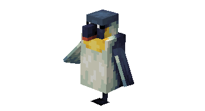
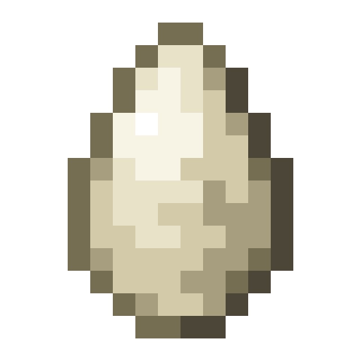
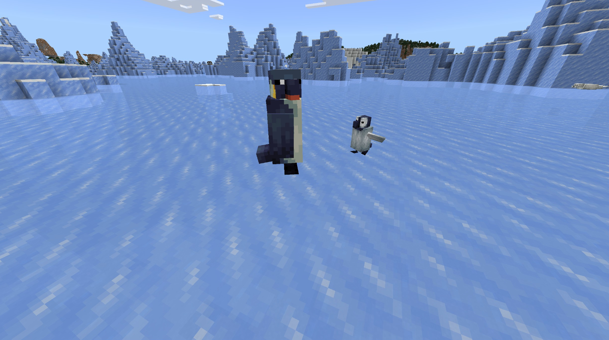
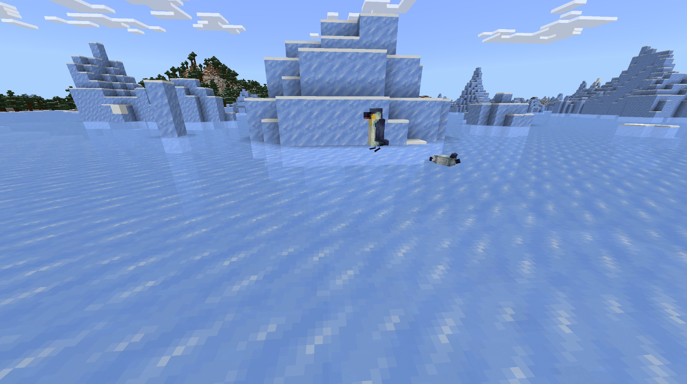
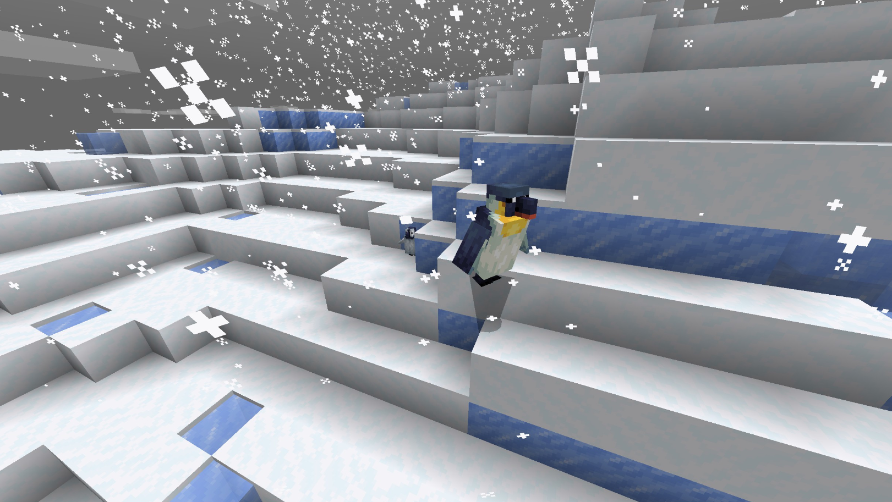
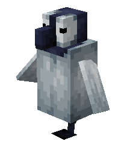
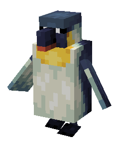

# Penguin

Last Updated: April 22, 2025 8:47 PM

---

**Return**

🐻 [Naturalist Add-On Wiki](/www.notion.so/1a7a9a61c3f1800c8e32e893d6e7f430?pvs=21)

---

Penguins thrive in the Antarctic, feasting on fish they hunt in the frozen oceans. Their feathers provide a waterproof coat that keeps them warm in harsh, cold environments. Penguins are considered birds, but they cannot fly. Their movements depend on waddling, sliding on ice, or swimming in water at up to 7.6 mph! Penguins collect pebbles to build their nests, but this makes them perfect animals for bartering with when you give them the right fish!

<aside>

### **Penguin**

---

**Health: 18** [♥️♥️♥️]

---

**Classification:** [Animal](/minecraft.fandom.com/wiki/Animal) / [Aquatic](/minecraft.fandom.com/wiki/Aquatic)

---

**Behavior:** Passive

---

**Spawn:** Frozen

---

</aside>

---

### 🌎 Spawning

A colony of 1-3 penguins will spawn anywhere frozen. The only requirement is that there is [ice](/minecraft.wiki/w/Ice) for the penguins to spawn on. These penguins will not spawn under the ice, so no need to go swimming! 

---

### ⚔️ Drops

Penguin [drops](/minecraft.fandom.com/wiki/Drops) upon death:

- 0 - 1 Cod
    - ⚔️ Cooked Cod can be dropped when killed on land with [Smelting](/minecraft.fandom.com/wiki/Fire_Aspect) or [Flame](/minecraft.fandom.com/wiki/Flame) enchantment. This will not work when the Penguin is killed underwater.
- 🟢 1 - 3 [Experience](/minecraft.fandom.com/wiki/Experience) Orbs if killed by Player
- 🟢 1 - 7 Experience Orbs upon [breeding](/minecraft.fandom.com/wiki/Breeding).

*Nestlings yield no items nor experience.*

You can barter with penguins by tossing them cod! Penguins have quite the selection of goods in their stash, so make sure to find yourself a penguin if you need any of the following loot:

- 5 - 8 [Gravel](/minecraft.wiki/w/Gravel)
- 3 - 6 [Prismarine Shards](/minecraft.wiki/w/Prismarine_Shard)
- 4 - 8 [Prismarine Crystals](/minecraft.wiki/w/Prismarine_Crystals)
- 1 - 3 [Ink Sacs](/minecraft.wiki/w/Ink_Sac)
- 1 [Fishing Rod](/minecraft.wiki/w/Fishing_Rod)
- 1 [Nautilus Shell](/minecraft.wiki/w/Nautilus_Shell)
- 1x [Potion of Water Breathing](/minecraft.wiki/w/Potion#Potion_of_Water_Breathing)
- 1x [Splash Potion of Water Breathing](/minecraft.wiki/w/Potion#Potion_of_Water_Breathing)
- 1x [Potion of Water Breathing (Extended)](/minecraft.wiki/w/Potion#Potion_of_Water_Breathing)
- 1x [Splash Potion of Water Breathing (Extended)](/minecraft.wiki/w/Potion#Potion_of_Water_Breathing)
- [Wet Sponge](/minecraft.wiki/w/Sponge)
- Enchanted Book: [Frost Walker I or II](/minecraft.wiki/w/Frost_Walker)
- Enchanted Book: [Depth Strider I, II, or III](/minecraft.wiki/w/Depth_Strider)
- Enchanted Book: [Aqua Affinity](/minecraft.wiki/w/Aqua_Affinity)
- Enchanted Book: [Respiration I, II, or III](/minecraft.wiki/w/Respiration)

---

### 🧠 Behavior

Penguins can be spotted waddling or sliding about in frozen biomes. Penguins are slow on land and are pretty clumsy, so they will fall, but they are fast swimmers in the water. These flightless birds are full of expressions as they flap their wings excitedly, especially if they are brought cod that they can admire to be traded for other oceanic goodies. 

When penguins are bred, they will stick close to their eggs and admire them until the egg hatches. The baby penguins will stick close to their parents until they have matured to be an adult.

---

### 🥚Breeding

Emperor penguins can be [bred](/minecraft.fandom.com/wiki/Breeding) with [raw cod](/minecraft.wiki/w/Raw_Cod), [raw salmon](/minecraft.wiki/w/Raw_Salmon), raw catfish, raw bass, and [tropical fish](/minecraft.fandom.com/wiki/Tropical_Fish). There is a 5-minute cooldown for breeding, during which the penguin does not accept any fish for breeding.

Upon successful breeding, the penguin will find [sand](/minecraft.wiki/w/Sand), [grass](/minecraft.fandom.com/wiki/Grass_Block), [dirt](/minecraft.wiki/w/Dirt), [snow](/minecraft.wiki/w/Snow_Block), [ice](/minecraft.wiki/w/Ice), [packed ice](/minecraft.wiki/w/Packed_Ice), or [blue ice](/minecraft.wiki/w/Blue_Ice) to lay their egg on. If in survival mode, the egg can be broken with 1 hit, and it will drop as an item. If you attempt this, be careful, as the parents are protective of their eggs! Once the egg is placed in the world, the egg hatch timer will restart. There are visuals for the egg hatching, and a cracking sound will be emitted when the egg hatches and a nestling appears.

The growth rate of nestlings can be slowly accelerated by feeding them raw cod, raw salmon, raw catfish, raw bass, and tropical fish.

---

### 🖼️ Gallery

---

### 🎨 Variants

                    Baby Emperor Penguin

                   Emperor Penguin

---

<aside>
 Have additional questions? Want to be a part of our community? → [Join our Discord!](/discord.com/invite/starfishstudios)

</aside>

<aside>

[**Marketplace](/www.minecraft.net/en-us/marketplace/creator?name=Starfish%20Studios)      [CurseForge](/www.curseforge.com/members/starfish_studios/projects)      [TikTok](/www.tiktok.com/@starfishstudios)      [Instagram](/www.instagram.com/starfishstudiosinc/)      [Twitter](/twitter.com/starfishstudios)      [YouTube](/www.youtube.com/@starfishstudios)      [Website](/starfish-studios.com/)**

</aside>
