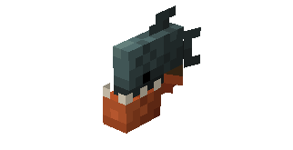
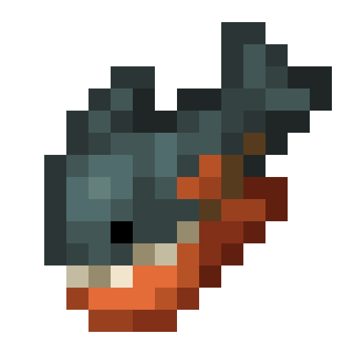
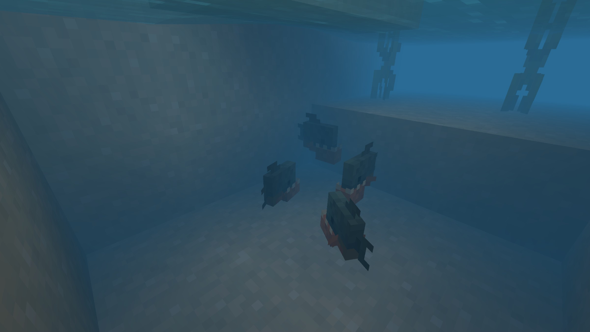
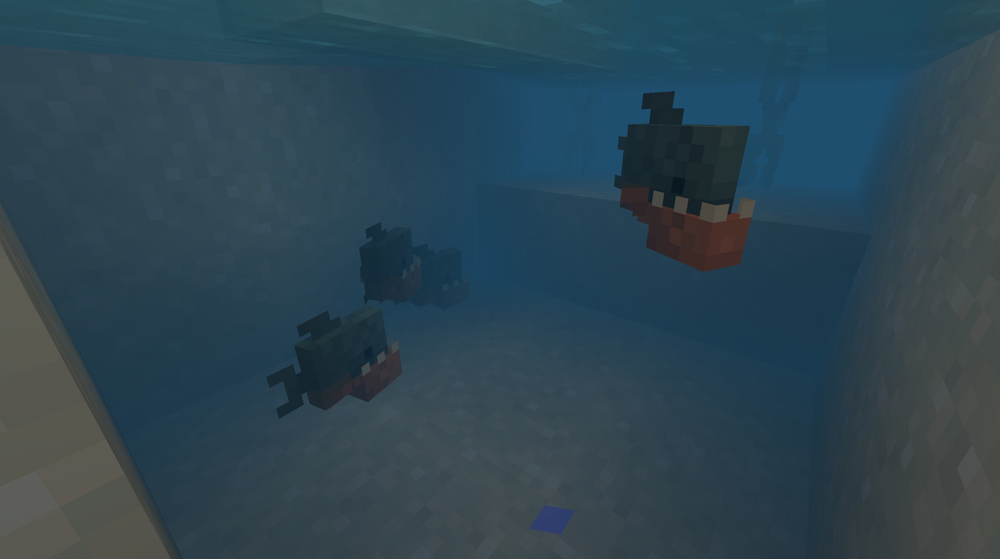

# Piranha

Last Updated: April 22, 2025 8:47 PM

---

**Return**

🐻 [Naturalist Add-On Wiki](/www.notion.so/1a7a9a61c3f1800c8e32e893d6e7f430?pvs=21)

---

Piranhas are native to South American rivers, and their name quite literally means “tooth fish”. They have a single row of sharp, triangular teeth in both jaws that are so strong that they can bite through a steel fishing hook! These fish have a strong sense of smell and are known to eat fruits, seeds, and aquatic plants. Piranhas are not as dangerous as portrayed; they only attack when threatened as a self-defense mechanism.

<aside>

### **Piranha**

---

**Health: 15** [♥️♥️♥️]

---

**Classification:** [Animal](/minecraft.fandom.com/wiki/Animal) / [Aquatic](/minecraft.fandom.com/wiki/Aquatic)

---

**Behavior:** Hostile

---

**Spawn:** [Jungle](/minecraft.wiki/w/Jungle) & [Lush Caves](/minecraft.wiki/w/Lush_Caves)

---

</aside>

---

### 🌎 Spawning

A shoal of 3-8 piranhas will spawn in the [jungle](/minecraft.wiki/w/Jungle) and [lush cave](/minecraft.wiki/w/Lush_Caves) biomes. They will be found in the [water](/minecraft.wiki/w/Water) of these biomes and spawn between Y coordinates Y -64 and Y 64.

---

### ⚔️ Drops

Piranha [drops](/minecraft.fandom.com/wiki/Drops) upon death:

- 0 - 1 Raw Piranha
    - ⚔️ The maximum amount is increased by 1 per level of [Looting](/minecraft.fandom.com/wiki/Looting), for a maximum of 0-3 with Looting III.
- 0 - 1 Cooked Piranha
    - ⚔️ Cooked Piranha can be dropped when killed on land with [Smelting](/minecraft.fandom.com/wiki/Fire_Aspect) or [Flame](/minecraft.fandom.com/wiki/Flame) enchantment. This will not work when the piranha is killed underwater.
- 🟢 1 - 3 [Experience](/minecraft.fandom.com/wiki/Experience) Orbs if killed by Player.

---

### 🧠 Behavior

Piranhas are hostile aquatic fish that tend to swim in schools, with a maximum of eight per school. When a player gets too close to a piranha, they will attack the player with a fierce bite.

The player may collect piranhas by using a [water bucket](/minecraft.fandom.com/wiki/Water_bucket) on it, which gives the player a bucket of piranha. Piranhas placed with buckets do not despawn naturally. When that fish bucket is used against a block, it empties the bucket, placing water with the piranha swimming in it.

**Weakness:**

Piranhas are unable to survive out of water. Outside of water, they flop around for a while until, eventually, they start to suffocate and die. Piranhas cannot be put in a [cauldron](/minecraft.fandom.com/wiki/Cauldron).

Piranhas are vulnerable to weapons that have the [Impaling](Bass%201dd816019a9f81379eecf7c25ed7e23f.md) enchantment.

---

### 🖼️ Gallery

---

<aside>
 Have additional questions? Want to be a part of our community? → [Join our Discord!](/discord.com/invite/starfishstudios)

</aside>

<aside>

[**Marketplace](/www.minecraft.net/en-us/marketplace/creator?name=Starfish%20Studios)      [CurseForge](/www.curseforge.com/members/starfish_studios/projects)      [TikTok](/www.tiktok.com/@starfishstudios)      [Instagram](/www.instagram.com/starfishstudiosinc/)      [Twitter](/twitter.com/starfishstudios)      [YouTube](/www.youtube.com/@starfishstudios)      [Website](/starfish-studios.com/)**

</aside>
