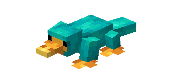
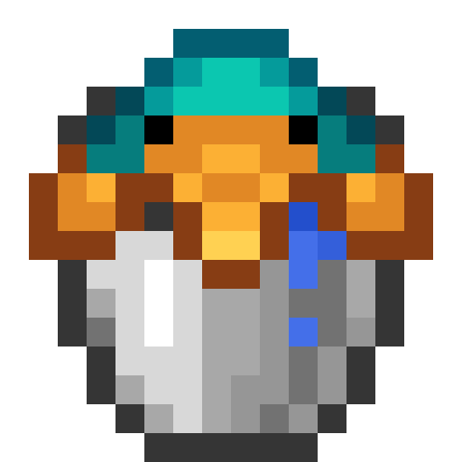
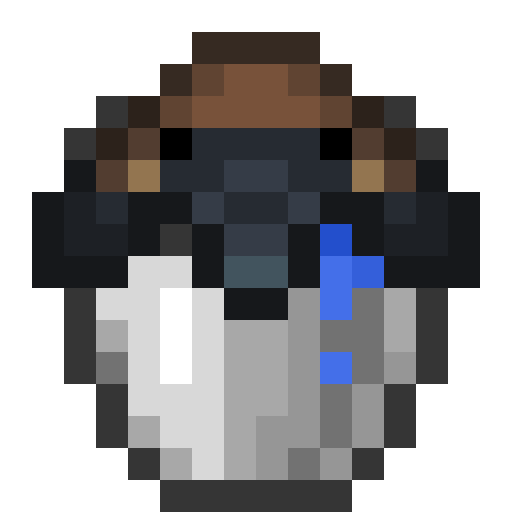
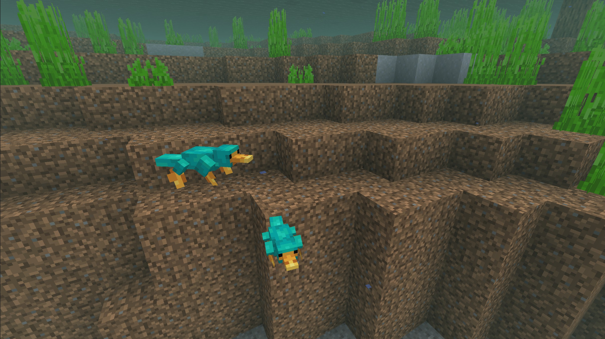
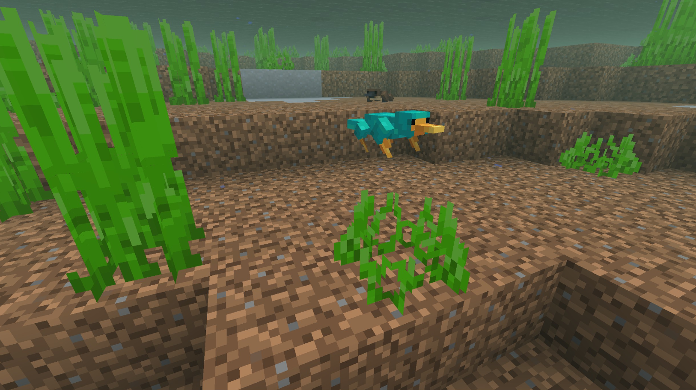
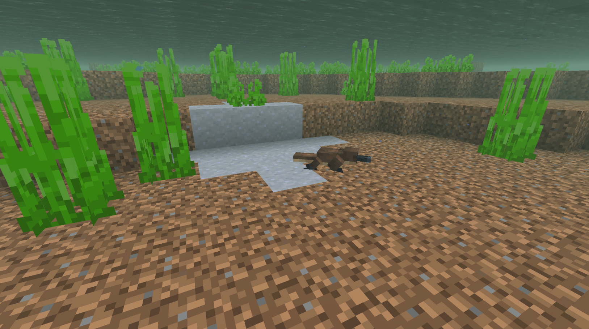
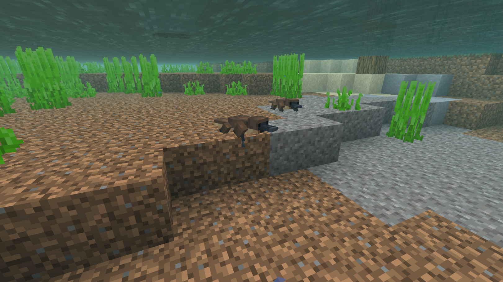
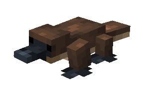
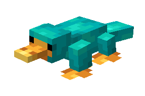

# Platypus

Last Updated: April 22, 2025 8:47 PM

---

**Return**

🐻 [Naturalist Add-On Wiki](/www.notion.so/1a7a9a61c3f1800c8e32e893d6e7f430?pvs=21)

---

Platypuses are semi-aquatic mammals that are native to Australia. They spend most of their time in the water but also have burrows on the side of riverbanks where they rest. They are well-adapted for this, with webbed feet for swimming and waterproof fur to keep them warm. These animals are hunted by a variety of predators; luckily, they are venomous, which helps them protect themselves and their families! 

<aside>

### **Platypus**

---

**Health: 12** [♥️♥️♥️]

---

**Classification:** [Animal](/minecraft.fandom.com/wiki/Animal) / [Aquatic](/minecraft.fandom.com/wiki/Aquatic)

---

**Behavior:** 

---

**Spawn:** [River](/minecraft.wiki/w/River) & [Swamp & Variants](/minecraft.wiki/w/Swamp)

---

</aside>

---

### 🌎 Spawning

A paddle of 1-3 platypuses will spawn in [river](/minecraft.wiki/w/River) & [swamp (including their variants)](/minecraft.wiki/w/Swamp) biomes. Platypuses will stay in warm waters as their dense and thick fur helps them stay warm, so you won’t find them in a frozen river. 

---

### ⚔️ Drops

Platypus [drops](/minecraft.fandom.com/wiki/Drops) upon death:

- 0 - 1 [Tropical Fish](/minecraft.fandom.com/wiki/Tropical_Fish), Raw Catfish, Raw Blobfish, [Raw Salmon](/minecraft.wiki/w/Raw_Salmon), or [Raw Cod](/minecraft.wiki/w/Raw_Cod)
    - ⚔️ The maximum amount is increased by 1 per level of [Looting](/minecraft.fandom.com/wiki/Looting), for a maximum of 1-3 with Looting III.
- 🟢 1 - 3 [Experience](/minecraft.fandom.com/wiki/Experience) Orbs if killed by Player.
- 🟢 1 - 7 Experience Orbs upon [breeding](/minecraft.fandom.com/wiki/Breeding).

*Puggles yield no items nor experience.*

---

### 🧠 Behavior

Platypuses are passive semi-aquatic animals that swim around in a small group. They will avoid players as much as they can, but if a player gets close enough to attack them, they will run/swim up to the player and poison them before fleeing. 

The player may collect a platypus by using a [water bucket](/minecraft.fandom.com/wiki/Water_bucket) on it, which gives the player a bucket of platypus (Blue or Brown depending on the variant). Platypuses placed with buckets do not despawn naturally. When that bucket is used against a block, it empties the bucket, placing water with the Platypus swimming in it. Platypus can survive out of water, so don’t worry if your platypus escapes water sources!

---

### ❤️ Taming, Healing, & Feeding

A platypus can be tamed with all variations of beetles and butterflies. There is a 33% chance of successful taming. Once they are tamed, you will see hearts appear. There is no visual indication indicating they are tamed other than the hearts, however, the platypus will follow you once it is tamed.

Tamed platypus cannot be commanded and will follow a player anytime they are outside of a 10-block radius. You can prohibit a platypus from following you by using a lead on them and tying the lead to a fence.

If a platypus you have tamed gets injured, you can feed them any variation of beetles or butterflies to increase its [health](/minecraft.fandom.com/wiki/Health) until it is maxed. 1 beetle or butterfly increases the platypus’ health points by 2. An injured platypus will be unable to breed until it is healed.

---

### 🥚Breeding

Platypus requires to be tamed before they can be [bred](/minecraft.fandom.com/wiki/Breeding). Adult platypus can be bred with beetles (red, black, brown, green, and yellow) and butterflies (blue morpho, cabbage white, clouded yellow, monarch, and swallowtail). There is a 5-minute cooldown for breeding, during which the platypus will not accept any beetles or butterflies for breeding but will if they get injured and need to heal.

Upon successful breeding, a puggle will be born. The growth of puggles can be slowly accelerated by using beetles or butterflies.

---

### 🖼️ Gallery

---

### 🎨 Variants

                                Platypus

                            Blue Platypus

<aside>
 Have additional questions? Want to be a part of our community? → [Join our Discord!](/discord.com/invite/starfishstudios)

</aside>

<aside>

[**Marketplace](/www.minecraft.net/en-us/marketplace/creator?name=Starfish%20Studios)      [CurseForge](/www.curseforge.com/members/starfish_studios/projects)      [TikTok](/www.tiktok.com/@starfishstudios)      [Instagram](/www.instagram.com/starfishstudiosinc/)      [Twitter](/twitter.com/starfishstudios)      [YouTube](/www.youtube.com/@starfishstudios)      [Website](/starfish-studios.com/)**

</aside>
