# Rat

Last Updated: April 22, 2025 8:47 PM

---

**Return**

🐻 [Naturalist Add-On Wiki](/www.notion.so/1a7a9a61c3f1800c8e32e893d6e7f430?pvs=21)

---

Rats are nocturnal rodents that thrive underground and in luscious environments where food sources are rich. A rat’s front teeth constantly grow, and they can be found gnawing on locally foraged goods to keep their teeth worn down to be able to eat properly. Rats are social animals that prefer to live in groups with their families, so if you spot one, then there are likely to be others nearby!

<aside>

### **Rat**

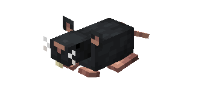

---

**Health: 5** [♥️♥️♥️]

---

**Classification:** [Animal](/minecraft.fandom.com/wiki/Animal)

---

**Behavior:** Passive

---

**Spawn:** [Birch Forest](/minecraft.wiki/w/Birch_Forest), [Caves](/minecraft.wiki/w/Cave), [Forest](/minecraft.wiki/w/Forest), & [Plains](/minecraft.wiki/w/Plains)

---

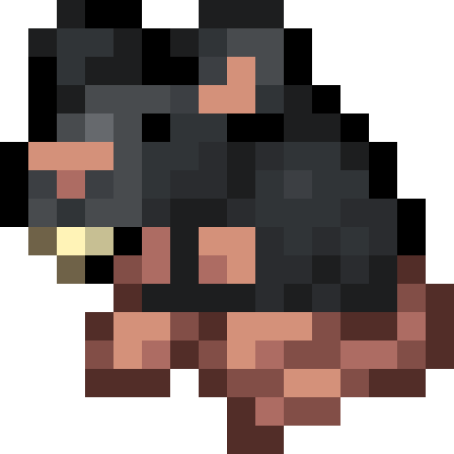

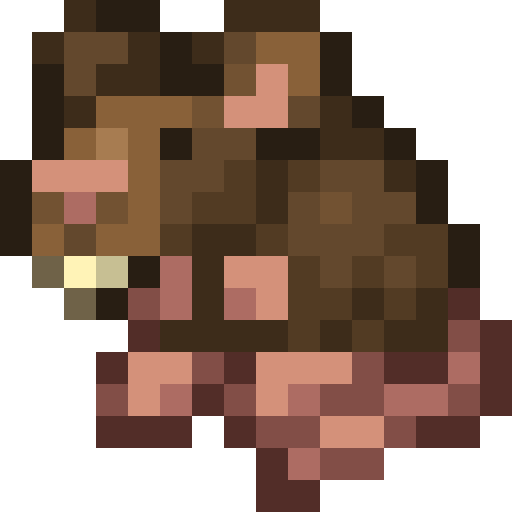

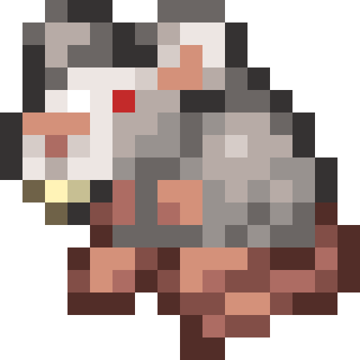

</aside>

---

### 🌎 Spawning

A mischief of 1-3 rats will spawn in the [birch forest](/minecraft.wiki/w/Birch_Forest), [forest](/minecraft.wiki/w/Forest), and [plains](/minecraft.wiki/w/Plains) biomes. These rodents will also spawn underground within [caves](/minecraft.fandom.com/wiki/Light) between 0-7 or in caves that match this light filter. They can be found between Y coordinates 50-100 when in biomes or anywhere underground.

---

### ⚔️ Drops

Rat [drops](/minecraft.fandom.com/wiki/Drops) upon death:

- 0 - 2 Fur
    - ⚔️ The maximum amount is increased by 1 per level of [Looting](/minecraft.fandom.com/wiki/Looting), for a maximum of 0-4 with Looting III.
- 1 Morsel
    - ⚔️ The maximum amount is increased by 1 per level of [Looting](/minecraft.fandom.com/wiki/Looting), for a maximum of 0-3 with Looting III.
- 1 Cooked Morsel
    - ⚔️ Cooked Morsel can be dropped when killed on land with [Smelting](/minecraft.fandom.com/wiki/Fire_Aspect) or [Flame](/minecraft.fandom.com/wiki/Flame) enchantment. This will not work when the platypus is killed underwater.
- 🟢 1 - 3 [Experience](/minecraft.fandom.com/wiki/Experience) Orbs if killed by Player
- 🟢 1 - 7 Experience Orbs upon [breeding](/minecraft.fandom.com/wiki/Breeding).

*Pups yield no items nor experience.*

---

### 🧠 Behavior

Rats are passive rodents that scuffle around aimlessly within their preferred biomes. Occasionally, you can find a rat swimming in water as they navigate their way to other biomes. Sometimes, you will randomly climb onto a nearby hamster wheel and go for a run!

**Capture Net:**

Rats can be caught in capture nets. If a rat is caught, the rat (in its variant) will enter a player’s inventory as an item. If the inventory is full, the rat will drop to the ground in front of the player.

- A rat is used by pressing ”use” on any surface (top, bottom, or side) of a block. When used on a top surface, the rat appears with its feet immediately adjacent to the surface. This interaction is much like a [spawn egg](/minecraft.fandom.com/wiki/Spawn_Egg). The surfaces of blocks are prioritized for spawning; if none are within reach, mobs can also be spawned in [water](/minecraft.fandom.com/wiki/Water).

---

### ❤️ Taming, Healing, & Feeding

Rats can be tamed with [carrots,](/minecraft.wiki/w/Carrot) [golden carrots](/minecraft.wiki/w/Golden_Carrot), [apples](/minecraft.wiki/w/Apple), [golden apples](/minecraft.wiki/w/Golden_Apple), [enchanted golden apples](/minecraft.wiki/w/Enchanted_Golden_Apple), and [bread](/minecraft.wiki/w/Bread). There is a 70% chance of successful taming. Once they are tamed, you will see hearts appear. There is no visual indication they are tamed other than the hearts, however, rats will follow you once it is tamed.

Tamed rats can be commanded to sit or to follow.

- Rats will teleport to the player if the player is further than 10 blocks away.
- Rats will not teleport to the player if they are commanded to sit.

If a rat you have tamed gets injured, you can feed it carrots, golden carrots, apples, golden apples, enchanted golden apples, and bread to increase its [health](/minecraft.fandom.com/wiki/Health) until it is maxed. These items heal a variety of health points as defined below. An injured rat will be unable to breed until it is healed.

---

### 🥚Breeding

Rats require to be tamed before they can be [bred](/minecraft.fandom.com/wiki/Breeding). Adult rats can be bred with [carrots,](/minecraft.wiki/w/Carrot) [golden carrots](/minecraft.wiki/w/Golden_Carrot), [apples](/minecraft.wiki/w/Apple), [golden apples](/minecraft.wiki/w/Golden_Apple), [enchanted golden apples](/minecraft.wiki/w/Enchanted_Golden_Apple), and [bread](/minecraft.wiki/w/Bread). There is a 5-minute cooldown for breeding, which the rat will not accept any food items but will if they get injured and need to heal.

Upon successful breeding, a pup will be born. The growth of pups can be slowly accelerated by using carrots, golden carrots, apples, golden apples, enchanted golden apples, and bread.

---

### 🖼️ Gallery

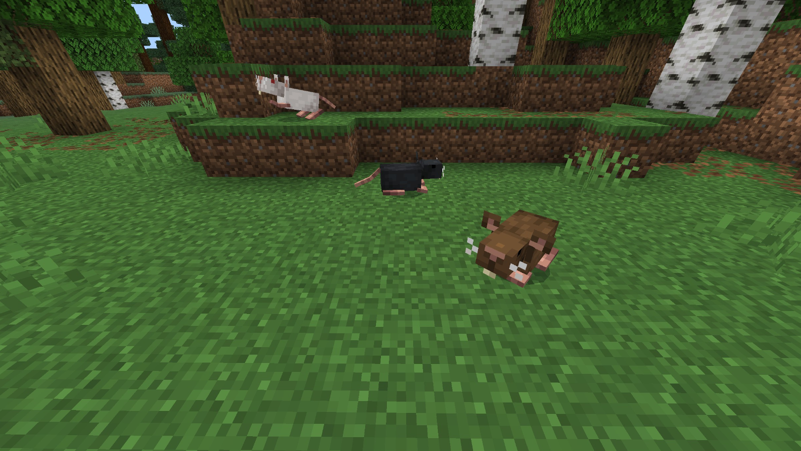

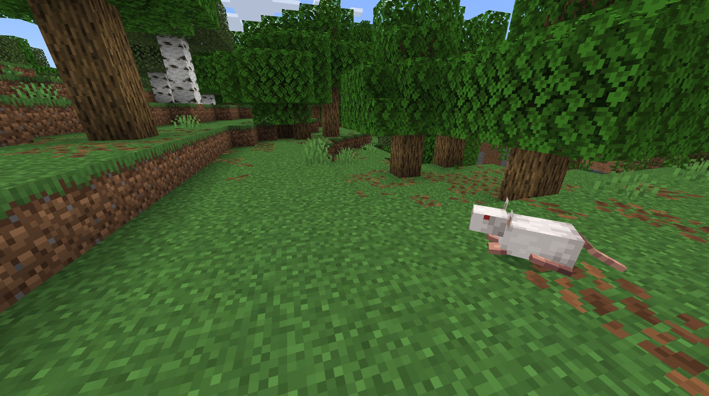

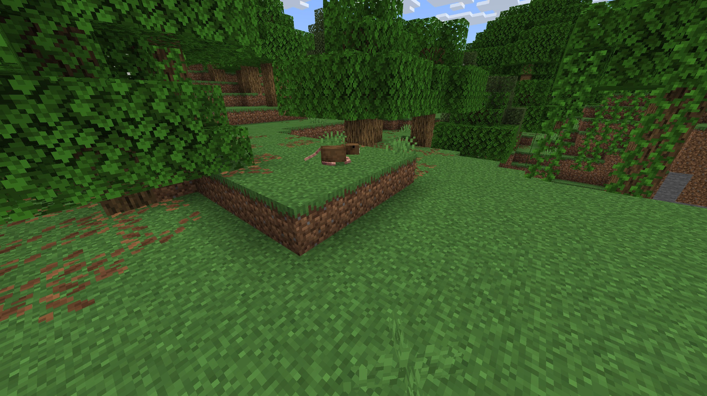

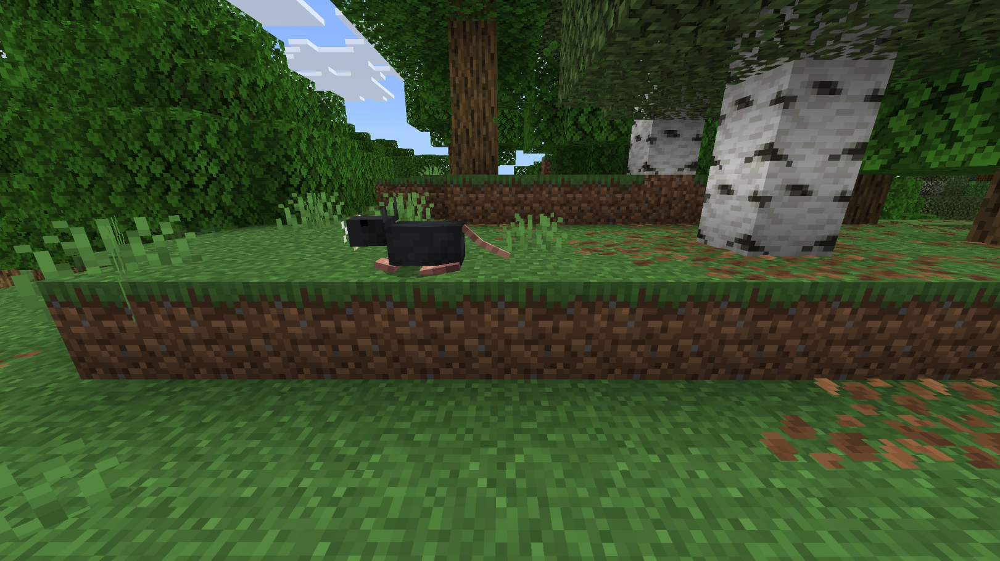

---

### 🎨 Variants

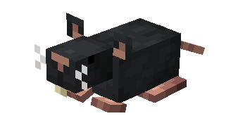

                 Black Rat

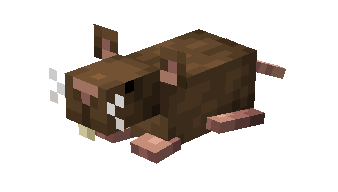

                 Brown Rat

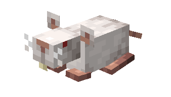

                 White Rat

---

<aside>
 Have additional questions? Want to be a part of our community? → [Join our Discord!](/discord.com/invite/starfishstudios)

</aside>

<aside>

[**Marketplace](/www.minecraft.net/en-us/marketplace/creator?name=Starfish%20Studios)      [CurseForge](/www.curseforge.com/members/starfish_studios/projects)      [TikTok](/www.tiktok.com/@starfishstudios)      [Instagram](/www.instagram.com/starfishstudiosinc/)      [Twitter](/twitter.com/starfishstudios)      [YouTube](/www.youtube.com/@starfishstudios)      [Website](/starfish-studios.com/)**

</aside>
