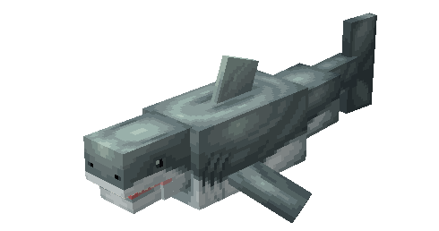
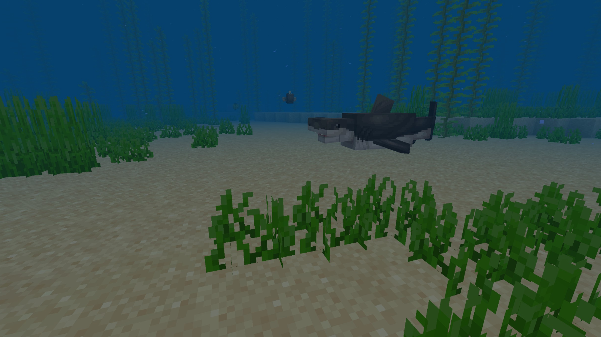
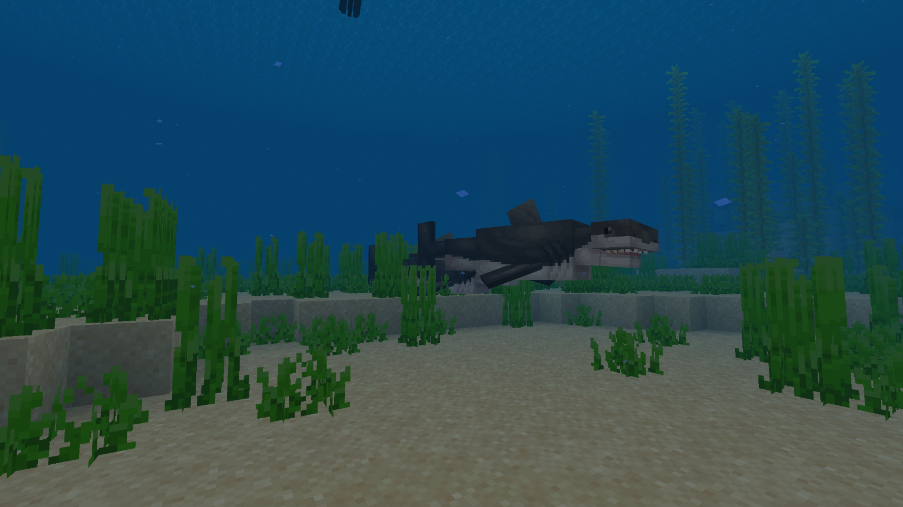
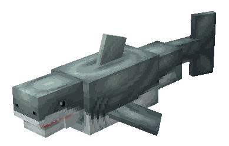
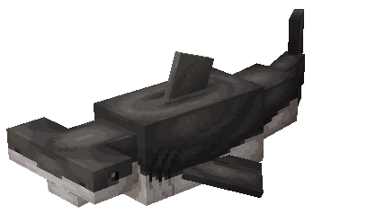

# Shark

Last Updated: April 22, 2025 8:47 PM

---

**Return**

🐻 [Naturalist Add-On Wiki](/www.notion.so/1a7a9a61c3f1800c8e32e893d6e7f430?pvs=21)

---

Sharks are large fish known for their sharp teeth, powerful swimming abilities, and predatory nature. They can be found in oceans worldwide, and they play a crucial role in the marine ecosystem. With their incredible eyesight and strong sense of hearing, they can detect water movements from afar. They thrive on small fish to large seals for their diets, sometimes even a seagull!

<aside>

### **Shark**

---

**Health: 40** [♥️♥️♥️]

---

**Classification:** [Animal](/minecraft.fandom.com/wiki/Animal) / [Aquatic](/minecraft.fandom.com/wiki/Aquatic)

---

**Behavior:** Passive unless provoked

---

**Spawn:** [Warm Ocean](/minecraft.wiki/w/Warm_Ocean) & [Lukewarm Ocean](/minecraft.wiki/w/Lukewarm_Ocean)

---

</aside>

---

### 🌎 Spawning

A school of 1-3 sharks will spawn in [warm ocean](/minecraft.wiki/w/Warm_Ocean) and [lukewarm ocean](/minecraft.wiki/w/Lukewarm_Ocean) biomes. They can be found between Y coordinates Y -20 and Y 64.

---

### ⚔️ Drops

Shark [drops](/minecraft.fandom.com/wiki/Drops) upon death:

- 2 - 5 Tooth
- 🟢 1 - 3 [Experience](/minecraft.fandom.com/wiki/Experience) Orbs if killed by Player

---

### 🧠 Behavior

Sharks are large aquatic fish that can be found roaming and hunting in ocean biomes. They swim around aimlessly while randomly attacking other fish for their next meal. Sharks will not attack players unless they are attacked first. Sharks will quickly chase players and attack players with ferocious bites until the player is out of sight or dies. 

Sharks are unable to survive out of water. Outside of water, they flop around for a while until, eventually, they start to suffocate and die.

---

### 🖼️ Gallery

---

### 🎨 Variants

                      Great White Shark

                     Hammer Head Shark

---

<aside>
 Have additional questions? Want to be a part of our community? → [Join our Discord!](/discord.com/invite/starfishstudios)

</aside>

<aside>

[**Marketplace](/www.minecraft.net/en-us/marketplace/creator?name=Starfish%20Studios)      [CurseForge](/www.curseforge.com/members/starfish_studios/projects)      [TikTok](/www.tiktok.com/@starfishstudios)      [Instagram](/www.instagram.com/starfishstudiosinc/)      [Twitter](/twitter.com/starfishstudios)      [YouTube](/www.youtube.com/@starfishstudios)      [Website](/starfish-studios.com/)**

</aside>
