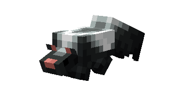
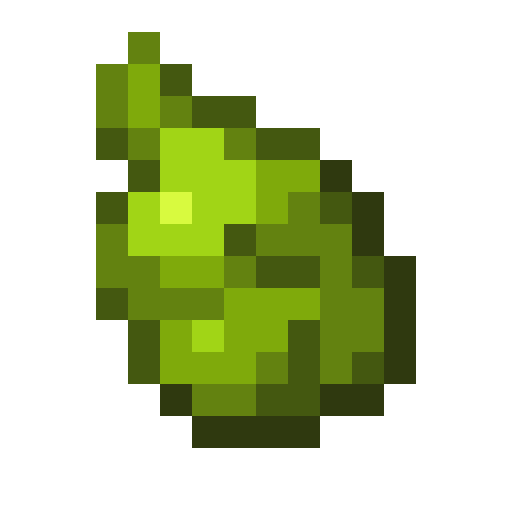
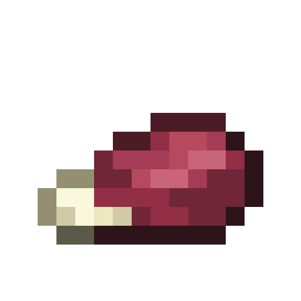
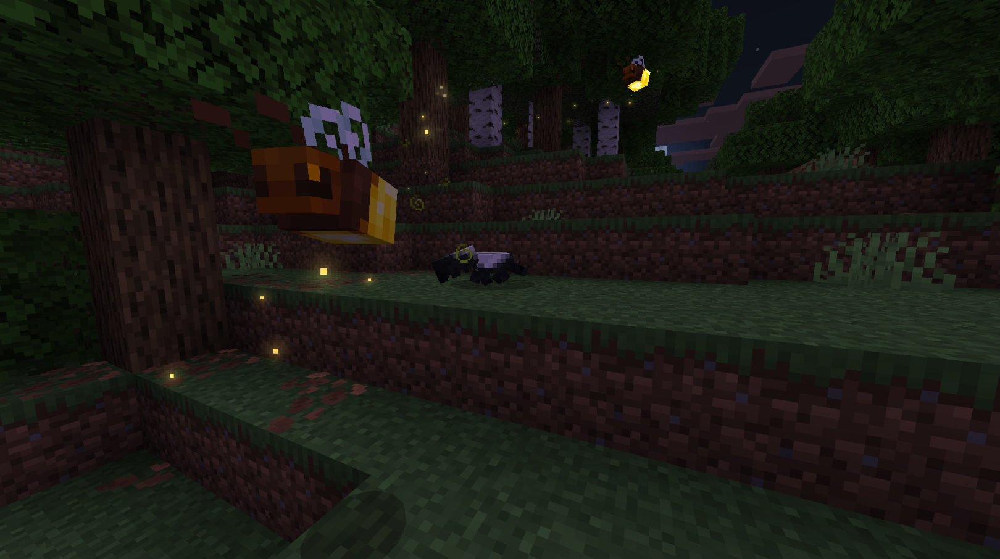
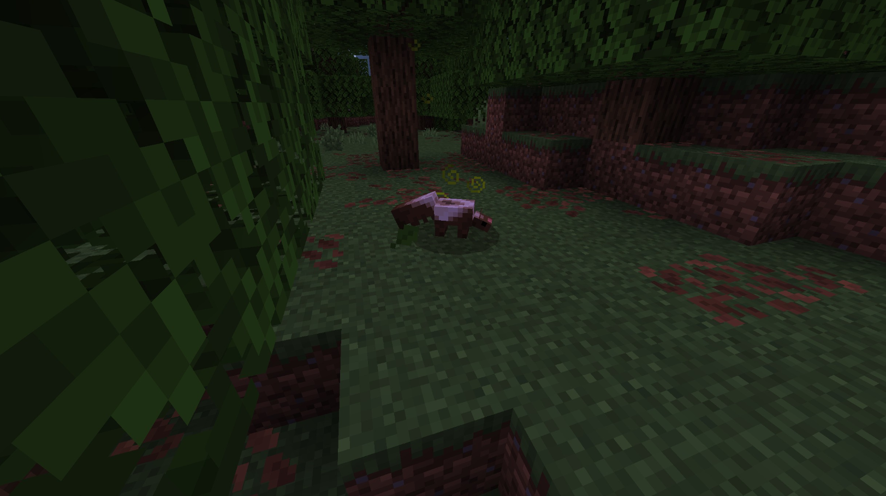
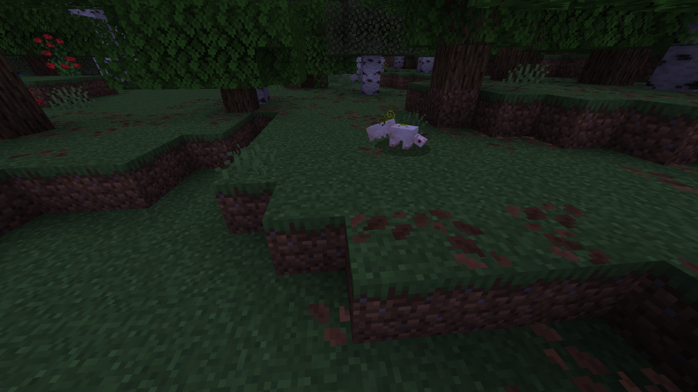
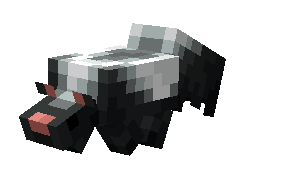
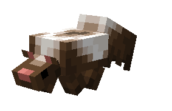
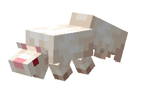

# Skunk

Last Updated: April 22, 2025 8:47 PM

---

**Return**

🐻 [Naturalist Add-On Wiki](/www.notion.so/1a7a9a61c3f1800c8e32e893d6e7f430?pvs=21)

---

Skunks are nocturnal animals that hide in dens during the day while scrounging at night. They are well-known for their ability to spray and extremely smelly liquid when they are threatened. Their coloration isn’t a form of camouflage but a form of wanting to be seen as a threat. Their distinct bright white stripe warns predators and humans alike to stay away!

<aside>

### **Skunk**

---

**Health: 14** [♥️♥️♥️]

---

**Classification:** [Animal](/minecraft.fandom.com/wiki/Animal)

---

**Behavior:** Neutral

---

**Spawn:** [Forest](/minecraft.wiki/w/Forest)

---

</aside>

---

### 🌎 Spawning

A surfeit of skunks will spawn in groups of 1-3 in the [forest](/minecraft.wiki/w/Forest). They can be easily spotted with their contrast to the forest floor, and their stinky particles will give them away. They spawn exclusively during the daytime with [light levels](/minecraft.fandom.com/wiki/Light) between 9 and 15.

---

### ⚔️ Drops

Adult skunks [drop](/minecraft.fandom.com/wiki/Drops) upon death:

- 1 Stinky Gland *(Will not drop if the Skunk is sheared)*
    - ⚔️ The maximum amount is increased by 1 per level of [Looting](/minecraft.fandom.com/wiki/Looting), for a maximum of 1-3 with Looting III
- 1 Morsel *(If the Skunk is sheared)*
    - ⚔️ The maximum amount is increased by 1 per level of [Looting](/minecraft.fandom.com/wiki/Looting), for a maximum of 1-3 with Looting III
    - ⚔️ Cooked Morsel can be dropped when killed on land with [Smelting](/minecraft.fandom.com/wiki/Fire_Aspect) or [Flame](/minecraft.fandom.com/wiki/Flame) enchantment. This will not work when the Skunk is killed in water.
- 🟢 1 - 3 [Experience](/minecraft.fandom.com/wiki/Experience) Orbs if killed by Player
- 🟢 1 - 7 Experience Orbs upon [breeding](/minecraft.fandom.com/wiki/Breeding).

*Kits yield no items nor experience.*

---

### 🧠 Behavior

Skunks are neutral mobs that stink up the forest biome. When a player approaches, the skunk (if awake) will spray them before running away. The spray itself inflicts 5 seconds of [nausea](/minecraft.fandom.com/wiki/Nausea) and 10 seconds of [poison](/minecraft.wiki/w/Poison) damage. Kits cannot spray. If a skunk is found sleeping, a player can approach it without being too cautious, as it will not wake up. Skunks will only wake up if it is hit or pushed, at which point they will spray the player and flee.

**Shears:**

Skunks (kits included) can be interacted with by using shears to drop a stinky gland which will prevent them from spraying when they are an adult. This makes it an easy way to obtain stinky glands without fighting a skunk.

---

### ❤️ Taming, Healing, & Feeding

Skunks can be tamed by feeding them sweet berries. There is a 70% chance of successful taming.  Once they are tamed, you will see hearts appear and a bow on their tail signifying you have tamed the skunk. You can [dye](/minecraft.fandom.com/wiki/Dye) the bow to your color of choice or use [shears](/minecraft.fandom.com/wiki/Shears) to cut off the bow. If you shear off a bow, it can be reapplied by using a dye color of your choice.

Tamed skunks can be commanded to sit or to follow.

- Skunks will teleport to the player if the player is further than 10 blocks away.
- Skunks will not teleport to the player if they are commanded to sit.

---

### 🥚Breeding

Adult skunks can be bred with beetles (red, brown, green, yellow, and black). There is a 5-minute cooldown for breeding, during which the skunks do not accept beetles for breeding. 

Upon successful breeding, a kit will be born. The growth of kits can be slowly accelerated by feeding them sweet berries.

---

### 🖼️ Gallery

---

### 🎨 Variants

            Black Skunk

            Brown Skunk

             White Skunk

<aside>
 Have additional questions? Want to be a part of our community? → [Join our Discord!](/discord.com/invite/starfishstudios)

</aside>

<aside>

[**Marketplace](/www.minecraft.net/en-us/marketplace/creator?name=Starfish%20Studios)      [CurseForge](/www.curseforge.com/members/starfish_studios/projects)      [TikTok](/www.tiktok.com/@starfishstudios)      [Instagram](/www.instagram.com/starfishstudiosinc/)      [Twitter](/twitter.com/starfishstudios)      [YouTube](/www.youtube.com/@starfishstudios)      [Website](/starfish-studios.com/)**

</aside>
