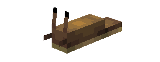
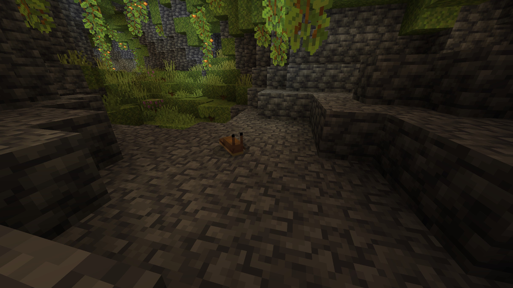
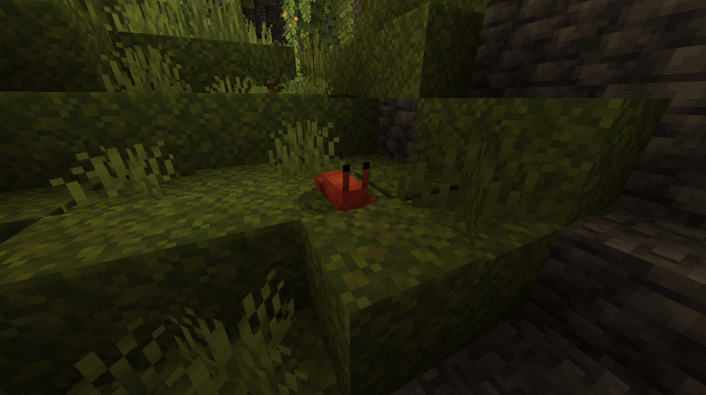
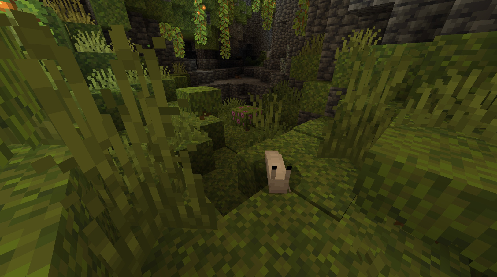
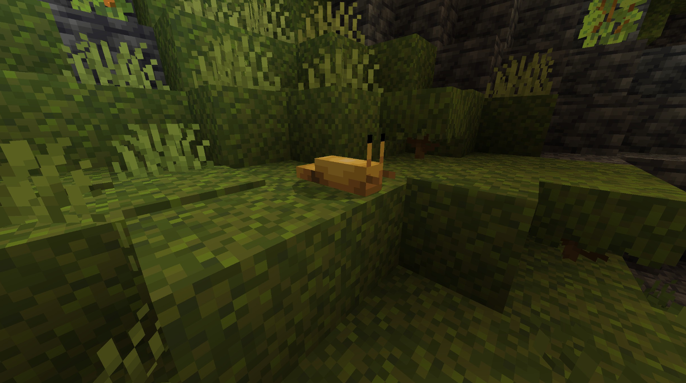
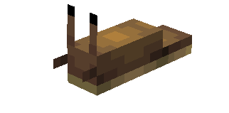
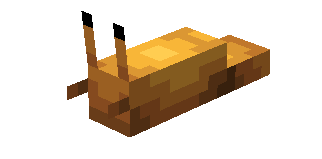
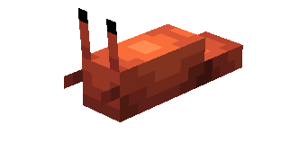
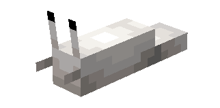
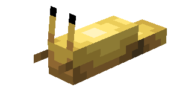

# Slug

Last Updated: April 22, 2025 8:47 PM

---

**Return**

🐻 [Naturalist Add-On Wiki](/www.notion.so/1a7a9a61c3f1800c8e32e893d6e7f430?pvs=21)

---

Slugs can be found worldwide and prefer to hide in dark spaces underground, such as caves. Their bodies are composed of 85-90% water and secrete a thick slime that is crucial for them to glide on the ground, and it trails behind them as they move along. Slugs eat a large number of fruits and vegetables, particularly those with high water content. They are incredibly slow, reaching a top speed  of 0.18 mph!

<aside>

### **Slug**

---

**Health: 2** [♥️♥️♥️]

---

**Classification:** [Animal](/minecraft.fandom.com/wiki/Animal)

---

**Behavior:** Passive

---

**Spawn:** [Lush Caves](/minecraft.wiki/w/Lush_Caves) & [Dripstone Caves](/minecraft.wiki/w/Dripstone_Caves)

---

</aside>

---

### 🌎 Spawning

Slugs will spawn in the [lush cave](/minecraft.wiki/w/Lush_Caves) and [dripstone cave](/minecraft.wiki/w/Dripstone_Caves) biomes. They can be found between Y coordinates Y -64 and Y 30.

---

### ⚔️ Drops

Slug [drops](/minecraft.fandom.com/wiki/Drops) upon death:

- 1 - 2 [Slime Ball](/minecraft.wiki/w/Slimeball)
- 🟢 1 - 3 [Experience](/minecraft.fandom.com/wiki/Experience) Orbs if killed by Player.

---

### 🧠 Behavior

Slugs are colorful, passive crawlers that enjoy dark environments. Slugs are so small that they can go unnoticed while they slide by. If a player is running through a dark cave and suddenly bounces, they may think they bounced on a slime block. In reality, they found themselves an unsuspecting slug!

The player may collect a slug by using a [bucket](/minecraft.fandom.com/wiki/Bucket) on it, which gives the player a bucket of slug (in their color variant). Slugs placed with buckets do not despawn naturally. When that bucket is used against a block, it empties the bucket, placing slug on the ground. Slugs cannot be put in a [cauldron](/minecraft.fandom.com/wiki/Cauldron).

---

### 🖼️ Gallery

---

### 🎨 Variants

              Brown Slug

               Orange Slug

              Red Slug

                               White Slug

                                 Yellow Slug

---

<aside>
 Have additional questions? Want to be a part of our community? → [Join our Discord!](/discord.com/invite/starfishstudios)

</aside>

<aside>

[**Marketplace](/www.minecraft.net/en-us/marketplace/creator?name=Starfish%20Studios)      [CurseForge](/www.curseforge.com/members/starfish_studios/projects)      [TikTok](/www.tiktok.com/@starfishstudios)      [Instagram](/www.instagram.com/starfishstudiosinc/)      [Twitter](/twitter.com/starfishstudios)      [YouTube](/www.youtube.com/@starfishstudios)      [Website](/starfish-studios.com/)**

</aside>
