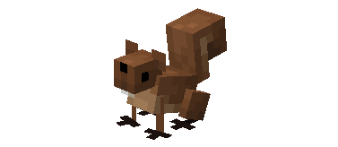
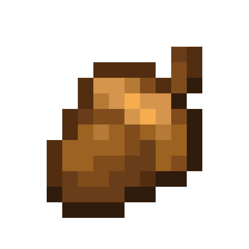
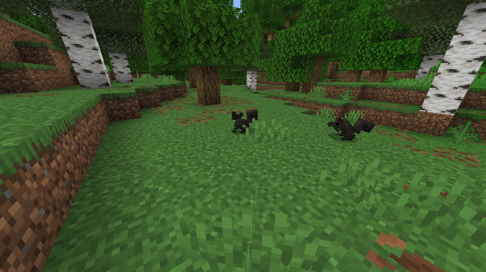
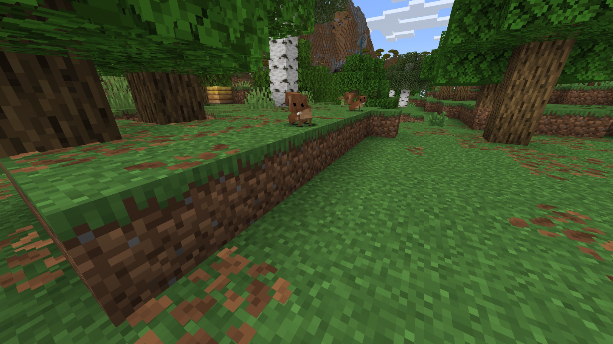
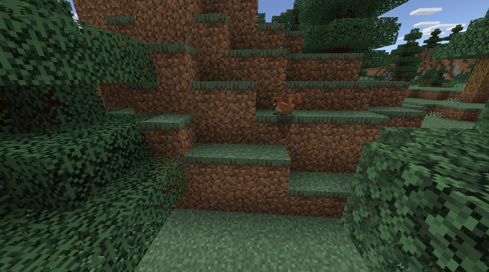
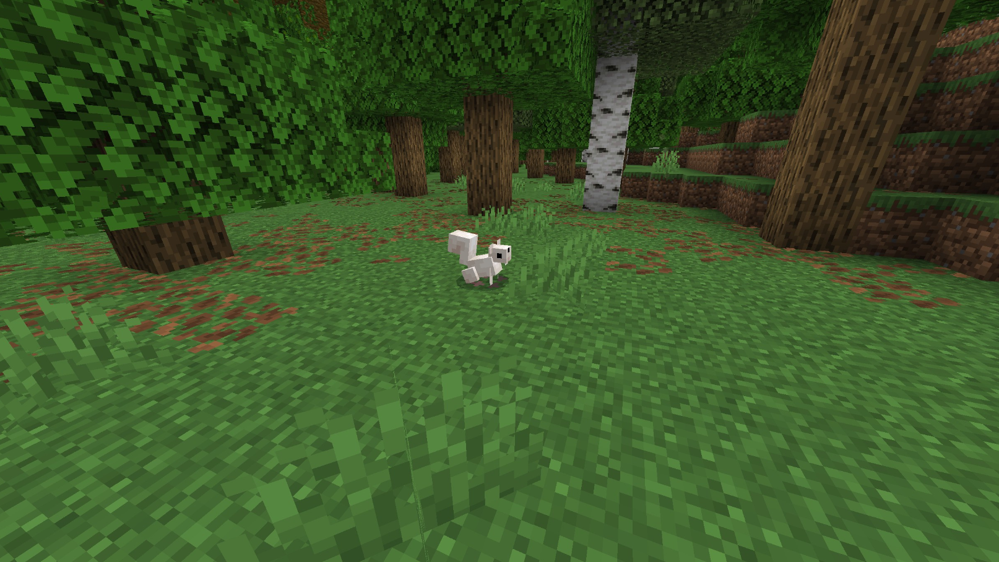
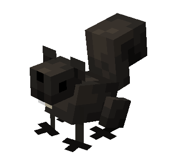
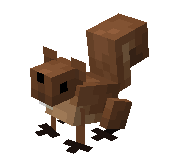
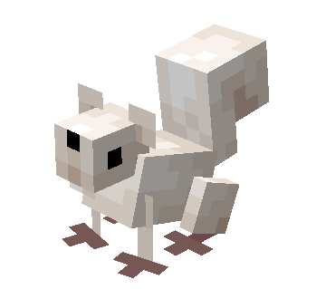

# Squirrel

Last Updated: April 22, 2025 8:47 PM

---

**Return**

🐻 [Naturalist Add-On Wiki](/www.notion.so/1a7a9a61c3f1800c8e32e893d6e7f430?pvs=21)

---

Squirrels are playful animals found everywhere except for Antartica and Australia. Much like other rodents, their front teeth never stop growing, and they will gnaw on a variety of nuts to wear down their teeth. Squirrels will hoard multiple stashes of food around the forest to keep them fed year-round but carefully cover their stashes to protect them from potential thieves. While it’s not intended, their stashes of seeds have been known to grow trees!

<aside>

### **Squirrel**

---

**Health: 8** [♥️♥️♥️]

---

**Classification:** [Animal](/minecraft.fandom.com/wiki/Animal)

---

**Behavior:** Passive

---

**Spawn:** [Birch Forest](/minecraft.wiki/w/Birch_Forest), [Cherry Grove](/minecraft.wiki/w/Cherry_Grove), [Flower Forest](/minecraft.wiki/w/Flower_Forest), & [Forest](/minecraft.wiki/w/Forest)

---

</aside>

---

### 🌎 Spawning

A scurry of 1-2 squirrels will spawn in the [birch forest](/minecraft.wiki/w/Birch_Forest), [cherry grove](/minecraft.wiki/w/Cherry_Grove), [flower forest](/minecraft.wiki/w/Flower_Forest), and [forest](/minecraft.wiki/w/Forest) biomes. They will spawn during the daytime with [light levels](/minecraft.fandom.com/wiki/Light) between 9-15.

---

### ⚔️ Drops

Squirrel [drops](/minecraft.fandom.com/wiki/Drops) upon death:

- 0 - 1 Acorn
- 0 - 1 Morsel
- 0 - 1 Fur
- 🟢 3 [Experience](/minecraft.fandom.com/wiki/Experience) Orbs if killed by Player.
- 🟢 1 - 7 Experience Orbs upon [breeding](/minecraft.fandom.com/wiki/Breeding).

*Pups yield no items nor experience.*

---

### 🧠 Behavior

Squirrels are entirely passive animals that roam plentiful forests. These animals are skittish, so if a player wants to get close to a squirrel they must crouch and approach slowly. Squirrels enjoy snacking on sweet berries and glow berries, so they will let a player get close to them when those items are held out (much like a cat with fish).

Squirrels are incredibly active animals; however, they enjoy taking long naps between tickets 6000 - 13000. They will not nap in the water but don’t mind napping through a thunderstorm. If a player approaches a squirrel while it is napping, they will wake up and flee from the player before resuming their nap.

If a player attacks a squirrel, it will flee from the player.

Baby squirrels will follow the parents until they are mature adults.

---

### 🥚Breeding

Adult squirrels can be [bred](/minecraft.fandom.com/wiki/Breeding) with [glow berries](/minecraft.wiki/w/Glow_Berries) and [sweet berries](/minecraft.wiki/w/Sweet_Berries). There is a 5-minute cooldown for breeding, during which the squirrel will not accept berries for breeding.

Upon successful breeding, a pup will be born. The growth of pups can be slowly accelerated by using glow berries and sweet berries.

---

### 🖼️ Gallery

---

### 🎨 Variants

             Black Squirrel

            Brown Squirrel

             White Squirrel

---

<aside>
 Have additional questions? Want to be a part of our community? → [Join our Discord!](/discord.com/invite/starfishstudios)

</aside>

<aside>

[**Marketplace](/www.minecraft.net/en-us/marketplace/creator?name=Starfish%20Studios)      [CurseForge](/www.curseforge.com/members/starfish_studios/projects)      [TikTok](/www.tiktok.com/@starfishstudios)      [Instagram](/www.instagram.com/starfishstudiosinc/)      [Twitter](/twitter.com/starfishstudios)      [YouTube](/www.youtube.com/@starfishstudios)      [Website](/starfish-studios.com/)**

</aside>
