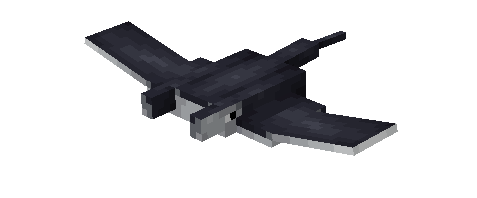
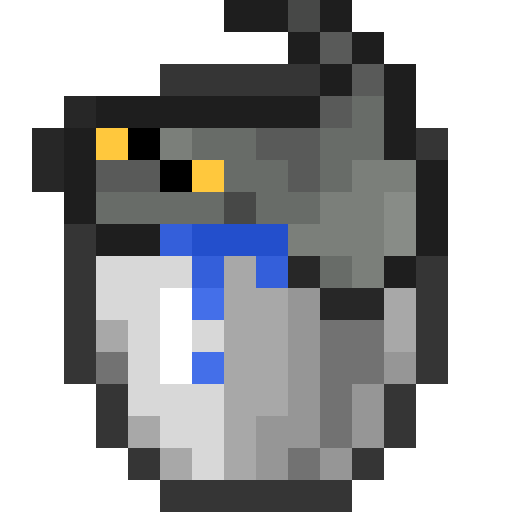
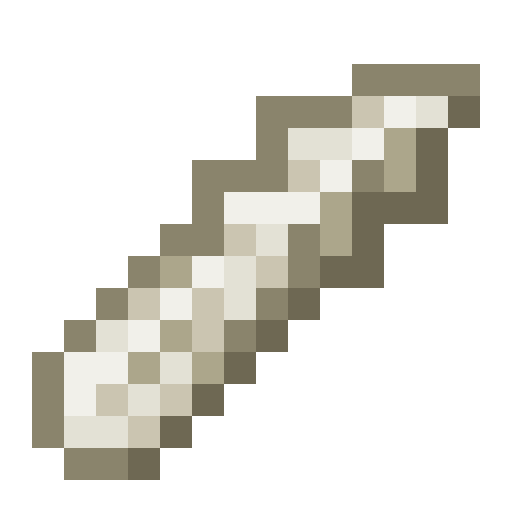
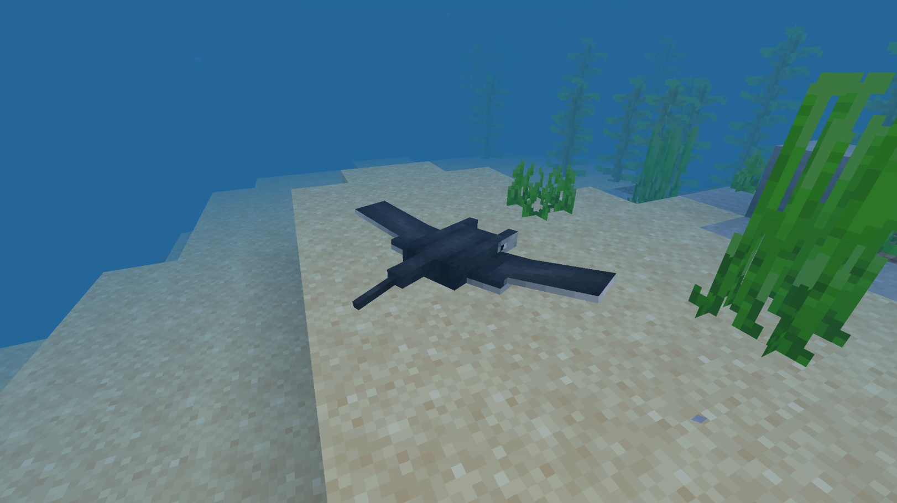
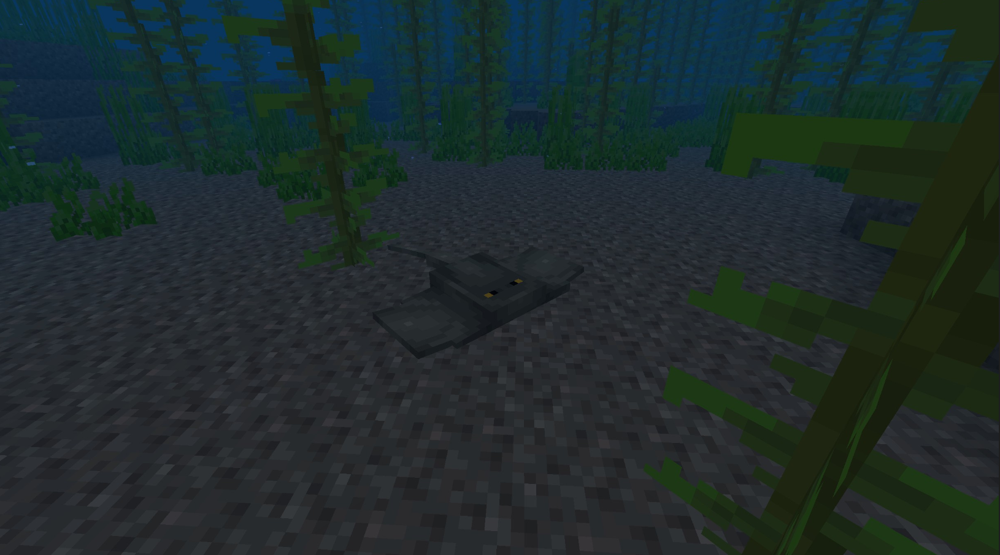
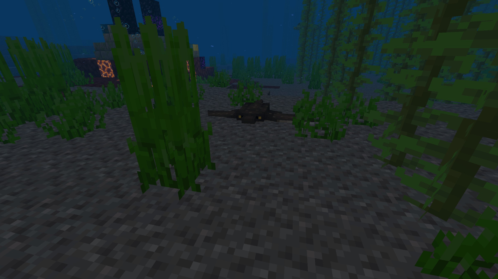
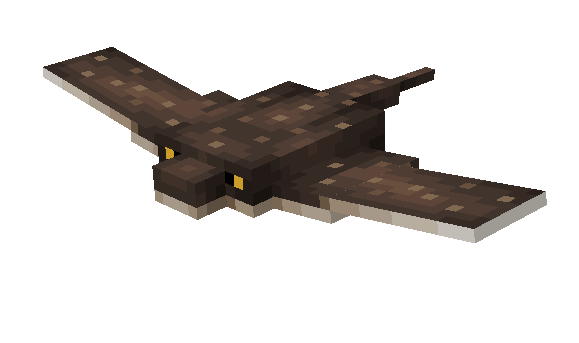
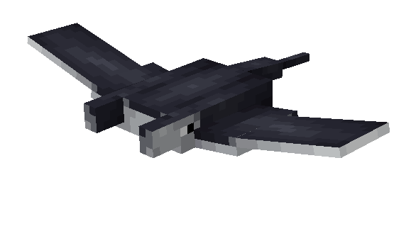
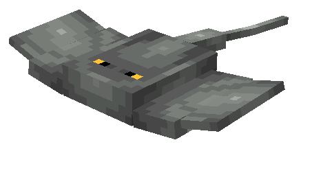

# Stingray

Last Updated: April 22, 2025 8:47 PM

---

**Return**

🐻 [Naturalist Add-On Wiki](/www.notion.so/1a7a9a61c3f1800c8e32e893d6e7f430?pvs=21)

---

Stingrays thrive in warm oceanic waters. Stingray is only one species of ray, but the term “stingray” is inclusive to all 60 species. These fish can measure up to 6.5 feet long and are purely made up of cartilage. This allows for their flexibility in water for fast swimming by utilizing a flapping motion. A stingray's stinger helps protect them from predators like sharks, but not used to hunt prey.

<aside>

### **Stingray**

---

**Health: 14** [♥️♥️♥️]

---

**Classification:** [Animal](/minecraft.fandom.com/wiki/Animal) / [Aquatic](/minecraft.fandom.com/wiki/Aquatic)

---

**Behavior:** Neutral

---

**Spawn:** [Warm Ocean](/minecraft.wiki/w/Warm_Ocean) & [Lukewarm Ocean](/minecraft.wiki/w/Lukewarm_Ocean)

---

</aside>

---

### 🌎 Spawning

A fever of 1-3 stingrays spawn in the warm and lukewarm oceans. They can be found between Y coordinates Y -20 and Y 64.

---

### ⚔️ Drops

Ray [drops](/minecraft.fandom.com/wiki/Drops) upon death:

- 1 - 2 Crab Meat
    - ⚔️ The maximum amount is increased by 1 per level of [Looting](/minecraft.fandom.com/wiki/Looting), for a maximum of 1-6 with Looting III
- 1 - 2 Cooked Crab Meat
    - ⚔️ Cooked Crab Meat can be dropped when killed on land with [Smelting](/minecraft.fandom.com/wiki/Fire_Aspect) or [Flame](/minecraft.fandom.com/wiki/Flame) enchantment. This will not work when the ray is killed underwater.
- 0 - 2 Stingray Stinger
    - ⚔️ The maximum amount is increased by 1 per level of [Looting](/minecraft.fandom.com/wiki/Looting), for a maximum of 1-6 with Looting III
- 🟢 1 - 3 [Experience](/minecraft.fandom.com/wiki/Experience) Orbs if killed by Player
- 🟢 1 - 7 Experience Orbs upon [breeding](/minecraft.fandom.com/wiki/Breeding).

*Pups yield no items nor experience.*

---

### 🧠 Behavior

Rays swim across the ocean floors and will munch on any squid that dares come close enough to them.

Rays are incredibly protective about their territory. If a player approaches, rays will swim away quickly and bury themselves in the ocean floor. Only the top part of them will remain visible. If a player still encroaches on their territory after the ray flees, the ray will launch out of hiding and sting the player, only to proceed to flee afterward.

The player may collect rays by using a [water bucket](/minecraft.fandom.com/wiki/Water_bucket) on them, which gives the player a bucket of stingray/eagle ray/mobula ray. Rays placed with buckets do not despawn naturally. When that fish bucket is used against a block, it empties the bucket, placing water with the ray swimming in it.

**Weakness:**

Rays are unable to survive out of water. Outside of water, they will float in the spot they are left in and eventually, they start to suffocate and die. Rays cannot be put in a [cauldron](/minecraft.fandom.com/wiki/Cauldron).

---

### 🥚Breeding

Rays can be [bred](/minecraft.fandom.com/wiki/Breeding) with raw crab meat. There is a 5-minute cooldown for breeding, during which the ray does not accept raw crab meat for breeding.

Upon successful breeding, a pup will be born. The growth rate of pups can be slowly accelerated by using raw crab meat.

---

### 🖼️ Gallery

---

### 🎨 Variants

              Eagle Ray

              Mobula Ray

                  Stingray

---

<aside>
 Have additional questions? Want to be a part of our community? → [Join our Discord!](/discord.com/invite/starfishstudios)

</aside>

<aside>

[**Marketplace](/www.minecraft.net/en-us/marketplace/creator?name=Starfish%20Studios)      [CurseForge](/www.curseforge.com/members/starfish_studios/projects)      [TikTok](/www.tiktok.com/@starfishstudios)      [Instagram](/www.instagram.com/starfishstudiosinc/)      [Twitter](/twitter.com/starfishstudios)      [YouTube](/www.youtube.com/@starfishstudios)      [Website](/starfish-studios.com/)**

</aside>
