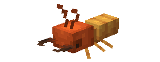
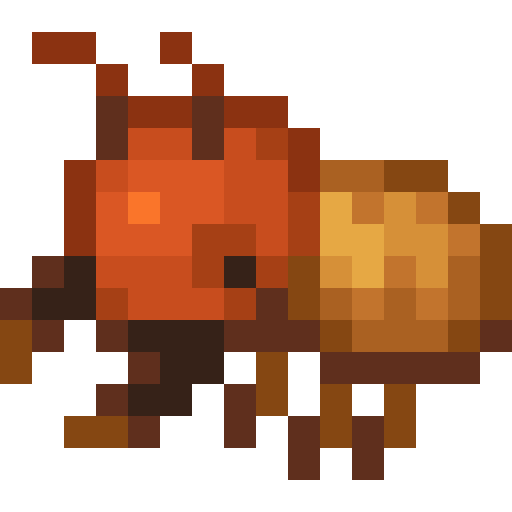
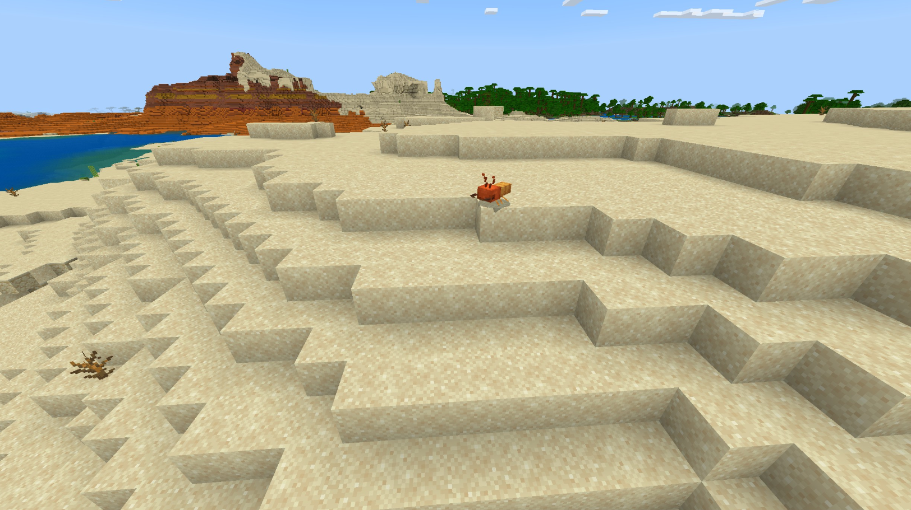

# Termite

Last Updated: April 22, 2025 8:47 PM

---

**Return**

🐻 [Naturalist Add-On Wiki](/www.notion.so/1a7a9a61c3f1800c8e32e893d6e7f430?pvs=21)

---

Termites live in large colonies feasting on dead plant matter such as wood, leaves, and grass. Termites do not sleep therefore, they will spend all of their extra time expanding their colony. Don’t be fooled by mistaking termites for ants; they may be small in size, but your wooden houses will know the difference!

<aside>

### **Termite**

---

**Health: 5** [♥️♥️♥️]

---

**Classification:** [Arthropod](/minecraft.fandom.com/wiki/Arthropods)

---

**Behavior:** Passive

---

**Spawn:** [Desert](/minecraft.wiki/w/Desert) & [Desert Hills](/minecraft.wiki/w/Desert_Hills)

---

</aside>

---

### 🌎 Spawning

A colony of 3-6 termites will spawn in the desert and desert hills biomes. They will spawn during the daytime with [light levels](/minecraft.fandom.com/wiki/Light) between 7-15. They will spawn as long as there is [grass](/minecraft.fandom.com/wiki/Grass_Block) or [sand](/minecraft.wiki/w/Sand) around!

---

### ⚔️ Drops

Termite [drops](/minecraft.fandom.com/wiki/Drops) upon death:

- 0 - 1 [Bone Meal](/minecraft.wiki/w/Bone_Meal)
    - ⚔️ The maximum amount is increased by 1 per level of [Looting](/minecraft.fandom.com/wiki/Looting), for a maximum of 0-3 with Looting III
- 🟢 3 [Experience](/minecraft.fandom.com/wiki/Experience) Orbs if killed by Player

---

### 🧠 Behavior

Termites are entirely passive arthropods that enjoy desert biomes. Their distinctive red heads and golden bodies stand out against the creamy desert sand. If a player is building in a desert, they may find their wooden logs are getting stripped! Be wary of termites looking to make their way into the comfort of your home!

**Capture Net:**

Termites can be caught in capture nets. If a termite is caught, the termite will enter a player’s inventory as an item. If the inventory is full, the termite will drop to the ground in front of the player.

- A termite is used by pressing ”use” on any surface (top, bottom, or side) of a block. When used on a top surface, the termite appears with its feet immediately adjacent to the surface. This interaction is much like a [spawn egg](/minecraft.fandom.com/wiki/Spawn_Egg). The surfaces of blocks are prioritized for spawning; if none are within reach, mobs can also be spawned in [water](/minecraft.fandom.com/wiki/Water).
- Termites can be fed to other animals for taming/[breeding](/minecraft.fandom.com/wiki/Breeding).

---

### 🖼️ Gallery

---

<aside>
 Have additional questions? Want to be a part of our community? → [Join our Discord!](/discord.com/invite/starfishstudios)

</aside>

<aside>

[**Marketplace](/www.minecraft.net/en-us/marketplace/creator?name=Starfish%20Studios)      [CurseForge](/www.curseforge.com/members/starfish_studios/projects)      [TikTok](/www.tiktok.com/@starfishstudios)      [Instagram](/www.instagram.com/starfishstudiosinc/)      [Twitter](/twitter.com/starfishstudios)      [YouTube](/www.youtube.com/@starfishstudios)      [Website](/starfish-studios.com/)**

</aside>
