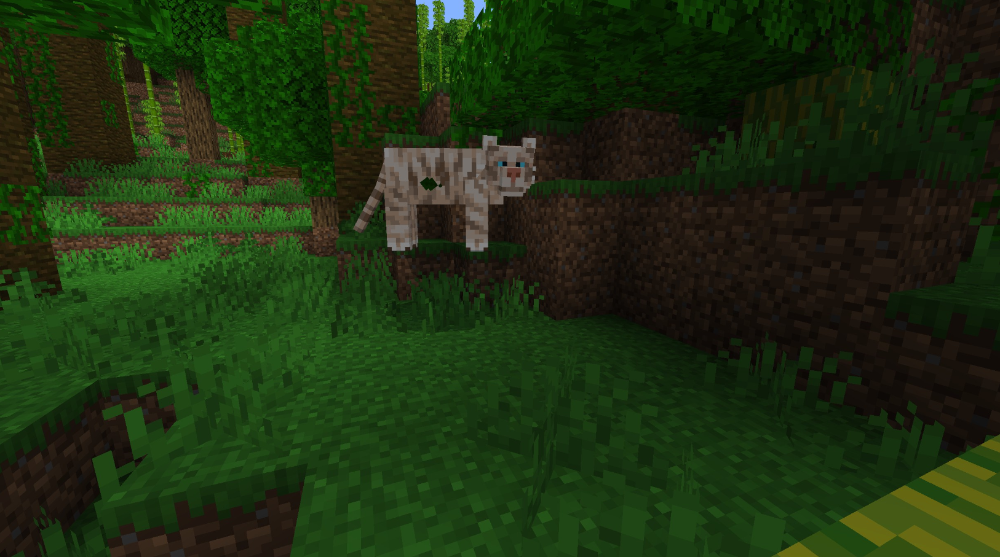

# Tiger

Last Updated: April 22, 2025 8:47 PM

---

**Return**

🐻 [Naturalist Add-On Wiki](/www.notion.so/1a7a9a61c3f1800c8e32e893d6e7f430?pvs=21)

---

Tigers are the largest cat species worldwide, primarily located in Asia. Tigers come in a varying range of colors, but their most predominant colorations are their unique orange coloring with black stripes. Tigers can move at speeds of 40 miles per hour, which makes them excellent hunters, especially when they are hunting in a pack. They can take down animals larger than themselves!

<aside>

### **Tiger**

---

**Health: 24** [♥️♥️♥️]

---

**Classification:** [Animal](/minecraft.fandom.com/wiki/Animal)

---

**Behavior:** Passive unless provoked

---

**Spawn:** [Cherry Grove](/minecraft.wiki/w/Cherry_Grove), [Desert](/minecraft.wiki/w/Desert), [Jungle](/minecraft.wiki/w/Jungle), [Mangrove Swamp](/minecraft.wiki/w/Swamp), & [Mountains](/minecraft.wiki/w/Mountains)

---

</aside>

---

### 🌎 Spawning

A streak of 1-2 tigers will spawn in the [cherry grove](/minecraft.wiki/w/Cherry_Grove), [desert,](/minecraft.wiki/w/Desert) [jungle](/minecraft.wiki/w/Jungle), [mangrove swamp](/minecraft.wiki/w/Swamp), and [mountain](/minecraft.wiki/w/Mountains) biomes. Tigers will spawn all day so better hope the hunter doesn’t become the prey!

---

### ⚔️ Drops

Tiger [drops](/minecraft.fandom.com/wiki/Drops) upon death:

- 1 - 2 Tooth
- 1 - 2 Fur
- 🟢 1 - 3 [Experience](/minecraft.fandom.com/wiki/Experience) Orbs if killed by Player
- 🟢 1 - 7 Experience Orbs upon [breeding](/minecraft.fandom.com/wiki/Breeding)

*Cubs yield no items nor experience.* 

---

### 🧠 Behavior

Tigers, upon spawning, will normally be adults; however, if tigers spawn in pairs, one of them will be a cub. Tigers are fearless cats and will hunt at night. 

When hunting at night, tigers will slowly stalk their prey before getting close enough to sprint and attack them. Tiger cubs do not attack other animals; however, they will still follow their parents. Tigers will hunt boars and pigs.

Tigers do not attack players unless the player attacks them or their cubs first. At which point, the tiger will get angry and attack the player until either the player dies, the tiger is killed, or the player is out of sight of the tiger.

Tigers will take long naps between the ticks of 6000 and 13000. They will not sleep if they are in the water. If hit while sleeping, they will wake up in an aggressive state and will go back to sleep once they either kill their target or lose sight of them.

---

### 🥚Breeding

Tigers can be [bred](/minecraft.fandom.com/wiki/Breeding) with a variety of raw meats and fish. There is a 5-minute cooldown for breeding, during which the tiger will not accept items for breeding.

Upon successful breeding, a cub will be born. It takes a full Minecraft day for the cub to grow up to be an adult, and you cannot feed the cub any items to accelerate their growth.

**List of items for breeding:**

**Fish:** [Raw Cod](/minecraft.wiki/w/Raw_Cod), [Raw Salmon](/minecraft.wiki/w/Raw_Salmon), Raw Bass, Raw Catfish, Raw Blobfish, Raw Clam, Raw Crab Meat, Raw Piranha, and [Tropical Fish](/minecraft.fandom.com/wiki/Tropical_Fish).

**Raw Meat:** [Raw Chicken](/minecraft.wiki/w/Raw_Chicken), [Raw Porkchop](/minecraft.wiki/w/Raw_Porkchop), [Raw Beef](/minecraft.wiki/w/Raw_Beef), [Raw Mutton](/minecraft.wiki/w/Raw_Mutton), [Raw Rabbit](/minecraft.wiki/w/Raw_Rabbit), Raw Drumstick, Raw Duck, Raw Goose, Raw Moose Meat, and Raw Reptile Tail.

---

### 🖼️ Gallery

---

### 🎨 Variants

       Black Panther

            Leopard

           Tiger

        White Tiger

---

<aside>
 Have additional questions? Want to be a part of our community? → [Join our Discord!](/discord.com/invite/starfishstudios)

</aside>

<aside>

[**Marketplace](/www.minecraft.net/en-us/marketplace/creator?name=Starfish%20Studios)      [CurseForge](/www.curseforge.com/members/starfish_studios/projects)      [TikTok](/www.tiktok.com/@starfishstudios)      [Instagram](/www.instagram.com/starfishstudiosinc/)      [Twitter](/twitter.com/starfishstudios)      [YouTube](/www.youtube.com/@starfishstudios)      [Website](/starfish-studios.com/)**

</aside>
