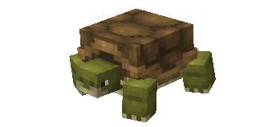
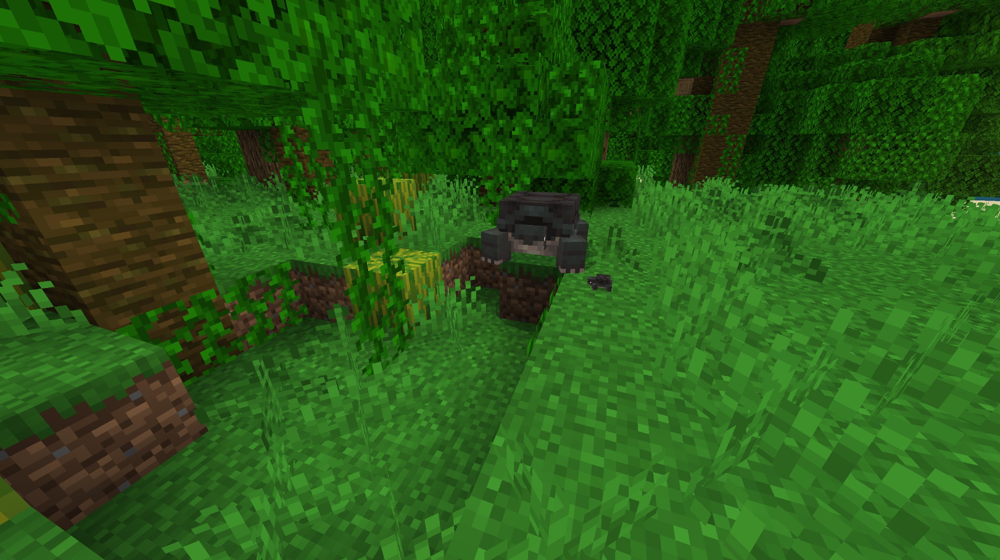
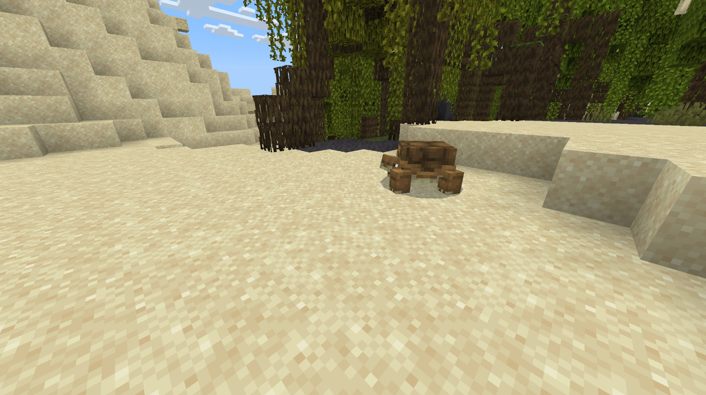
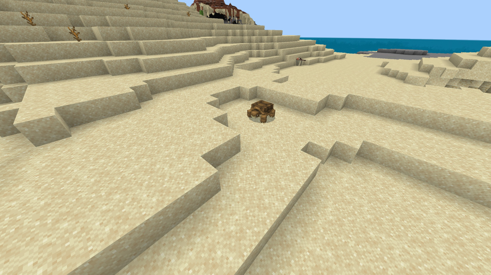
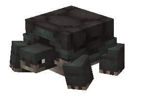
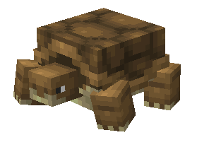
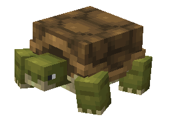

# Tortoise

Last Updated: April 22, 2025 8:47 PM

---

**Return**

🐻 [Naturalist Add-On Wiki](/www.notion.so/1a7a9a61c3f1800c8e32e893d6e7f430?pvs=21)

---

Tortoises are large reptiles that are easily identifiable for their large, protective shells. A tortoise can be a turtle, but a turtle cannot be a tortoise. To know the difference, check their feet as tortoises have chunky feet like elephants, but turtles have webbed feet. These shells are not a single component, but they are 60 individual bones that are interconnected, which gives them their unique strength and pattern. 

<aside>

### **Tortoise**

---

**Health: 30** [♥️♥️♥️]

---

**Classification:** [Animal](/minecraft.fandom.com/wiki/Animal)

---

**Behavior:** Passive

---

**Spawn:** [Desert](/minecraft.wiki/w/Desert), [Jungle](/minecraft.wiki/w/Jungle), [Mangrove Swamp](/minecraft.wiki/w/Swamp), & [Swamp](/minecraft.wiki/w/Swamp)

</aside>

---

### 🌎 Spawning

A group of 1-3 tortoises will spawn in the [desert](/minecraft.wiki/w/Desert), [jungle](/minecraft.wiki/w/Jungle), [mangrove swamp](/minecraft.wiki/w/Swamp), and [swamp](/minecraft.wiki/w/Swamp) biomes. They will spawn during the daytime with [light levels](/minecraft.fandom.com/wiki/Light) between 9-15. Tortoises will spawn as long as there are [grass](/minecraft.fandom.com/wiki/Grass_Block) and [leaves](/minecraft.wiki/w/Leaves) around!

---

### ⚔️ Drops

Tortoise [drops](/minecraft.fandom.com/wiki/Drops) upon death:

- 1 - 2 [Turtle Scute](/minecraft.wiki/w/Turtle_Scute)
    - ⚔️ The maximum amount is increased by 1 per level of [Looting](/minecraft.fandom.com/wiki/Looting), for a maximum of 1-6 with Looting III
- 🟢 1 - 3 [Experience](/minecraft.fandom.com/wiki/Experience) Orbs if killed by Player.
- 🟢 1 - 7 Experience Orbs upon [breeding](/minecraft.fandom.com/wiki/Breeding).

*Hatchlings yield no items nor experience.*

---

### 🧠 Behavior

Tortoises are entirely passive animals that slowly move across their designated biomes. They are quite large and easy to spot, but don’t go chasing one down without their favorite foods. Tortoises will hide in their shells if a player approaches without sneaking or holding one of their favored items. They will not reappear from their shell until the player walks away.

---

### ❤️ Taming, Healing, & Feeding

Tortoises can be tamed with [yellow flowers](/minecraft.wiki/w/Dandelion), [brown mushrooms](/minecraft.wiki/w/Mushroom), [cactus](/minecraft.wiki/w/Cactus), and [bamboo](/minecraft.wiki/w/Bamboo).  There is a 60% chance of successful taming. Once they are tamed, you will see hearts appear. There is no visual indication that they are tamed other than the hearts, however, tortoises will follow you once tamed.

Tamed tortoises can be commanded to sit or to follow.

- Tortoises will teleport to the player if the player is further than 10 blocks away.
- Tortoises will not teleport to the player if they are commanded to sit.

If a tortoise you have tamed gets injured, you can feed the tortoise yellow flowers, brown mushrooms, cactus, and bamboo to increase its [health](/minecraft.fandom.com/wiki/Health) until it is maxed. 1 feedable item increases the tortoise’s health points by 2. An injured tortoise will be unable to breed until it is healed. 

---

### 🥚Breeding

Tortoises can be bred with yellow flowers, brown mushrooms, cactus, and bamboo. There is a 5-minute cooldown for breeding, during which the tortoise does not accept any items for breeding.

Upon successful breeding, the tortoise will find [sand](/minecraft.wiki/w/Sand), [grass](/minecraft.fandom.com/wiki/Grass_Block), or [dirt](/minecraft.wiki/w/Dirt) to lay their egg on. If in survival mode, the egg can be broken with 1 hit, and it will drop as an item. Once the egg is placed in the world, the egg hatch timer will restart. There are visuals for the egg hatching, and a cracking sound will be emitted when the egg hatches and a hatchling appears.

Once the hatchling emerges from its egg, the growth rate can be slowly accelerated by using yellow flowers, brown mushrooms, cactus, and bamboo.

---

### 🖼️ Gallery

---

### 🎨 Variants

               Black Tortoise

             Brown Tortoise

              Green Tortoise

---

<aside>
 Have additional questions? Want to be a part of our community? → [Join our Discord!](/discord.com/invite/starfishstudios)

</aside>

<aside>

[**Marketplace](/www.minecraft.net/en-us/marketplace/creator?name=Starfish%20Studios)      [CurseForge](/www.curseforge.com/members/starfish_studios/projects)      [TikTok](/www.tiktok.com/@starfishstudios)      [Instagram](/www.instagram.com/starfishstudiosinc/)      [Twitter](/twitter.com/starfishstudios)      [YouTube](/www.youtube.com/@starfishstudios)      [Website](/starfish-studios.com/)**

</aside>
