# Tree Frog

Last Updated: April 22, 2025 8:47 PM

---

**Return**

🐻 [Naturalist Add-On Wiki](/www.notion.so/1a7a9a61c3f1800c8e32e893d6e7f430?pvs=21)

---

Tree frogs come in various bright colors and sizes. Many of these frogs can camouflage themselves to blend in with their surroundings to avoid predators. They can hang upside down off of trees and leaves, using their sticky padding on their toes to stick to any kind of surface. Tree frogs are noisy amphibians; they engage in a chorus of croaks, particularly when rain is about to arrive. 

<aside>

### **Tree Frog**

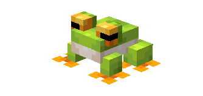

---

**Health: 10** [♥️♥️♥️]

---

**Classification:** [Animal](/minecraft.fandom.com/wiki/Animal)

---

**Behavior:** Neutral

---

**Spawn:** [Bamboo Jungle](/minecraft.wiki/w/Bamboo_Jungle), [Dripstone Caves](/minecraft.wiki/w/Dripstone_Caves), [Jungle](/minecraft.wiki/w/Jungle), [Lush Caves](/minecraft.wiki/w/Lush_Caves), & [Plains](/minecraft.wiki/w/Plains)

---

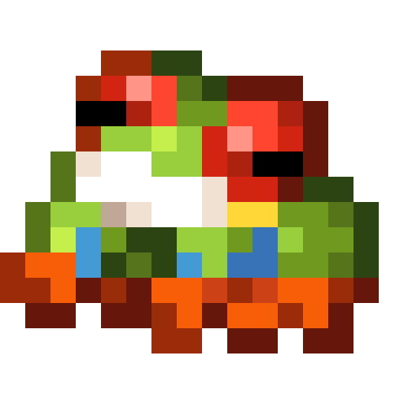

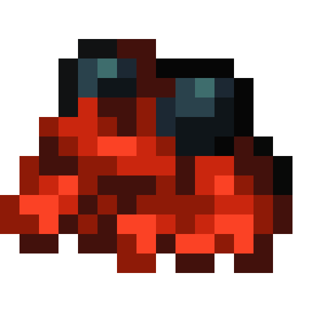

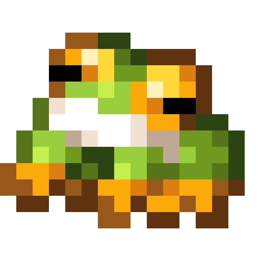

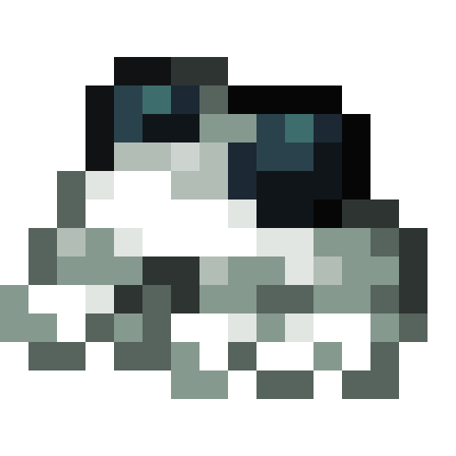

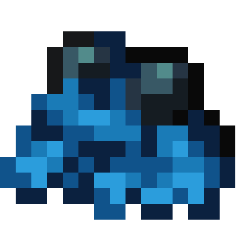

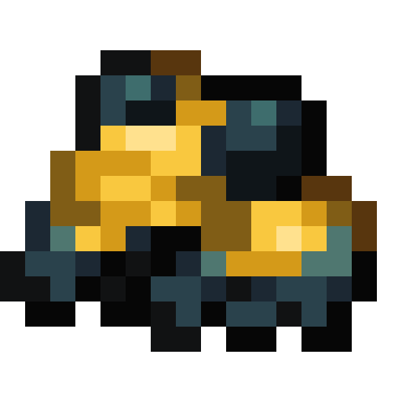

</aside>

---

### 🌎 Spawning

An army of 1-2 frogs will spawn in the bamboo jungle, dripstone caves, jungle, lush caves, and plain biomes. They will spawn exclusively at night or in dark areas underground with [light levels](/minecraft.fandom.com/wiki/Light) of 0-7. If you are looking in the cave biomes, make sure that daylight is not filtering through and prohibiting these spawns!

---

### ⚔️ Drops

Tree Frog [drops](/minecraft.fandom.com/wiki/Drops) upon death:

- 1 - 2 Frog Leg
- 🟢 1 - 3 [Experience](/minecraft.fandom.com/wiki/Experience) Orbs if killed by Player
- 🟢 1 - 7 Experience Orbs upon [breeding](/minecraft.fandom.com/wiki/Breeding).

---

### 🧠 Behavior

Tree frogs are neutral animals that enjoy being on their own in luscious biomes. Many variants of tree frogs can be found on a player’s adventure. They can be heard croaking or using their long tongues to gobble up some unfortunate arthropod that encroaches on the tree frogs’ area.

Tree frogs are mostly passive, but if a player hits a tree frog, then they will get stung. 

**Capture Net:**

Tree frogs can be caught in capture nets. If a tree frog is caught, the tree frog (in its variant) will enter a player’s inventory as an item. If the inventory is full, the tree frog will drop to the ground in front of the player.

- A tree frog is used by pressing ”use” on any surface (top, bottom, or side) of a block. When used on a top surface, the tree frog appears with its feet immediately adjacent to the surface. This interaction is much like a [spawn egg](/minecraft.fandom.com/wiki/Spawn_Egg). The surfaces of blocks are prioritized for spawning; if none are within reach, mobs can also be spawned in [water](/minecraft.fandom.com/wiki/Water).
- Tree frogs can be fed to other animals for taming/[breeding](/minecraft.fandom.com/wiki/Breeding).

---

### 🖼️ Gallery

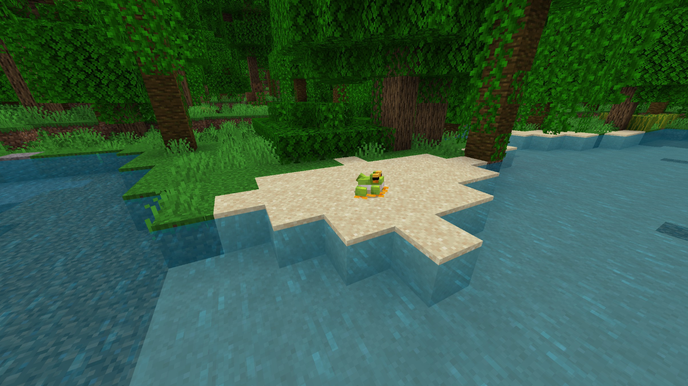

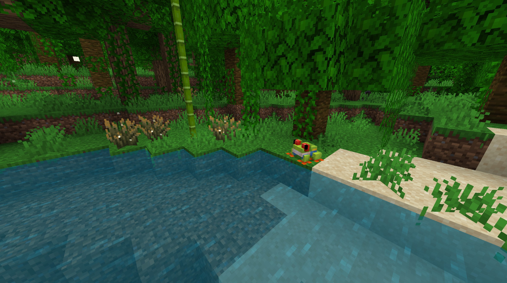

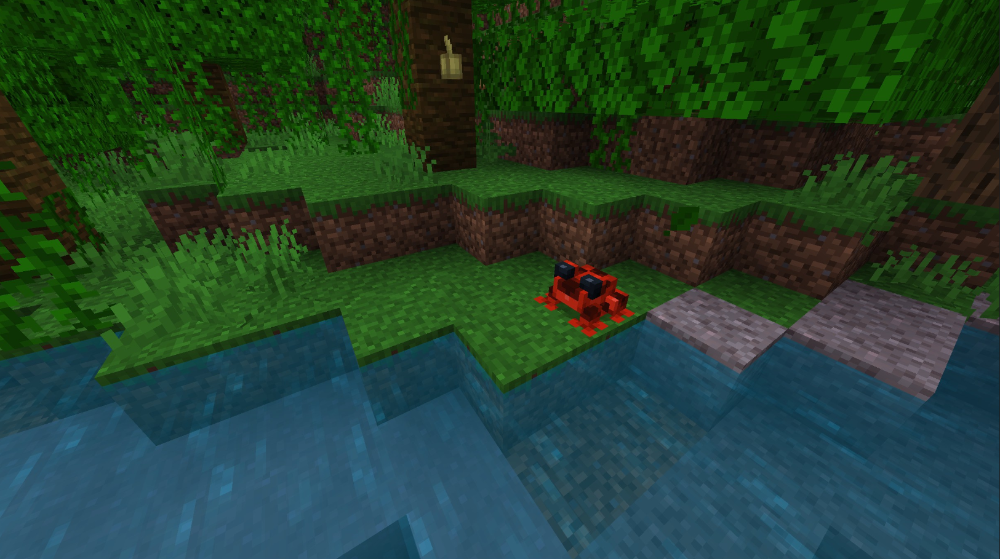

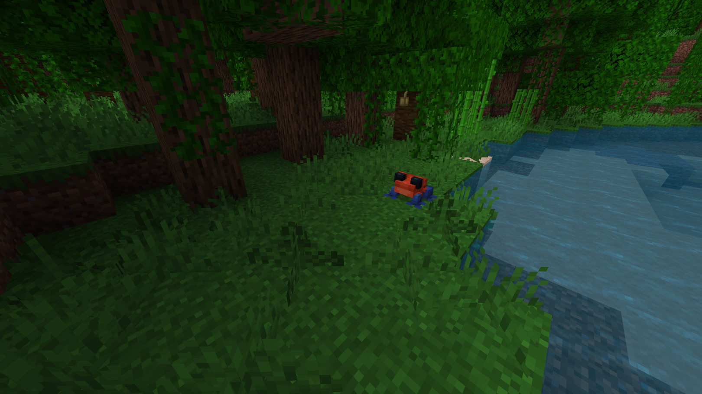

---

### 🎨 Variants

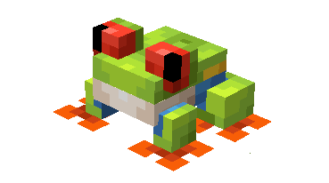

             Red Eyed Tree Frog

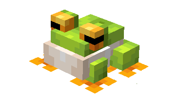

             Green Tree Frog

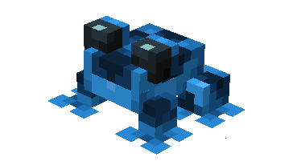

                     Blue Dart

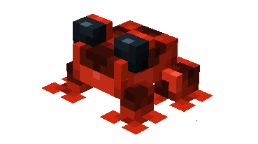

            Red Dart

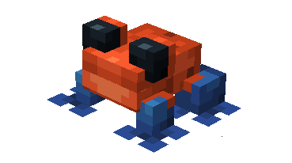

   Strawberry Dart

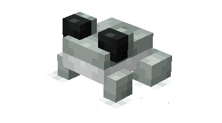

         White Dart

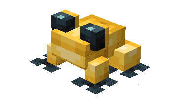

        Yellow Dart

---

<aside>
 Have additional questions? Want to be a part of our community? → [Join our Discord!](/discord.com/invite/starfishstudios)

</aside>

<aside>

[**Marketplace](/www.minecraft.net/en-us/marketplace/creator?name=Starfish%20Studios)      [CurseForge](/www.curseforge.com/members/starfish_studios/projects)      [TikTok](/www.tiktok.com/@starfishstudios)      [Instagram](/www.instagram.com/starfishstudiosinc/)      [Twitter](/twitter.com/starfishstudios)      [YouTube](/www.youtube.com/@starfishstudios)      [Website](/starfish-studios.com/)**

</aside>
