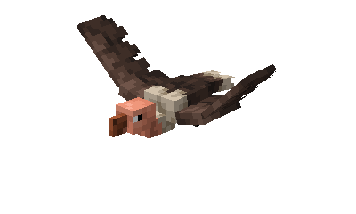
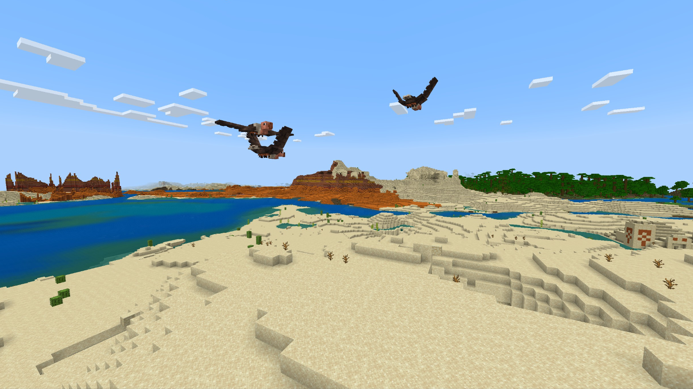

# Vulture

Last Updated: April 22, 2025 8:47 PM

---

**Return**

🐻 [Naturalist Add-On Wiki](/www.notion.so/1a7a9a61c3f1800c8e32e893d6e7f430?pvs=21)

---

Vultures reside in most continents worldwide except for Antartica and Australia. They are social birds that travel and eat in flocks. Vultures do not have a voice box; therefore, they cannot sing like most other birds. They have an incredible sense of smell and sight, which helps them find food that is over a mile away.

<aside>

### **Vulture**

---

**Health: 10** [♥️♥️♥️]

---

**Classification:** [Animal](/minecraft.fandom.com/wiki/Animal)

---

**Behavior:** Passive

---

**Spawn:** [Desert](/minecraft.wiki/w/Desert), [Mesa](/minecraft.wiki/w/Badlands), & [Savanna](/minecraft.wiki/w/Savanna)

</aside>

---

### 🌎 Spawning

A flock of 1-2 vultures spawn in the desert, mesa, and savanna biomes. They will spawn during the day with [light levels](/minecraft.fandom.com/wiki/Light) of 9-15. You will find them near [grass](/minecraft.fandom.com/wiki/Grass_Block), [sand](/minecraft.wiki/w/Sand), and [leaves](/minecraft.wiki/w/Leaves)!

---

### ⚔️ Drops

Vulture [drops](/minecraft.fandom.com/wiki/Drops) upon death:

- 0 - 2 [Feather](/minecraft.wiki/w/Feather)
    - ⚔️ The maximum amount is increased by 1 per level of [Looting](/minecraft.fandom.com/wiki/Looting), for a maximum of 0-4 with Looting III
- 0 - 2 [Rotten Flesh](/minecraft.wiki/w/Rotten_Flesh)
    - ⚔️ The maximum amount is increased by 1 per level of [Looting](/minecraft.fandom.com/wiki/Looting), for a maximum of 0-4 with Looting III
- 🟢 1 - 3 [Experience](/minecraft.fandom.com/wiki/Experience) Orbs if killed by Player.

---

### 🧠 Behavior

Vultures are large birds that soar the skies of deserts and savanna biomes. They fly high above the ground and will attack zombies at night! While they can’t be tamed or bred, they are good protectors to have near your home to keep you safe from zombies, zombie horses, or any zombie variant mobs that may come through your nether portal. 

---

### 🖼️ Gallery

---

<aside>
 Have additional questions? Want to be a part of our community? → [Join our Discord!](/discord.com/invite/starfishstudios)

</aside>

<aside>

[**Marketplace](/www.minecraft.net/en-us/marketplace/creator?name=Starfish%20Studios)      [CurseForge](/www.curseforge.com/members/starfish_studios/projects)      [TikTok](/www.tiktok.com/@starfishstudios)      [Instagram](/www.instagram.com/starfishstudiosinc/)      [Twitter](/twitter.com/starfishstudios)      [YouTube](/www.youtube.com/@starfishstudios)      [Website](/starfish-studios.com/)**

</aside>
