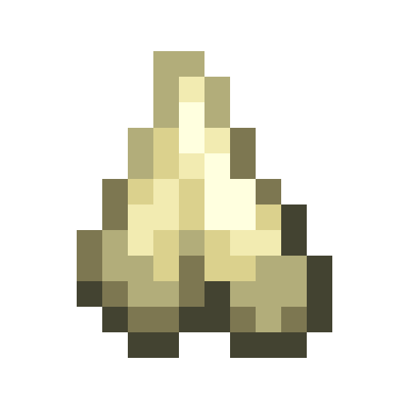
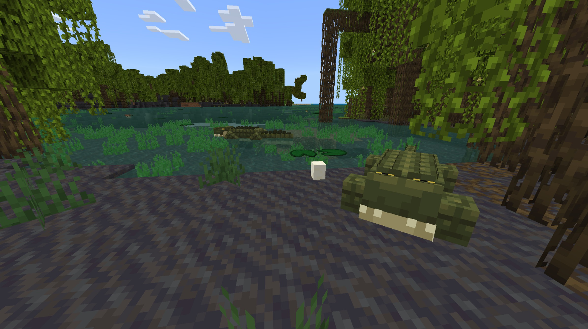

# Alligator

Dernière mise à jour : 22 avril 2025 20h47

---

**Retour**

🐻 [Wiki de l'extension Naturalist](/www.notion.so/1a7a9a61c3f1800c8e32e893d6e7f430?pvs=21)

---

L'alligator est un grand reptile carnivore semi-aquatique que l'on trouve dans les [marais](/minecraft.fandom.com/wiki/Swamp) et autres biomes similaires aux marais. C'est un prédateur d'autres animaux des marais.

<aside>

### **Alligator**

---

**Santé :** 40 [♥️♥️♥️]

---

**Classification :** [Animal](/minecraft.fandom.com/wiki/Animal) / [Aquatique](/minecraft.fandom.com/wiki/Aquatic)

---

**Comportement :** Neutre

---

**Apparition :** [Marais et variantes](/minecraft.fandom.com/wiki/Swamp)

---

</aside>

---

### 🌎 Apparition

Les alligators apparaissent en groupes de 1 à 2 dans les biomes de [marais](/minecraft.fandom.com/wiki/Swamp) et de [marais de mangroves](/minecraft.fandom.com/wiki/Swamp). Ils apparaîtront s'il y a des [blocs d'herbe](/minecraft.fandom.com/wiki/Grass_Block), de la [boue](/minecraft.fandom.com/wiki/Mud), des [racines de mangroves](/minecraft.fandom.com/wiki/Mangrove_Roots) et des [racines de mangroves boueuses](/minecraft.fandom.com/wiki/Muddy_Mangrove_Roots).

---

### ⚔️ Butin

L'alligator adulte [laisse tomber](/minecraft.fandom.com/wiki/Drops) à sa mort :

- 1 - 3 Dents
    - ⚔️ La quantité maximale est augmentée de 1 par niveau de [Butin](/minecraft.fandom.com/wiki/Looting), pour un maximum de 1-6 avec Butin III
- 🟢 1 - 3 Orbes d'[expérience](/minecraft.fandom.com/wiki/Experience) si tué par un joueur ou un [loup](/minecraft.fandom.com/wiki/Wolf) apprivoisé
- 🟢 1 - 7 Orbes d'expérience lors de la [reproduction](/minecraft.fandom.com/wiki/Breeding)

*Les bébés ne donnent ni objets ni expérience.*

---

### 🧠 Comportement

Les alligators peuvent être passifs ou hostiles. Les bébés sont passifs ; les adultes deviennent hostiles lorsque vous êtes près des **œufs d'alligator** ou provoqués (sauf s'ils sont tués en un coup).

Les alligators attaquent occasionnellement des animaux comme les [cochons](/minecraft.fandom.com/wiki/Pig), les [vaches](/minecraft.fandom.com/wiki/Cow), les [moutons](/minecraft.fandom.com/wiki/Sheep), les cerfs et les poissons-chats.

---

### 🥚Reproduction

Les alligators adultes en pleine santé peuvent se [reproduire](/minecraft.fandom.com/wiki/Breeding) avec du [bœuf cru](/minecraft.wiki/w/Raw_Beef), des [côtelettes de porc crues](/minecraft.wiki/w/Raw_Porkchop), du [poulet cru](/minecraft.wiki/w/Raw_Chicken), du [lapin cru](/minecraft.wiki/w/Raw_Rabbit), du cerf cru et du poisson-chat cru. Il y a un temps de recharge de 5 minutes pour la reproduction, pendant lequel les alligators n'acceptent pas de viande crue pour se reproduire.

Après une reproduction réussie, un alligator trouvera du sable, de l'[herbe](/minecraft.fandom.com/wiki/Grass_Block), de la [terre](/minecraft.wiki/w/Dirt) ou de la [boue](/minecraft.fandom.com/wiki/Mud) pour y pondre son œuf. Si en mode survie, l'œuf peut être cassé en un coup, et il tombera comme un objet. Une fois l'œuf placé dans le monde, le minuteur d'éclosion de l'œuf redémarrera. Il y a des visuels pour l'éclosion de l'œuf, et un son de craquement sera émis lorsque l'œuf éclot et qu'un bébé apparaît.

---

### 🖼️ Galerie

.png)

---

<aside>
 Des questions supplémentaires ? Vous voulez faire partie de notre communauté ? → [Rejoignez notre Discord !](/discord.com/invite/starfishstudios)

</aside>

<aside>

[**Marketplace](/www.minecraft.net/en-us/marketplace/creator?name=Starfish%20Studios)      [CurseForge](/www.curseforge.com/members/starfish_studios/projects)      [TikTok](/www.tiktok.com/@starfishstudios)      [Instagram](/www.instagram.com/starfishstudiosinc/)      [Twitter](/twitter.com/starfishstudios)      [YouTube](/www.youtube.com/@starfishstudios)      [Website](/starfish-studios.com/)**

</aside> 