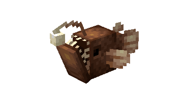
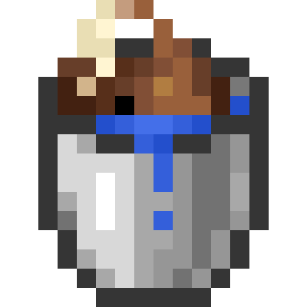
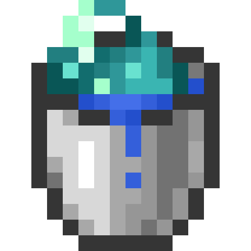
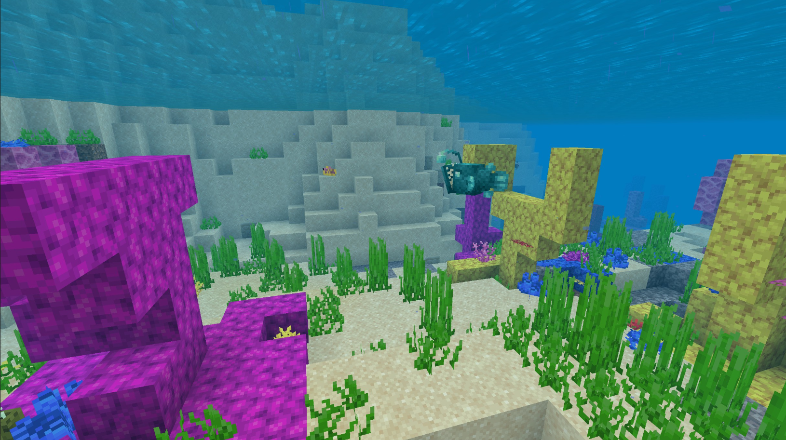
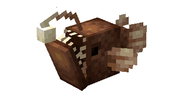

# Baudroie

Dernière mise à jour : 22 avril 2025 20h47

---

**Retour**

🐻 [Wiki de l'extension Naturalist](/www.notion.so/1a7a9a61c3f1800c8e32e893d6e7f430?pvs=21)

---

La baudroie est un prédateur des profondeurs connu pour son apparence bizarre, ses crocs acérés et son leurre bioluminescent qui s'étend du haut de sa tête. Les baudroies peuvent être trouvées dans les océans et autres biomes similaires aux océans. C'est un prédateur des [poissons tropicaux](/minecraft.fandom.com/wiki/Tropical_Fish).

<aside>

### **Baudroie**

---

**Santé : 8** [♥️♥️♥️]

---

**Classification :** [Animal](/minecraft.fandom.com/wiki/Animal) / [Aquatique](/minecraft.fandom.com/wiki/Aquatic)

---

**Comportement :** Neutre

---

**Apparition :** [Océan et variantes](/minecraft.fandom.com/wiki/Ocean)

---

</aside>

---

### 🌎 Apparition

Les baudroies apparaissent sous l'eau dans l'[océan](/minecraft.fandom.com/wiki/Ocean) et autres biomes similaires aux océans. Ces poissons apparaîtront entre les coordonnées Y -20 et Y 64.

---

### ⚔️ Butin

La baudroie [laisse tomber](/minecraft.fandom.com/wiki/Drops) à sa mort :

- 0 - 2 [Poudre de pierre lumineuse](/minecraft.wiki/w/Glowstone_Dust)
    - ⚔️ La quantité maximale est augmentée de 1 par niveau de [Butin](/minecraft.fandom.com/wiki/Looting), pour un maximum de 0-6 avec Butin III
- 0 - 1 Baudroie crue
    - ⚔️ La quantité maximale est augmentée de 1 par niveau de [Butin](/minecraft.fandom.com/wiki/Looting), pour un maximum de 0-3 avec Butin III
- 0 - 1 Baudroie cuite
    - ⚔️ La baudroie cuite peut être obtenue lorsqu'elle est tuée sur terre avec l'enchantement [Fonte](/minecraft.fandom.com/wiki/Fire_Aspect) ou [Flamme](/minecraft.fandom.com/wiki/Flame). Cela ne fonctionnera pas si la baudroie est tuée sous l'eau
- 🟢 1 - 3 Orbes d'[expérience](/minecraft.fandom.com/wiki/Experience) si tuée par un joueur

*Les bébés baudroies ne donnent pas d'orbes d'expérience lorsqu'ils sont tués.*

---

### 🧠 Comportement

Les baudroies sont des prédateurs agressifs qui attaqueront à la fois les joueurs et les [poissons tropicaux](/minecraft.fandom.com/wiki/Tropical_Fish).

Le joueur peut collecter des baudroies en utilisant un [seau d'eau](/minecraft.fandom.com/wiki/Water_bucket) sur elles, ce qui donne au joueur un seau de baudroie/seau de baudroie lumineuse. Les baudroies placées avec des seaux ne disparaissent pas naturellement. Lorsque ce seau de poisson est utilisé contre un bloc, il vide le seau, plaçant de l'eau avec la baudroie nageant dedans.

**Faiblesse :**

Les baudroies ne peuvent pas survivre hors de l'eau. En dehors de l'eau, elles se débattent pendant un moment jusqu'à ce qu'elles commencent à suffoquer et meurent. Les baudroies ne peuvent pas être placées dans un [chaudron](/minecraft.fandom.com/wiki/Cauldron).

---

### 🖼️ Galerie

Baudroie chassant des poissons tropicaux

Baudroie lumineuse chassant des poissons tropicaux

---

### 🎨 Variantes

                                 Baudroie

                             Baudroie lumineuse

---

<aside>
 Des questions supplémentaires ? Vous voulez faire partie de notre communauté ? → [Rejoignez notre Discord !](/discord.com/invite/starfishstudios)

</aside>

<aside>

[**Marketplace](/www.minecraft.net/en-us/marketplace/creator?name=Starfish%20Studios)      [CurseForge](/www.curseforge.com/members/starfish_studios/projects)      [TikTok](/www.tiktok.com/@starfishstudios)      [Instagram](/www.instagram.com/starfishstudiosinc/)      [Twitter](/twitter.com/starfishstudios)      [YouTube](/www.youtube.com/@starfishstudios)      [Website](/starfish-studios.com/)**

</aside> 