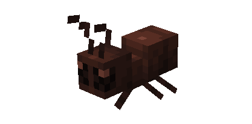
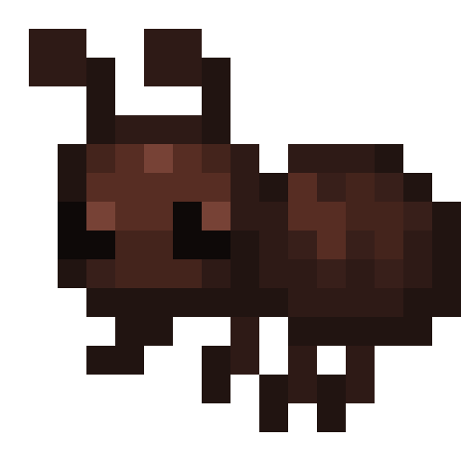
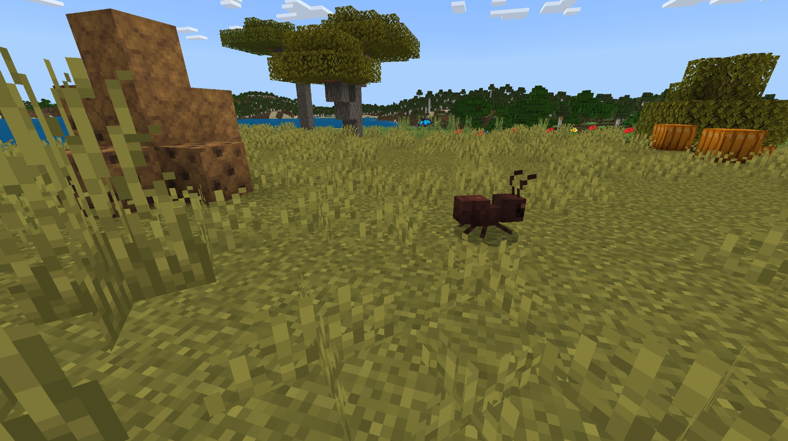
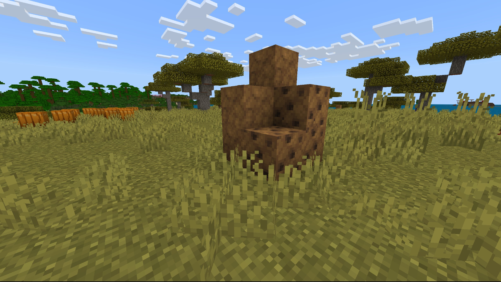

# Ant

Last Updated: April 22, 2025 8:47 PM

---

**Return**

🐻 [Naturalist Add-On Wiki](/www.notion.so/1a7a9a61c3f1800c8e32e893d6e7f430?pvs=21)

---

Ants are fascinating arthropods with the longest lifespans. They can carry objects 50 times their body weight and communicate using chemicals called pheromones. Ant colonies are run by a single queen ant, and these ants build complex nests to protect their queen.

<aside>

### **Ant**

---

**Health: 5** [♥️♥️♥️]

---

**Classification:** [Arthropod](/minecraft.fandom.com/wiki/Arthropods)

---

**Behavior:** Passive

---

**Spawn: N/A**

---

</aside>

---

### 🌎 Spawning

Ants do not spawn naturally in the overworld; however, their ant hills can be commonly found within the [savanna](/minecraft.wiki/w/Savanna) and [jungle](/minecraft.wiki/w/Jungle) biomes. If an ant hill block is broken, an ant will pop out! If the player is lucky, they’ll spot a queen ant, which can be used to make more ant hills.

---

### 🧠 Behavior

Ants are found in new structures that spawn in the world, Ant Hills. They are small hills built from blocks that the Ants can go in and out of, like Bee Nests.

- If there are not Ants outside of the Ant Hills, Anteaters will approach the blocks and dig at them, forcing Ants out of them before eating them.
- Each Ant Hill has 1 single “Queen Ant” block that when broken will drop a Queen Ant item.

**Capture Net:**

Ants can be caught in capture nets. If an ant is caught, the ant will enter a player’s inventory as an item. If the inventory is full, the ant will drop to the ground in front of the player.

- An ant is used by pressing ”use” on any surface (top, bottom, or side) of a block. When used on a top surface, the ant appears with its feet immediately adjacent to the surface. This interaction is much like a [spawn egg](/minecraft.fandom.com/wiki/Spawn_Egg). The surfaces of blocks are prioritized for spawning; if none are within reach, mobs can also be spawned in [water](/minecraft.fandom.com/wiki/Water).
- Ants can be fed to other animals for taming/[breeding](/minecraft.fandom.com/wiki/Breeding).

---

### 🖼️ Gallery

---

<aside>
 Have additional questions? Want to be a part of our community? → [Join our Discord!](/discord.com/invite/starfishstudios)

</aside>

<aside>

[**Marketplace](/www.minecraft.net/en-us/marketplace/creator?name=Starfish%20Studios)      [CurseForge](/www.curseforge.com/members/starfish_studios/projects)      [TikTok](/www.tiktok.com/@starfishstudios)      [Instagram](/www.instagram.com/starfishstudiosinc/)      [Twitter](/twitter.com/starfishstudios)      [YouTube](/www.youtube.com/@starfishstudios)      [Website](/starfish-studios.com/)**

</aside>
