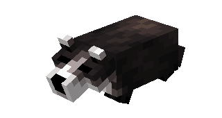
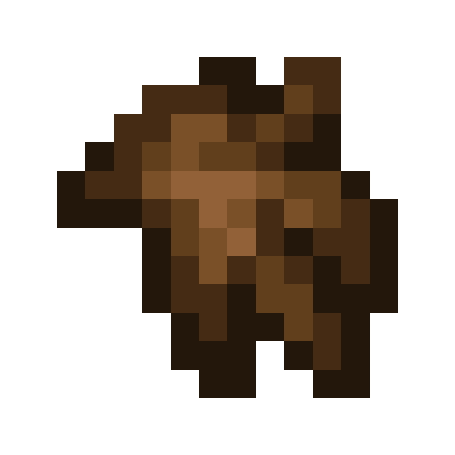
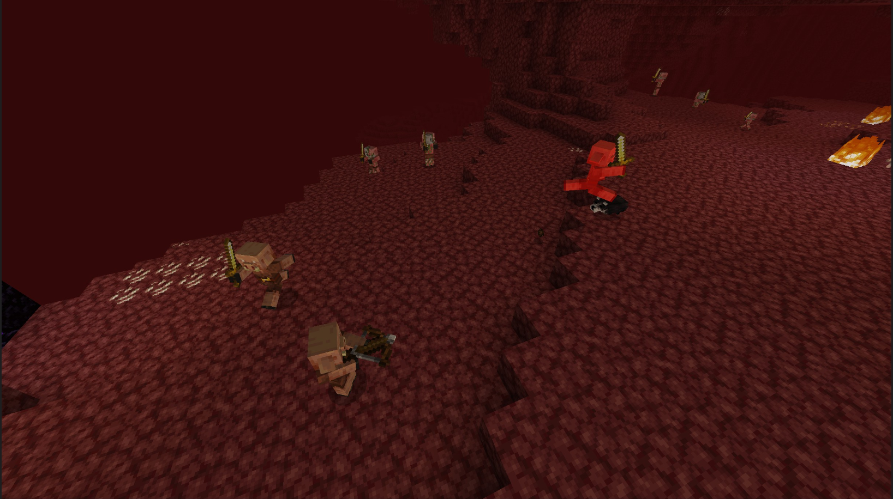

# Blaireau

Dernière mise à jour : 22 avril 2025 20h47

---

**Retour**

🐻 [Wiki de l'extension Naturalist](/www.notion.so/1a7a9a61c3f1800c8e32e893d6e7f430?pvs=21)

---

Les blaireaux sont de petits mammifères au corps plat et en forme de coin, avec de larges pattes munies de longues griffes et un pelage grossier. Ils passent la plupart de leur temps sous terre, ne sortant que la nuit pour chasser.

<aside>

### Blaireau

---

**Santé : 6** [♥️♥️♥️]

---

**Classification :** [Animal](/minecraft.fandom.com/wiki/Animal)

---

**Comportement :** Neutre

---

**Apparition :** [Forêt](/minecraft.fandom.com/wiki/Forest), [Collines](/minecraft.fandom.com/wiki/Biome), [Taïga](/minecraft.fandom.com/wiki/Taiga), et [Grottes luxuriantes](/minecraft.fandom.com/wiki/Biome) près des entrées de grottes.

---

</aside>

---

### 🌎 Apparition

Les blaireaux apparaîtront en groupes de 1 à 2 près des entrées de grottes dans les biomes de [forêt](/minecraft.fandom.com/wiki/Forest), de [collines](/minecraft.fandom.com/wiki/Biome), de [taïga](/minecraft.fandom.com/wiki/Taiga) et de [grotte luxuriante](/minecraft.fandom.com/wiki/Biome). Ces animaux sont plus actifs la nuit et apparaîtront avec des [niveaux de lumière](/minecraft.fandom.com/wiki/Light) de 7 ou moins.

---

### ⚔️ Butin

Le blaireau [laisse tomber](/minecraft.fandom.com/wiki/Drops) à sa mort :

- 0 - 1 Fourrure
    - ⚔️ La quantité maximale est augmentée de 1 par niveau de [Butin](/minecraft.fandom.com/wiki/Looting), pour un maximum de 0-3 avec Butin III
- 0 - 1 Viande de brousse crue
    - ⚔️ La quantité maximale est augmentée de 1 par niveau de [Butin](/minecraft.fandom.com/wiki/Looting), pour un maximum de 0-3 avec Butin III
- 0 - 1 Viande de brousse cuite
    - ⚔️ La viande de brousse cuite peut être obtenue lorsqu'elle est tuée sur terre avec l'enchantement [Fonte](/minecraft.fandom.com/wiki/Fire_Aspect) ou [Flamme](/minecraft.fandom.com/wiki/Flame). Cela ne fonctionnera pas si le blaireau est tué pendant qu'il nage
- 🟢 1 - 3 Orbes d'[expérience](/minecraft.fandom.com/wiki/Experience) si tué par un joueur
- 🟢 1 - 7 Orbes d'expérience lors de la [reproduction](/minecraft.fandom.com/wiki/Breeding)

*Les bébés ne donnent pas d'orbes d'expérience lorsqu'ils sont tués.*

---

### 🧠 Comportement

Les blaireaux peuvent être passifs ou hostiles. Les bébés sont passifs ; les blaireaux adultes ne deviennent hostiles qu'à proximité des [Piglins](/minecraft.fandom.com/wiki/Piglin) et les attaqueront.

Les blaireaux prospèrent dans les grottes/sous terre, et si vous en voyez un dehors pendant la journée, il y a de fortes chances qu'il fasse une sieste !

---

### 🥚Reproduction

Les blaireaux adultes en pleine santé peuvent se [reproduire](/minecraft.fandom.com/wiki/Breeding) avec des [baies sucrées](/minecraft.wiki/w/Sweet_Berries). Il y a un temps de recharge de 5 minutes pour la reproduction, pendant lequel le blaireau n'acceptera pas les baies sucrées mais le fera s'il est blessé et a besoin de guérir.

Après une reproduction réussie, un bébé naîtra. La croissance des bébés peut être lentement accélérée en utilisant des baies sucrées.

---

### 🖼️ Galerie

---

<aside>
 Des questions supplémentaires ? Vous voulez faire partie de notre communauté ? → [Rejoignez notre Discord !](/discord.com/invite/starfishstudios)

</aside>

<aside>

[**Marketplace](/www.minecraft.net/en-us/marketplace/creator?name=Starfish%20Studios)      [CurseForge](/www.curseforge.com/members/starfish_studios/projects)      [TikTok](/www.tiktok.com/@starfishstudios)      [Instagram](/www.instagram.com/starfishstudiosinc/)      [Twitter](/twitter.com/starfishstudios)      [YouTube](/www.youtube.com/@starfishstudios)      [Website](/starfish-studios.com/)**

</aside> 