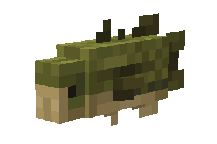
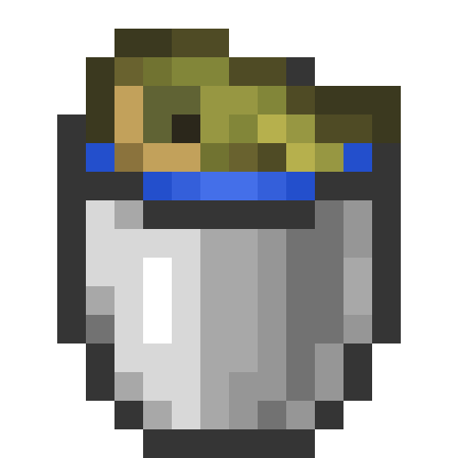
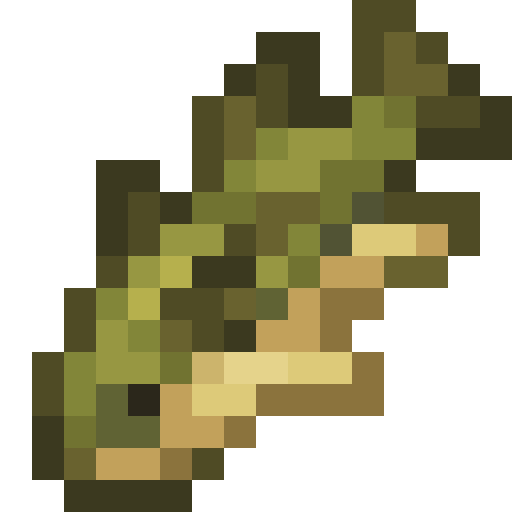
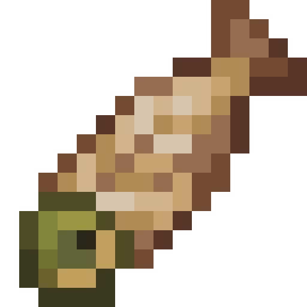
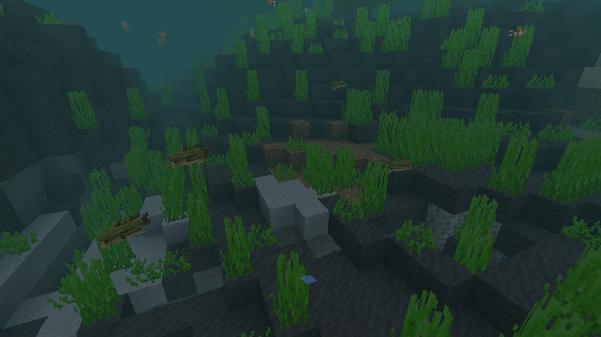
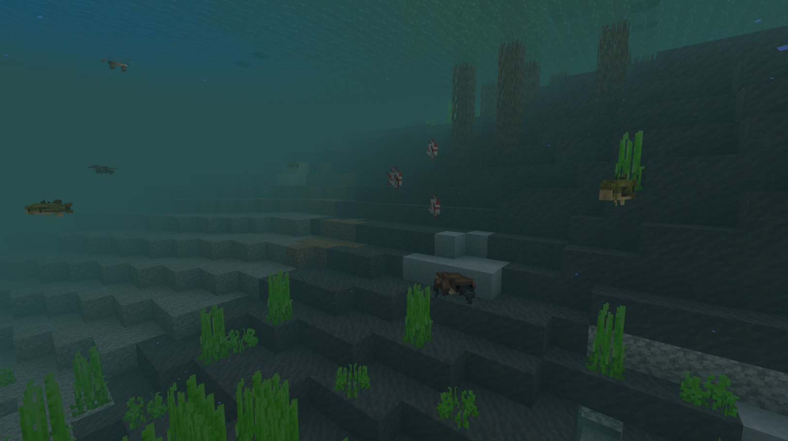

# Perche

Dernière mise à jour : 22 avril 2025 20h47

---

**Retour**

🐻 [Wiki de l'extension Naturalist](/www.notion.so/1a7a9a61c3f1800c8e32e893d6e7f430?pvs=21)

---

Les perches sont des poissons aquatiques passifs qui nagent en groupes dans les biomes marécageux et les rivières. Ces perches sont des proies pour les joueurs et les animaux car elles constituent une excellente source de nourriture. Si vous cultivez votre nourriture, assurez-vous d'attraper ce poisson passif dans un seau et de lui donner un nouveau foyer !

<aside>

### **Perche**

---

**Santé : 3** [♥️♥️♥️]

---

**Classification :** [Animal](/minecraft.fandom.com/wiki/Animal) / [Aquatique](/minecraft.fandom.com/wiki/Aquatic)

---

**Comportement :** Passif

---

**Apparition :** [Marais et variantes](/minecraft.fandom.com/wiki/Swamp), [Rivières et variantes](/minecraft.fandom.com/wiki/River)

---

</aside>

---

### 🌎 Apparition

Les perches apparaissent en groupes de 1 à 4 sous l'eau dans les [marais](/minecraft.fandom.com/wiki/Swamp), les [rivières](/minecraft.fandom.com/wiki/River) et les variantes de chaque biome tant qu'il n'est pas gelé. Divers animaux chassent couramment ces poissons, donc vous pourriez découvrir des restes de ces poissons flottant à la surface de l'eau. Si vous voulez attraper un de ces poissons dans un seau, vérifiez vos alentours pour ne pas devenir la proie !

---

### ⚔️ Butin

La perche [laisse tomber](/minecraft.fandom.com/wiki/Drops) à sa mort :

- 0 - 1 Perche crue
    - ⚔️ La quantité maximale est augmentée de 1 par niveau de [Butin](/minecraft.fandom.com/wiki/Looting), pour un maximum de 0-3 avec Butin III
- 0 - 1 Perche cuite
    - ⚔️ La perche cuite peut être obtenue lorsqu'elle est tuée sur terre avec l'enchantement [Fonte](/minecraft.fandom.com/wiki/Fire_Aspect) ou [Flamme](/minecraft.fandom.com/wiki/Flame). Cela ne fonctionnera pas si la perche est tuée sous l'eau
- 🟢 1 - 3 Orbes d'[expérience](/minecraft.fandom.com/wiki/Experience) si tuée par un joueur

---

### 🧠 Comportement

Les perches sont des créatures aquatiques passives qui ont tendance à nager en bancs avec un maximum de quatre individus par banc.

Le joueur peut collecter des perches en utilisant un [seau d'eau](/minecraft.fandom.com/wiki/Water_bucket) sur elles, ce qui donne au joueur un seau de perche. Les perches placées avec des seaux ne disparaissent pas naturellement. Lorsque ce seau de poisson est utilisé contre un bloc, il vide le seau, plaçant de l'eau avec la perche nageant dedans.

**Faiblesse :**

Les perches ne peuvent pas survivre hors de l'eau. En dehors de l'eau, elles se débattent pendant un moment jusqu'à ce qu'elles commencent à suffoquer et meurent. Les perches ne peuvent pas être placées dans un [chaudron](/minecraft.fandom.com/wiki/Cauldron).

Les perches sont vulnérables aux armes qui ont l'enchantement [Empalement](Bass%201dd816019a9f81379eecf7c25ed7e23f.md).

---

### 🖼️ Galerie

---

<aside>
 Des questions supplémentaires ? Vous voulez faire partie de notre communauté ? → [Rejoignez notre Discord !](/discord.com/invite/starfishstudios)

</aside>

<aside>

[**Marketplace](/www.minecraft.net/en-us/marketplace/creator?name=Starfish%20Studios)      [CurseForge](/www.curseforge.com/members/starfish_studios/projects)      [TikTok](/www.tiktok.com/@starfishstudios)      [Instagram](/www.instagram.com/starfishstudiosinc/)      [Twitter](/twitter.com/starfishstudios)      [YouTube](/www.youtube.com/@starfishstudios)      [Website](/starfish-studios.com/)**

</aside> 