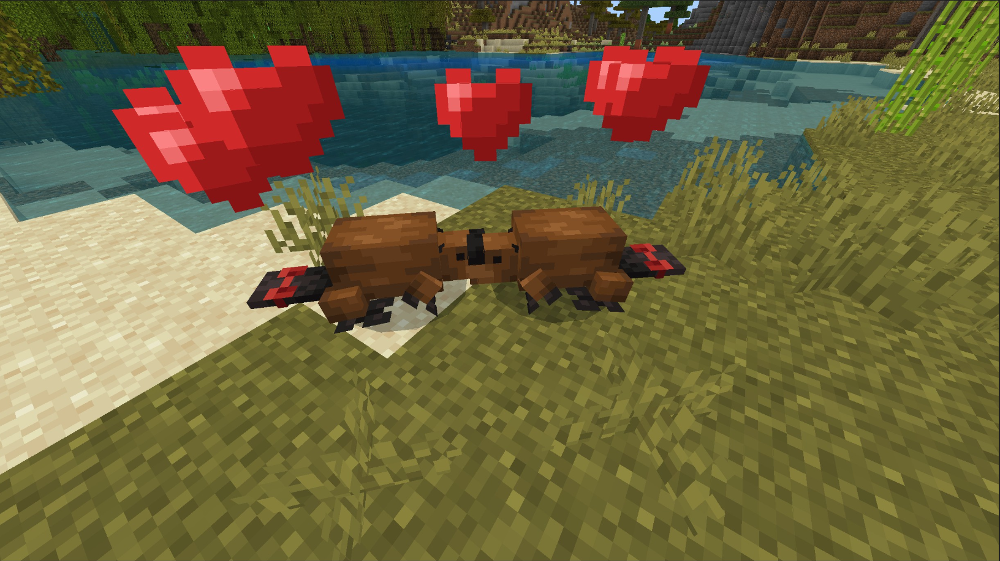
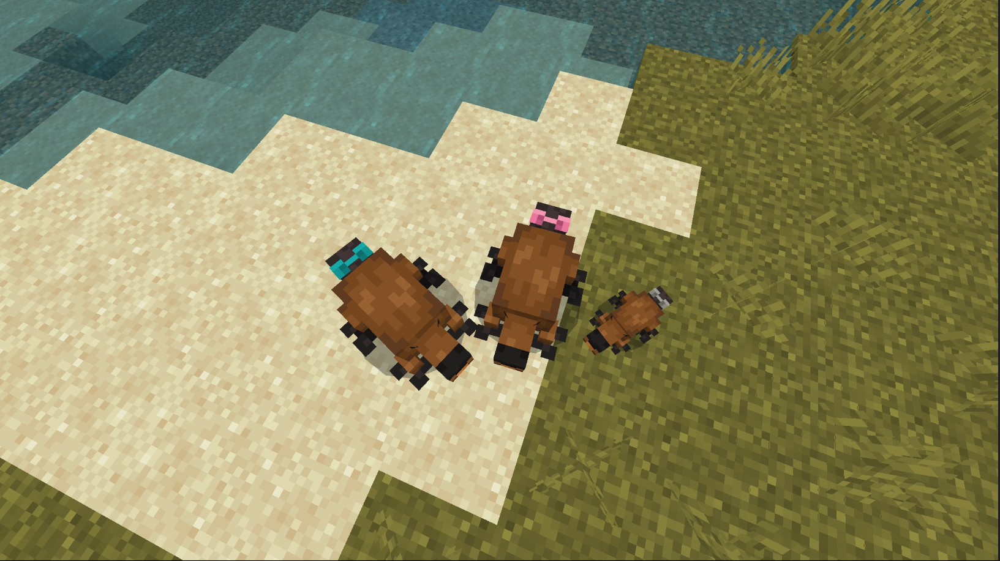

# Beaver

Last Updated: April 22, 2025 8:47 PM

---

**Return**

🐻 [Naturalist Add-On Wiki](/www.notion.so/1a7a9a61c3f1800c8e32e893d6e7f430?pvs=21)

---

Beavers are the second largest rodents in the world! They are known for their large front teeth that never stop growing which helps them carve away wooden materials for their dams. Average beavers can swim up to 15 minutes underwater.

<aside>

### **Beaver**

---

**Health: 7** [♥️♥️♥️]

---

**Classification:** [Animal](/minecraft.fandom.com/wiki/Animal)

---

**Behavior:** Passive

---

**Spawn: [Rivers & Variants](/minecraft.fandom.com/wiki/River)**

---

</aside>

---

### 🌎 Spawning

Beavers will spawn in a colony of 1-3 during the daytime with [light levels](/minecraft.fandom.com/wiki/Light) between 7-15. These rodents enjoy [rivers & their variants](/minecraft.fandom.com/wiki/River) but will avoid frozen rivers.

---

### ⚔️ Drops

Beaver [drops](/minecraft.fandom.com/wiki/Drops) upon death:

- 0 - 1 Hide
- 0 - 2 [Stick](/minecraft.fandom.com/wiki/Stick)
    - ⚔️ The maximum amount is increased by 1 per level of [Looting](/minecraft.fandom.com/wiki/Looting), for a maximum of 0-4 with Looting III.
- 🟢1 - 3 [Experience](/minecraft.fandom.com/wiki/Experience) Orbs if killed by Player.
- 🟢 1 - 7 Experience Orbs upon [breeding](/minecraft.fandom.com/wiki/Breeding).

*Kits will not drop experience orbs when killed.*

---

### 🧠 Behavior

Beavers randomly stroll around in a passive state, sticking near water or nearby logs. If you’re in a forest with trees and find stripped logs, a beaver is likely nearby!

Beavers will occasionally strip wooden logs with their front teeth.

---

### ❤️ Taming, Healing, & Feeding

Adult beavers can be tamed with [sticks](/minecraft.fandom.com/wiki/Stick). There is a 50% chance of successful taming. Once they are tamed, you will see hearts appear and a bow on their tail signifying you have tamed the rodent. You can [dye](/minecraft.fandom.com/wiki/Dye) the bow to your color of choice or use [shears](/minecraft.fandom.com/wiki/Shears) to cut off the bow. If you shear off a bow, it can be reapplied by using a dye color of your choice.

Tamed beavers can be commanded to sit or to follow.

- Beavers will teleport to the player if the player is further than 10 blocks away.
- Beavers will not teleport to the player if they are commanded to sit.

If the beaver you have tamed gets injured, you can feed the beaver sticks to increase its [health](/minecraft.fandom.com/wiki/Health) until it is maxed. 1 stick increases the beaver's health points by 2. An injured beaver will be unable to breed until healed.

Tamed beavers will deliver sticks to their owner!

---

### 🥚Breeding

Adult beavers with full health can be [bred](/minecraft.fandom.com/wiki/Breeding) with sticks. There is a 5-minute cooldown for breeding, during which the beaver does not accept sticks for breeding but will if they get injured and need to heal.

The growth of kits can be slowly accelerated by using sticks.

---

### 🖼️ Gallery

---

<aside>
 Have additional questions? Want to be a part of our community? → [Join our Discord!](/discord.com/invite/starfishstudios)

</aside>

<aside>

[**Marketplace](/www.minecraft.net/en-us/marketplace/creator?name=Starfish%20Studios)      [CurseForge](/www.curseforge.com/members/starfish_studios/projects)      [TikTok](/www.tiktok.com/@starfishstudios)      [Instagram](/www.instagram.com/starfishstudiosinc/)      [Twitter](/twitter.com/starfishstudios)      [YouTube](/www.youtube.com/@starfishstudios)      [Website](/starfish-studios.com/)**

</aside>
