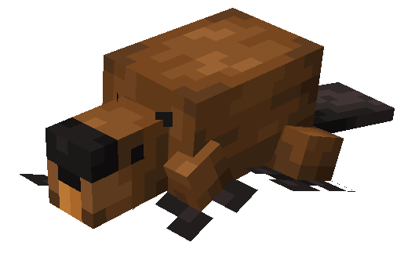
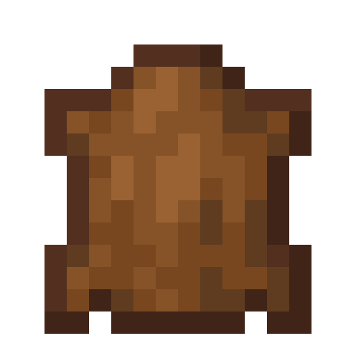
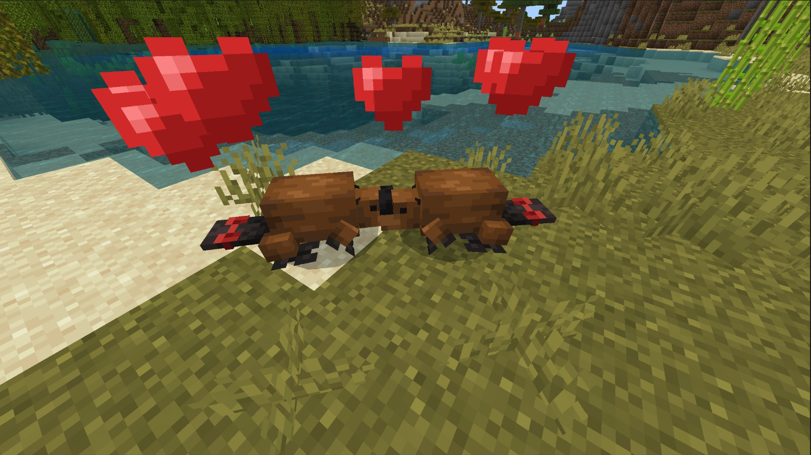
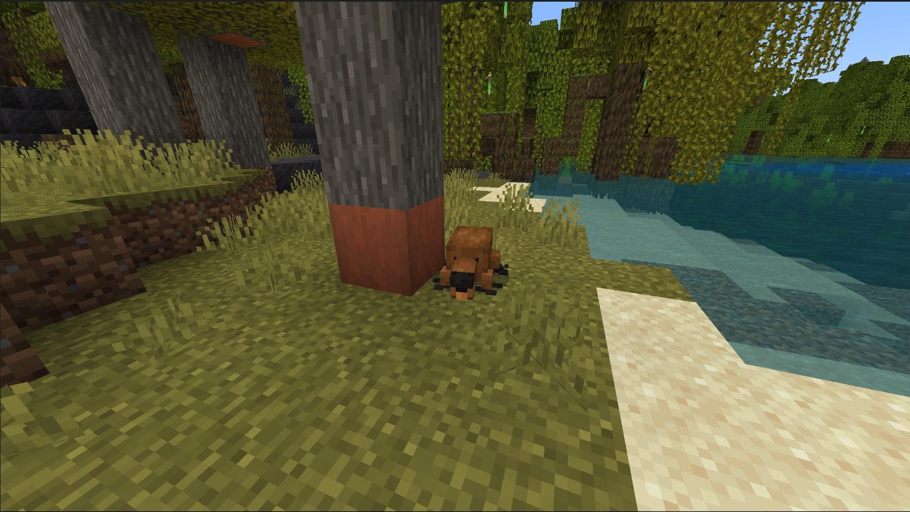

# Castor

Dernière mise à jour : 22 avril 2025 20h47

---

**Retour**

🐻 [Wiki de l'extension Naturalist](/www.notion.so/1a7a9a61c3f1800c8e32e893d6e7f430?pvs=21)

---

Les castors sont les deuxièmes plus grands rongeurs du monde ! Ils sont connus pour leurs grandes dents de devant qui ne cessent jamais de pousser, ce qui les aide à tailler des matériaux en bois pour leurs barrages. Un castor moyen peut nager jusqu'à 15 minutes sous l'eau.

<aside>

### **Castor**

---

**Santé : 7** [♥️♥️♥️]

---

**Classification :** [Animal](/minecraft.fandom.com/wiki/Animal)

---

**Comportement :** Passif

---

**Apparition :** [Rivières et variantes](/minecraft.fandom.com/wiki/River)

---

</aside>

---

### 🌎 Apparition

Les castors apparaîtront en colonie de 1 à 3 pendant la journée avec des [niveaux de lumière](/minecraft.fandom.com/wiki/Light) entre 7 et 15. Ces rongeurs apprécient les [rivières et leurs variantes](/minecraft.fandom.com/wiki/River) mais éviteront les rivières gelées.

---

### ⚔️ Butin

Le castor [laisse tomber](/minecraft.fandom.com/wiki/Drops) à sa mort :

- 0 - 1 Peau
- 0 - 2 [Bâton](/minecraft.fandom.com/wiki/Stick)
    - ⚔️ La quantité maximale est augmentée de 1 par niveau de [Butin](/minecraft.fandom.com/wiki/Looting), pour un maximum de 0-4 avec Butin III
- 🟢 1 - 3 Orbes d'[expérience](/minecraft.fandom.com/wiki/Experience) si tué par un joueur
- 🟢 1 - 7 Orbes d'expérience lors de la [reproduction](/minecraft.fandom.com/wiki/Breeding)

*Les bébés ne donnent pas d'orbes d'expérience lorsqu'ils sont tués.*

---

### 🧠 Comportement

Les castors se promènent aléatoirement dans un état passif, restant près de l'eau ou des bûches à proximité. Si vous êtes dans une forêt avec des arbres et que vous trouvez des bûches écorcées, un castor est probablement à proximité !

Les castors écorceront occasionnellement les bûches en bois avec leurs dents de devant.

---

### ❤️ Apprivoisement, Soins et Nourriture

Les castors adultes peuvent être apprivoisés avec des [bâtons](/minecraft.fandom.com/wiki/Stick). Il y a 50% de chances de réussir l'apprivoisement. Une fois apprivoisés, vous verrez des cœurs apparaître et un nœud sur leur queue, signifiant que vous avez apprivoisé le rongeur. Vous pouvez [teindre](/minecraft.fandom.com/wiki/Dye) le nœud à la couleur de votre choix ou utiliser des [cisailles](/minecraft.fandom.com/wiki/Shears) pour couper le nœud. Si vous coupez un nœud, il peut être réappliqué en utilisant une couleur de teinture de votre choix.

Les castors apprivoisés peuvent être commandés pour s'asseoir ou suivre.

- Les castors se téléporteront vers le joueur si celui-ci est à plus de 10 blocs de distance.
- Les castors ne se téléporteront pas vers le joueur s'ils sont commandés pour s'asseoir.

Si le castor que vous avez apprivoisé est blessé, vous pouvez le nourrir de bâtons pour augmenter sa [santé](/minecraft.fandom.com/wiki/Health) jusqu'à son maximum. 1 bâton augmente les points de santé du castor de 2. Un castor blessé ne pourra pas se reproduire jusqu'à ce qu'il soit guéri.

Les castors apprivoisés apporteront des bâtons à leur propriétaire !

---

### 🥚Reproduction

Les castors adultes en pleine santé peuvent se [reproduire](/minecraft.fandom.com/wiki/Breeding) avec des bâtons. Il y a un temps de recharge de 5 minutes pour la reproduction, pendant lequel le castor n'acceptera pas les bâtons pour se reproduire mais le fera s'il est blessé et a besoin de guérir.

La croissance des bébés peut être lentement accélérée en utilisant des bâtons.

---

### 🖼️ Galerie

---

<aside>
 Des questions supplémentaires ? Vous voulez faire partie de notre communauté ? → [Rejoignez notre Discord !](/discord.com/invite/starfishstudios)

</aside>

<aside>

[**Marketplace](/www.minecraft.net/en-us/marketplace/creator?name=Starfish%20Studios)      [CurseForge](/www.curseforge.com/members/starfish_studios/projects)      [TikTok](/www.tiktok.com/@starfishstudios)      [Instagram](/www.instagram.com/starfishstudiosinc/)      [Twitter](/twitter.com/starfishstudios)      [YouTube](/www.youtube.com/@starfishstudios)      [Website](/starfish-studios.com/)**

</aside> 